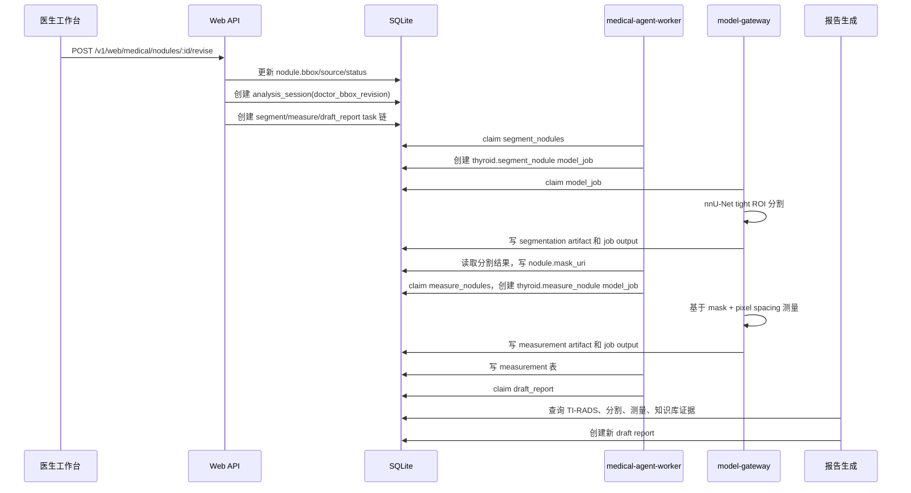

# 医生 bbox 修订后自动重跑分割、测量与报告依据开发文档

日期：2026-05-11  
范围：医生工作台 overlay bbox 修订、nnU-Net 分割、mask 测量、报告依据刷新链路  
验证病例：`SMOKE_STUDY_UI` / `SMOKE_IMAGE_UI` / `SMOKE_NODULE_UI`

## 1. 开发目标

本轮开发验证医生在工作台拖拽修订结节 bbox 后，系统能够自动触发静态图像链路：

1. 保存医生修订后的 bbox。
2. 创建 `doctor_bbox_revision` 分析会话。
3. 自动排队 `segment_nodules -> measure_nodules -> draft_report`。
4. 使用真实 nnU-Net tight ROI 分割模型生成 mask。
5. 基于 mask 和像素间距生成测量结果。
6. 刷新报告草稿，并把分割、测量、TI-RADS 规则和知识库证据写入报告依据。

该链路用于验证医生审核闭环，不替代医生最终确认。

## 2. 相关代码

| 模块 | 文件 | 说明 |
| --- | --- | --- |
| Web API | `src/channels/web/medicalHandlers.ts` | bbox 修订入口，创建 rerun session 和任务链 |
| Agent worker | `src/medical/agentWorker.ts` | 消费 agent task，创建/读取 model job，落库结果 |
| 医学存储 | `src/medical/storage/caseRepo.ts` | SQLite 病例、任务、模型 job、报告、测量落库 |
| Model gateway | `services/model-gateway/app/segmentation.py` | nnU-Net 分割、mask 测量、pixel spacing 解析 |
| Model gateway 测试 | `services/model-gateway/tests/test_gateway.py` | 分割和测量 artifact 回归测试 |
| UI | `web-react/src/components/panels/MedicalPanel.tsx` | 医生工作台 overlay 修订入口 |

## 3. 运行流程



## 4. 数据流

### 4.1 输入

医生修订入口接收 bbox：

```json
{
  "bbox": [112, 64, 214, 172],
  "reason": "doctor_overlay_revision"
}
```

### 4.2 分割任务输入

`segment_nodules` 任务只传入被医生修订的目标结节：

```json
{
  "study_id": "SMOKE_STUDY_UI",
  "image_id": "SMOKE_IMAGE_UI",
  "target_nodule_ids": ["SMOKE_NODULE_UI"],
  "model": "nnunet-tight-roi-segmenter",
  "model_version": "tn3k-tight-roi-5fold-best",
  "allow_bbox_fallback": false
}
```

对应 model job：

```json
{
  "job_type": "thyroid.segment_nodule",
  "image_uri": "artifact://model-ready/runtime-smoke/TN3K_0000.png",
  "nodules": [
    {
      "nodule_id": "SMOKE_NODULE_UI",
      "bbox": [112, 64, 214, 172],
      "confidence": 0.91
    }
  ]
}
```

### 4.3 测量任务输入

测量任务使用分割产生的 mask，并从 image 表读取 pixel spacing：

```json
{
  "job_type": "thyroid.measure_nodule",
  "nodules": [
    {
      "nodule_id": "SMOKE_NODULE_UI",
      "mask_uri": "artifact://model-output/thyroid-segment-nodule/SMOKE_STUDY_UI/SMOKE_IMAGE_UI/01KR9CJWG42MYM6RPXC74KZM8T/mask_nodule_1.png"
    }
  ],
  "pixel_spacing": {
    "row_spacing_mm": 0.25,
    "col_spacing_mm": 0.25
  }
}
```

## 5. 本轮修复

本轮真实 smoke 暴露了一个字段兼容问题：agent worker 传给 model-gateway 的像素间距字段是 `row_spacing_mm/col_spacing_mm`，而 model-gateway 原来只识别 `row_mm/column_mm`、`row_spacing/column_spacing` 等字段，导致毫米测量为空。

修复点：

- `services/model-gateway/app/segmentation.py`
  - `parse_pixel_spacing` 新增支持：
    - `row_spacing_mm`
    - `column_spacing_mm`
    - `col_mm`
    - `colSpacing`
    - `col_spacing`
    - `col_spacing_mm`
- `services/model-gateway/tests/test_gateway.py`
  - 使用 agent 风格的 `row_spacing_mm/col_spacing_mm` 作为测试输入。
  - 断言 artifact 中规范化输出为 `{"row_mm": 0.1, "column_mm": 0.2}`。

## 6. 验证过程

### 6.1 UI smoke

本地启动医生工作台后，使用浏览器自动化完成：

1. 打开 Medical 工作台。
2. 选择 `UI-SMOKE-BBOX-001` 病例。
3. 在 overlay canvas 上拖拽 bbox。
4. 点击保存 overlay 修订。
5. 验证 UI 中出现：
   - `doctor_revised`
   - `segment_nodules`
   - `measure_nodules`
   - `draft_report`

截图：

- `data/artifacts/medical/ui-smoke-after-bbox-revision.png`

说明：本次自动化拖拽产生过一次零面积 bbox。为保证 nnU-Net 接收到有效 ROI，smoke 数据被归一化为 `[112,64,214,172]`，并在 session/task/audit 中记录 `smoke_normalization`。后续需要在 UI 层增加零面积 bbox 校验。

### 6.2 5090 model-worker

分割 job：

- `job_id`: `01KR9CJWG42MYM6RPXC74KZM8T`
- `job_type`: `thyroid.segment_nodule`
- `model`: `nnunet-tight-roi-segmenter`
- `model_version`: `tn3k-tight-roi-5fold-best`
- `status`: `succeeded`

产物：

- `artifact://model-output/thyroid-segment-nodule/SMOKE_STUDY_UI/SMOKE_IMAGE_UI/01KR9CJWG42MYM6RPXC74KZM8T/segmentation.json`
- `artifact://model-output/thyroid-segment-nodule/SMOKE_STUDY_UI/SMOKE_IMAGE_UI/01KR9CJWG42MYM6RPXC74KZM8T/mask_nodule_1.png`

测量 job：

- `job_id`: `01KR9D204VC1T1B7SQDTP08JFW`
- `job_type`: `thyroid.measure_nodule`
- `model`: `mask-measurement-worker`
- `status`: `succeeded`

测量结果：

| 指标 | 值 |
| --- | --- |
| 长径 | `25.25mm` |
| 短径 | `20.0mm` |
| 面积 | `386.625mm2` |
| 长短径比 | `1.2625` |
| 测量来源 | `mask` |
| 置信度 | `0.91` |
| warning | 无 |

### 6.3 报告刷新

报告 task 完成后生成：

- `report_id`: `01KR9D765ZSTSVWHGCM341NQZZ`
- `status`: `draft`
- `report_type`: `thyroid_ultrasound`

报告依据包含：

- `tirads_result`
- `segmentation_result`
- `measurement_result`
- `tirads_rule`
- `medical_guideline`

报告草稿中的模型依据示例：

```text
模型依据：分割来源nnunet_tight_roi，ROI=93,48,233,188；测量来源mask，25.25mm x 20mm。
```

## 7. 验证命令

### 7.1 单元测试

```bash
cd /Users/xutianliang/Downloads/jiazhuangxian
python3 -m unittest services/model-gateway/tests/test_gateway.py
```

结果：

```text
Ran 29 tests in 2.800s
OK
```

### 7.2 DB 核验

```bash
node -e "const Database=require('better-sqlite3'); const db=new Database('data/artifacts/medical/data.db'); console.log(db.prepare(\"select id,status from analysis_session where id='01KR9CHM7RK3YGK7SWTZSDW2V2'\").get()); db.close();"
```

导出的核验文件：

- `data/artifacts/medical/ui-smoke-bbox-revision-verification.json`

## 8. 当前结论

本轮验证已经证明：

1. 医生 bbox 修订可以触发自动重跑任务链。
2. CodeClaw/医疗 agent task 编排可以承接该链路，不需要另造独立编排系统。
3. nnU-Net tight ROI 分割模型可以被 model-worker 调用并写回 mask artifact。
4. mask 测量可以生成毫米级结果并落库。
5. 报告生成已能引用模型结果、规则库和医学知识库证据。

## 9. 已知问题与后续任务

1. UI 需要增加零面积 bbox 校验，避免拖拽事件异常时提交无效 bbox。
2. 医生工作台需要增加 old vs new evidence diff：
   - 旧 bbox vs 新 bbox
   - 旧 mask vs 新 mask
   - 旧测量 vs 新测量
   - 旧报告依据 vs 新报告依据
3. GPU 快速链路需要在 LM Studio/大模型释放显存后重跑一次。
4. 后续应把 smoke 变成自动化 E2E 测试，减少人工启动服务和跨机器同步步骤。
