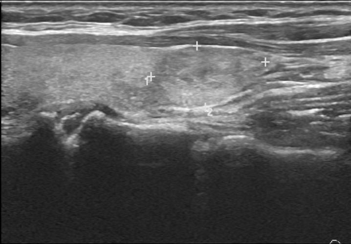
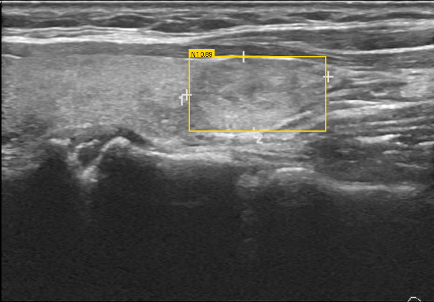
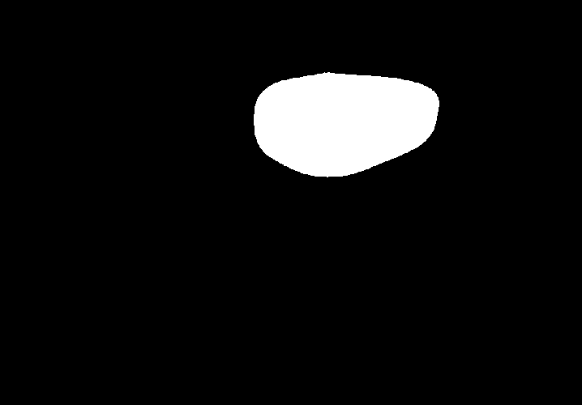

# RTX 5090 真实 GPU E2E 验证报告

日期：2026-05-11  
验证主机：`beelink@100.110.127.117`  
项目目录：`/home/beelink/jiazhuangxian`  
本机结果目录：`data/artifacts/gpu-e2e-20260511/`

## 1. 验证目标

本轮目标是把 RTX 5090 作为独立 AI 推理服务器，真实跑通一例甲状腺超声图像的核心链路：

```text
TN5000 图像
-> RF-DETR-Medium 主检测
-> YOLO11m 对照检测
-> 双模型 bbox 一致性评估
-> nnU-Net Tight ROI 分割
-> mask 测量
-> 输出报告依据与部署证据
```

本轮不使用 `bbox_fallback` 分割；分割结果必须来自真实 nnU-Net worker。

## 2. 5090 部署证据

`model-gateway:check --strict` 返回 `ready`。

| 项目 | 结果 |
|---|---|
| GPU | NVIDIA GeForce RTX 5090 |
| Driver | 580.126.09 |
| PyTorch | 2.11.0+cu128 |
| Torch CUDA | 12.8 |
| CUDA available | true |
| Ready detectors | `yolov11`, `rt-detr`, `rf-detr` |
| Ready segmenters | `sam2-static`, `nnunet-tight-roi` |
| Ready video segmenters | `sam2-video` |
| Warnings | none |

部署证据文件：

- `data/artifacts/gpu-e2e-20260511/model-gateway-check.json`
- `data/artifacts/gpu-e2e-20260511/nvidia-smi.csv`

## 3. 输入数据

| 字段 | 值 |
|---|---|
| 数据集 | TN5000 detection-clean |
| 图像 ID | `000016` |
| 图像尺寸 | `718 x 500` |
| 验证原始标注 bbox | `[308, 97, 538, 217]` |
| 输入 artifact | `artifact://model-ready/tn5000_000016.jpg` |



## 4. 结节检测结果

### 4.1 主检测模型：RF-DETR-Medium

| 字段 | 值 |
|---|---|
| model | `rf-detr-medium-thyroid-detector` |
| version | `tn5000-rfdetr-medium-ema-e40-r576` |
| weight | `checkpoint_best_ema.pth` |
| bbox | `[312.55, 93.54, 539.81, 217.30]` |
| confidence | `0.8938` |

### 4.2 对照检测模型：YOLO11m

| 字段 | 值 |
|---|---|
| model | `yolov11-thyroid-detector` |
| bbox | `[314.01, 92.88, 539.33, 222.87]` |
| confidence | `0.7728` |

### 4.3 双模型一致性

| 指标 | 值 |
|---|---|
| IoU | `0.9443` |
| status | `matched` |
| primary_only | `0` |
| comparator_only | `0` |
| LLM evaluation pack | `pending_llm`, `overall_assessment=consistent` |



检测 artifact：

- `data/artifacts/gpu-e2e-20260511/model-output/thyroid-detect-nodules/GPU-E2E-20260511-STUDY/GPU-E2E-IMG-000016/mj_cff2acdd412d4aeb8d971ca086d225cf/detections.json`
- `data/artifacts/gpu-e2e-20260511/model-output/thyroid-detect-nodules/GPU-E2E-20260511-STUDY/GPU-E2E-IMG-000016/mj_cff2acdd412d4aeb8d971ca086d225cf/comparison.json`
- `data/artifacts/gpu-e2e-20260511/model-output/thyroid-detect-nodules/GPU-E2E-20260511-STUDY/GPU-E2E-IMG-000016/mj_cff2acdd412d4aeb8d971ca086d225cf/overlay.png`

## 5. 分割结果

| 字段 | 值 |
|---|---|
| model | `nnunet-tight-roi-segmenter` |
| version | `tn3k-tight-roi-5fold-best` |
| segmentation_source | `nnunet_tight_roi` |
| prompt bbox | `[312.55, 93.54, 539.81, 217.30]` |
| output bbox | `[313, 89, 542, 219]` |
| crop box | `[279, 8, 574, 303]` |
| roi size | `384 x 384` |
| dataset | `503` |
| folds | `0 1 2 3 4` |
| checkpoint | `checkpoint_best.pth` |
| requires_doctor_review | `false` |



分割 artifact：

- `data/artifacts/gpu-e2e-20260511/model-output/thyroid-segment-nodule/GPU-E2E-20260511-STUDY/GPU-E2E-IMG-000016/mj_d94dbad6de4e4734bf5583d55ee2ccd9/segmentation.json`
- `data/artifacts/gpu-e2e-20260511/model-output/thyroid-segment-nodule/GPU-E2E-20260511-STUDY/GPU-E2E-IMG-000016/mj_d94dbad6de4e4734bf5583d55ee2ccd9/mask_nodule_1.png`

## 6. 测量结果

本轮使用 `mask-measurement-worker` 基于 nnU-Net mask 测量。TN5000 图像不是临床 DICOM，本轮为了端到端 smoke 使用显式验证标定：

```json
{"row_mm": 0.1, "column_mm": 0.1, "source": "validation_assumed_spacing_for_e2e_smoke"}
```

| 指标 | 值 |
|---|---|
| long_axis_px | `229` |
| short_axis_px | `130` |
| area_px2 | `23198` |
| long_axis_mm | `22.9` |
| short_axis_mm | `13.0` |
| area_mm2 | `231.98` |
| aspect_ratio | `1.7615` |
| measurement_source | `mask` |
| confidence | `0.8938` |

测量 artifact：

- `data/artifacts/gpu-e2e-20260511/model-output/thyroid-measure-nodule/GPU-E2E-20260511-STUDY/GPU-E2E-IMG-000016/mj_48cc04f0ede7490bbcebaf021852ca36/measurements.json`

## 7. 报告草稿与依据

### 7.1 GPU E2E 验证草稿

甲状腺超声图像中检测到 1 个结节候选。RF-DETR-Medium 主检测模型输出 bbox `[312.55, 93.54, 539.81, 217.30]`，置信度 `0.8938`；YOLO11m 对照检测输出 bbox `[314.01, 92.88, 539.33, 222.87]`，双模型 IoU 为 `0.9443`，一致性状态为 `matched`。

基于 RF-DETR 主检测框，nnU-Net Tight ROI 真实分割模型生成结节 mask，输出分割 bbox `[313, 89, 542, 219]`。基于 mask 测量得到长径 `229 px`、短径 `130 px`、面积 `23198 px²`。按本轮验证标定 `0.1 mm/px` 换算为 `22.9 mm x 13.0 mm`，面积 `231.98 mm²`。

本轮未运行 TI-RADS 特征识别模型，不能生成正式 TI-RADS 分级或 FNA/随访建议。后续报告生成必须继续绑定 TI-RADS 特征、规则引擎和医学知识库证据，并由医生最终确认。

### 7.2 报告依据

| 依据类型 | 内容 |
|---|---|
| 主检测依据 | RF-DETR bbox、confidence、model/version、detections artifact |
| 对照依据 | YOLO11m bbox、confidence、comparison artifact |
| 一致性依据 | RF-DETR 与 YOLO IoU `0.9443`，无 primary-only/comparator-only |
| 分割依据 | nnU-Net Tight ROI mask、prompt bbox、crop box、fold/checkpoint metadata |
| 测量依据 | mask pixel measurement 与验证标定换算 |
| 安全边界 | LLM 不得新增、删除或移动 bbox；最终 bbox 接受和报告签署仍需医生确认 |
| 缺口 | 未运行 TI-RADS 特征识别，因此本轮不输出正式 TI-RADS 管理建议 |

## 8. 结论

本轮真实 GPU E2E 已跑通：

```text
RF-DETR 主检测 succeeded
YOLO11m 对照 succeeded
双模型 comparison succeeded
nnU-Net Tight ROI 真实分割 succeeded
mask measurement succeeded
artifact 全部落盘
```

下一步应把该链路从“文件同步式验证”升级为稳定 AI 服务器模式：

1. 5090 常驻 `model-gateway` 和 `model-worker`。
2. Mac/医生工作台通过 HTTP 或共享 artifact 根目录提交任务。
3. 统一 `artifact://` 解析策略，避免在 Mac 和 5090 间手工同步 SQLite。
4. 把本轮检测、分割、测量结果接回 `medical-agent-worker`，生成正式 `report.evidence_json`。
5. 增加真实 UI smoke：医生打开病例、查看 overlay/mask/测量、编辑报告、审核归档。
