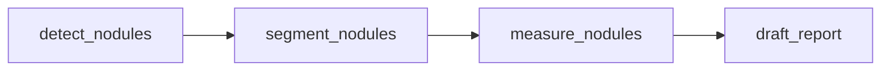

# 医疗 Agent 端到端链路接入记录

日期：2026-05-10

## 1. 本轮目标

在已有 CodeClaw 医疗 Agent 任务队列上补齐静态图像主链路：

其中 `segment_nodules` 默认使用 `nnunet-tight-roi-segmenter`，`measure_nodules` 使用分割 mask 做测量。

## 2. 自动排队策略

为了不破坏显式编排，自动排队采用保守策略：

- 当前任务没有显式子任务时，才自动创建下一步。
- `detect_nodules` 成功且持久化到结节后，自动创建 `segment_nodules`。
- `segment_nodules` 成功且持久化到 mask 后，自动创建 `measure_nodules`。
- 如果任务链中已经显式创建了下游任务，不重复创建。

## 3. 报告证据增强

报告草稿的 `evidence` 新增两类模型证据：

- `segmentation_result`
  - `model_job_id`
  - `artifact_uri`
  - `model_name`
  - `model_version`
  - `segmentation_source`
  - `mask_uri`
  - `metadata.crop_box_xyxy`
  - `metadata.roi_size`
- `measurement_result`
  - `model_job_id`
  - `artifact_uri`
  - `model_name`
  - `model_version`
  - `measurement_source`
  - `long_axis_mm`
  - `short_axis_mm`
  - `pixel_measurements`

报告结构化字段新增：

- `structured.model_evidence.segmentation_count`
- `structured.model_evidence.measurement_count`
- `structured.nodules[].segmentation`
- `structured.nodules[].measurement`

报告正文的“结节描述”和“证据”部分会展示分割来源、ROI crop box、测量来源和尺寸依据。

## 4. 验证

- `npm test -- test/unit/medical/agentWorker.test.ts`
  - 14 tests passed
- `python3 -m unittest services/model-gateway/tests/test_gateway.py`
  - 29 tests passed
- `npm run typecheck`
  - passed

## 5. 下一步

1. 医生工作台 overlay 拖拽框选后重新触发 `segment_nodules(nnunet-tight-roi-segmenter)`。
2. 对检测空病例增加低阈值检测、RF-DETR fallback 或医生手工框选入口。
3. 把报告证据面板展示 `segmentation_result` 和 `measurement_result`。
