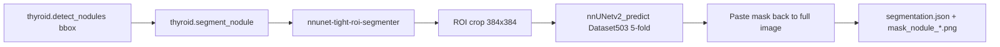

# nnU-Net Tight ROI 接入 model-gateway 记录

日期：2026-05-10

## 1. 接入目标

根据 100 例 TN3K official test 对比结果，静态图像自动分割主链路从 `YOLO -> SAM2` 调整为：



SAM2/MedSAM 保留为医生交互式框选、点选修订和疑难病例复核路线。

## 2. 代码改动

- `SegmentNoduleRequest` 默认模型改为 `nnunet-tight-roi-segmenter`，默认版本为 `tn3k-tight-roi-5fold-best`。
- `src/medical/agentWorker.ts` 的 `segment_nodules` 默认模型同步改为 `nnunet-tight-roi-segmenter`。
- model-gateway 新增 `NnUnetTightRoiSegmenter` adapter：
  - 读取目标 bbox；
  - 外扩 tight ROI；
  - 缩放为 `384x384`；
  - 调用 `nnUNetv2_predict`；
  - 将 ROI mask 贴回原图；
  - 输出 full-size bbox、contour、mask artifact；
  - 在 segmentation metadata 记录 `prompt_bbox`、`crop_box_xyxy`、`roi_size`、`full_size_paste`、dataset、folds、checkpoint。
- `/model/v1/config/check` 新增 `nnunet-tight-roi` segmenter 状态检查。
- segmentation artifact 保留 per-segmentation `metadata`，用于医生复核和审计。

## 3. 5090 推荐配置

```bash
export JZX_NNUNET_RESULTS=/home/beelink/jiazhuangxian/data/nnunet/nnUNet_results
export JZX_NNUNET_RAW=/home/beelink/jiazhuangxian/data/nnunet/nnUNet_raw
export JZX_NNUNET_PREPROCESSED=/home/beelink/jiazhuangxian/data/nnunet/nnUNet_preprocessed
export JZX_NNUNET_PREDICT_BIN=/home/beelink/jiazhuangxian/.venv-model-gateway-gpu/bin/nnUNetv2_predict
export JZX_NNUNET_DATASET=503
export JZX_NNUNET_CONFIGURATION=2d
export JZX_NNUNET_TRAINER=nnUNetTrainer_100epochs
export JZX_NNUNET_PLANS=nnUNetPlans
export JZX_NNUNET_FOLDS="0 1 2 3 4"
export JZX_NNUNET_CHECKPOINT=checkpoint_best.pth
export JZX_NNUNET_ROI_SIZE=384
export JZX_NNUNET_ROI_MARGIN_RATIO=0.15
export JZX_NNUNET_MIN_CROP_SIZE=80
export JZX_MODEL_DEVICE=0
```

## 4. 验证结果

### 本地

- `python3 -m py_compile services/model-gateway/app/segmentation.py services/model-gateway/app/config_check.py services/model-gateway/app/schemas.py services/model-gateway/app/artifacts.py`
- `python3 -m unittest services/model-gateway/tests/test_gateway.py`
  - 29 tests passed
- `npm test -- test/unit/medical/agentWorker.test.ts`
  - 13 tests passed

### 5090

- `python -m unittest services/model-gateway/tests/test_gateway.py`
  - 29 tests passed
- `/model/v1/config/check` 在配置 nnU-Net 环境变量后：
  - `ready_segmenters = ["nnunet-tight-roi"]`
- 真实单例 smoke：
  - 输入：TN3K test `0000`
  - job type：`thyroid.segment_nodule`
  - model：`nnunet-tight-roi-segmenter`
  - fallback：disabled
  - status：succeeded
  - segmentation source：`nnunet_tight_roi`
  - mask artifact 已生成
  - metadata 已写入 `crop_box_xyxy = [97, 49, 200, 152]`

## 5. 后续任务

1. 将检测成功后的默认 Agent 调度链路改成 `detect_nodules -> segment_nodules(nnunet) -> measure_nodules`，并在报告依据中展示分割模型、crop box 和 mask source。
2. 接入医生工作台 overlay 拖拽框选修订：医生改 bbox 后重新调用 `nnunet-tight-roi-segmenter`。
3. 对检测空病例 `0037`、`0085`、`0087` 增加低阈值 YOLO/RF-DETR fallback 或医生手工框选入口。
