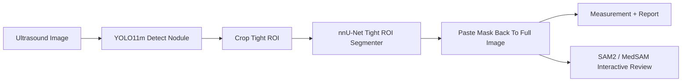

# 甲状腺结节分割静态链条对比报告：YOLO 框提示下的 SAM2 与 nnU-Net Tight ROI

日期：2026-05-10

## 1. 本轮目标

本轮验证同一批 TN3K official test 前 100 例在真实检测框提示下的分割表现，重点回答：

- `YOLO11m -> SAM2.1 Large` 是否能稳定支撑静态图像结节分割；
- 已训练的 `nnU-Net Tight ROI 5-fold ensemble` 能否在同一批 YOLO 检测框上取得更高 Dice；
- 当前工程主用分割路线应选择哪一个。

## 2. 运行链条

### 2.1 YOLO -> SAM2

- 检测模型：`yolov11-thyroid-detector`
- 检测权重：TN3K YOLO11m 80/20 训练最佳权重
- 分割模型：`sam2-thyroid-segmenter`
- SAM2 权重：`sam2.1_hiera_large.pt`
- Prompt：YOLO 最高置信度 bbox
- 数据：TN3K official test annotation 前 100 例
- 输出目录：`docs/assets/sam2-static-chain-validation-20260510-yolo100/`

### 2.2 YOLO -> nnU-Net Tight ROI

- 检测框来源：同一份 YOLO100 `case_metrics.csv`
- ROI 策略：YOLO bbox 外扩 `0.15`，最小裁剪边长 `80`，缩放到 `384x384`
- 分割模型：`Dataset503_TN3KThyroidROITight`
- 推理权重：`nnUNetTrainer_100epochs__nnUNetPlans__2d` 5-fold `checkpoint_best.pth`
- 评估方式：ROI 预测贴回原图后，与 TN3K full-size mask 计算 Dice/IoU
- 输出目录：`docs/assets/nnunet-detector-roi-validation-20260510-yolo100/`

## 3. 结果摘要

| 链条 | 总病例 | 成功 | 失败/跳过 | Mean Dice | Median Dice | Min Dice | Mean IoU | Dice >= 0.90 | Dice >= 0.95 |
|---|---:|---:|---:|---:|---:|---:|---:|---:|---:|
| YOLO -> SAM2.1 Large | 100 | 97 | 3 | 0.769584 | 0.837804 | 0.065372 | 0.656610 | 22 | 3 |
| YOLO -> nnU-Net Tight ROI | 100 | 97 | 3 | 0.875605 | 0.919343 | 0.085727 | 0.797751 | 54 | 22 |

3 个失败/跳过病例为 `0037`、`0085`、`0087`，原因均为 YOLO 在 `confidence_threshold=0.25` 下未返回检测框。

## 4. 成对对比

仅统计两条链条均成功的 97 例：

| 指标 | 结果 |
|---|---:|
| 成对病例数 | 97 |
| nnU-Net 平均 Dice 提升 | +0.106021 |
| nnU-Net Dice 更高病例 | 88 |
| SAM2 Dice 更高病例 | 9 |
| 持平病例 | 0 |

## 5. 典型差异病例

### 5.1 nnU-Net 优势最大的病例

| image_id | SAM2 Dice | nnU-Net Dice | Delta |
|---|---:|---:|---:|
| 0068 | 0.098400 | 0.956164 | +0.857764 |
| 0042 | 0.306745 | 0.962124 | +0.655379 |
| 0084 | 0.404205 | 0.961158 | +0.556953 |
| 0057 | 0.485667 | 0.960025 | +0.474358 |
| 0012 | 0.489228 | 0.933793 | +0.444565 |
| 0047 | 0.495907 | 0.839159 | +0.343252 |
| 0086 | 0.623041 | 0.942308 | +0.319267 |
| 0002 | 0.458820 | 0.775826 | +0.317006 |
| 0065 | 0.602973 | 0.917605 | +0.314632 |
| 0060 | 0.639007 | 0.924489 | +0.285482 |

### 5.2 SAM2 优势病例

| image_id | SAM2 Dice | nnU-Net Dice | Delta |
|---|---:|---:|---:|
| 0052 | 0.909273 | 0.823906 | -0.085367 |
| 0011 | 0.772804 | 0.695036 | -0.077768 |
| 0005 | 0.929922 | 0.860807 | -0.069115 |
| 0001 | 0.927139 | 0.863743 | -0.063396 |
| 0061 | 0.907512 | 0.844604 | -0.062908 |
| 0022 | 0.900316 | 0.883078 | -0.017238 |
| 0032 | 0.950950 | 0.935797 | -0.015153 |
| 0016 | 0.870125 | 0.859817 | -0.010308 |
| 0028 | 0.885836 | 0.884624 | -0.001212 |

## 6. 结论

当前验证版静态图像分割主链条建议调整为：

工程结论：

- `YOLO -> nnU-Net Tight ROI` 在同一批 97 个可检测病例上明显优于 `YOLO -> SAM2`，更适合作为静态图像自动分割主链条。
- `SAM2 / MedSAM` 不建议作为当前静态自动分割主模型；更适合作为交互式修订、医生点选/框选复核、疑难病例二次分割工具。
- 分割链条的主要短板仍有两类：检测为空病例，以及检测框虽然覆盖结节但 ROI/边界提示导致 mask 偏移的病例。

## 7. 下一步任务

1. 已完成：将 model-gateway 的分割默认策略扩展为 `nnunet-tight-roi-segmenter` 主用、`sam2-thyroid-segmenter` 复核；见 `docs/NNUNET_TIGHT_ROI_GATEWAY_INTEGRATION_20260510.md`。
2. 在 `thyroid.segment_nodule` 的 metadata 中保留 `crop_box_xyxy`、`roi_size`、`full_size_paste`、`detector_bbox`，保证测量和审计可追溯。
3. 针对 `0037`、`0085`、`0087` 做检测失败审计，评估是否降低阈值、启用 RF-DETR 对照框、或进入医生手工框选。
4. 对 nnU-Net 低 Dice 病例做 ROI 审计，重点看检测框偏移、结节贴边、强噪声、多个结构粘连等问题。
5. 将医生工作台的 overlay 拖拽框选修订接入 `nnunet-tight-roi-segmenter`，形成“医生修订框 -> ROI 分割 -> 测量刷新”的闭环。

## 8. 产物

- SAM2 100 例报告：`docs/assets/sam2-static-chain-validation-20260510-yolo100/SAM2_STATIC_CHAIN_VALIDATION_REPORT.md`
- SAM2 100 例 contact sheet：`docs/assets/sam2-static-chain-validation-20260510-yolo100/contact_sheet.png`
- nnU-Net 100 例报告：`docs/assets/nnunet-detector-roi-validation-20260510-yolo100/NNUNET_DETECTOR_ROI_VALIDATION_REPORT.md`
- nnU-Net 100 例 contact sheet：`docs/assets/nnunet-detector-roi-validation-20260510-yolo100/contact_sheet.png`
- 新增验证脚本：`scripts/run_nnunet_detector_roi_validation.py`
