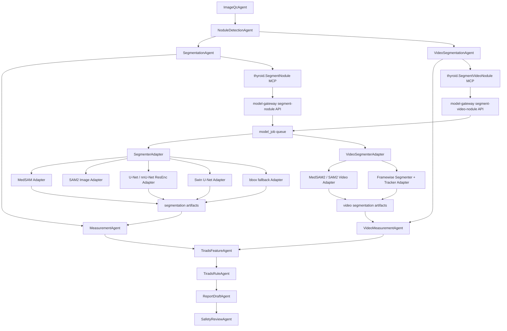

# 甲状腺结节真实分割权重接入技术方案

本文档定义将真实 MedSAM/SAM2 detector-prompt、Swin U-Net、U-Net、nnU-Net ResEnc presets 分割权重接入当前甲状腺 AI 智能体系统的工程方案，同时补充甲状腺超声视频的分割和测量设计。目标是在不重做 CodeClaw 编排层、不破坏已有 MCP/API 契约的前提下，把当前 MED-312 的 `bbox_fallback` 验证分割替换为可评估、可追溯、可回滚的真实模型分割链路，并让静态图像和视频 cine loop 使用统一证据体系。

## 1. 结论

第一阶段建议升级为 MedSAM/SAM2 detector-prompt 双路线，作为静态图像真实 mask 的快速主线。原因是当前检测链路已经输出 RF-DETR 主框和 YOLO 对照框，MedSAM 与 SAM2 image predictor 都能直接使用 bbox prompt 生成分割结果，不需要先完成本院分割模型训练；两者可作为 prompt 分割对照，避免单一 SAM 系列模型误差无人复核。

视频分割第一阶段建议接 MedSAM2 / SAM2 video predictor，作为超声 cine loop 的主线。原因是视频不能简单逐帧独立分割，否则 mask 会抖动、目标容易漂移，测量帧也不可追踪。MedSAM2/SAM2 的视频分割能力可以从关键帧 bbox 或 mask prompt 出发，在相邻帧传播目标 mask，并保留跨帧连续性证据。

第二阶段训练 nnU-Net v2 新 ResEnc presets 作为强监督主线，并保留 U-Net / 增强版 U-Net 作为可解释、可快速导出的工程基线。U-Net 类模型必须使用甲状腺超声 mask 数据训练或微调，不能直接拿其它器官、CT/MRI 或自然图像分割权重当作甲状腺结节分割模型。

第三阶段训练 Swin U-Net 作为 Transformer 分割对照。官方 Swin-Unet 仓库提供代码和 Swin-T 预训练骨干，但没有可直接分发的论文成品权重，也不是甲状腺超声专用权重。因此本项目应使用 TN3K 等甲状腺 mask 数据重新训练后再接入。

最终验证版模型策略：

| 阶段 | 模型 | 定位 | 是否可先接真实权重 | 是否作为主用 |
|---|---|---|---|---|
| P1 | SAM2 image predictor | bbox prompt 强通用分割 | 可以 | 第一阶段主用 |
| P1 | MedSAM | bbox prompt 通用医学分割 | 可以 | 第一阶段对照 |
| P1V | MedSAM2 / SAM2 video predictor | 超声视频关键帧 prompt + 跨帧传播 | 可以 | 视频分割第一阶段主用 |
| P1.5 | SAM-Med2D | 2D 医学 SAM 对照 | 可以，作为可选对照 | 备选 |
| P2 | nnU-Net v2 ResEnc 2D | 甲状腺监督分割强基线 | 需要训练本项目权重 | 达标后主用 |
| P2 | U-Net / 增强版 U-Net | 甲状腺监督分割工程基线 | 需要训练本项目权重 | 训练后候选 |
| P3 | Swin U-Net | Transformer 分割对照 | 需要训练本项目权重 | 训练后候选主用 |
| 长期 | Ensemble | MedSAM + U-Net/Swin U-Net 一致性复核 | 依赖前面模型 | 高风险病例复核 |

## 2. 现状

当前系统已经完成 MED-312 / MED-313 的验证链路：

```text
CodeClaw Agent Team
-> thyroid.SegmentNodule MCP
-> model-gateway /model/v1/infer/thyroid/segment-nodule
-> model_job: thyroid.segment_nodule
-> model-worker
-> segmentation.json + mask_nodule_<index>.png
-> nodule.mask_uri
-> thyroid.MeasureNodule MCP
-> measurements.json
-> measurement 表
-> 报告生成和医生工作台
```

当前 `thyroid.segment_nodule` 在没有真实模型时只输出 `segmentation_source = bbox_fallback` 的矩形 mask，并强制 `requires_doctor_review = true`。这个设计是正确的安全底座，真实模型接入后仍然要保留：

- 如果真实模型未配置或推理失败，不能静默伪装成真实分割。
- 只有 `allow_bbox_fallback = true` 时才允许退回矩形 mask。
- 临床验证、论文评估、模型验收场景必须关闭 fallback。

## 3. 总体架构

真实分割模型仍然放在 model-gateway，不放进 CodeClaw Agent 内部。Agent 只负责任务编排和证据传递，模型由 MCP/HTTP 工具调用。视频分割同样遵守这个边界：CodeClaw 只调度 `thyroid.SegmentVideoNodule` 和 `thyroid.MeasureVideoNodule`，不直接加载视频模型。



关键原则：

- 继续复用 CodeClaw 的 Agent/Subagent/Task/MCP 编排能力。
- `thyroid.SegmentNodule` 的输入输出 schema 保持稳定。
- 真实模型通过 `SegmenterAdapter` 接入，避免每接一个模型都改业务链路。
- 每次输出必须带模型名、模型版本、权重 hash、推理参数、mask artifact URI 和 warning。
- 视频输出必须记录帧率、帧索引、关键帧 prompt、逐帧 mask URI、目标跟踪 ID、最大径帧和跨帧质量评分。
- 主 LLM 只评估结构化分割/测量结果，不生成、不修改 mask 和 bbox。

## 4. 权重目录与模型注册

统一使用项目 `data` 目录保存模型权重和模型元数据：

```text
data/models/segmentation/
  medsam/
    medsam_vit_b.pth
    model.json
  medsam2/
    medsam2.pt
    sam2.1_hiera_tiny.yaml
    model.json
  sam2-image/
    sam2.1_hiera_tiny.pt
    sam2.1_hiera_tiny.yaml
    model.json
  sam2-video/
    sam2.1_hiera_tiny.pt
    sam2.1_hiera_tiny.yaml
    model.json
  sam-med2d/
    sam-med2d_b.pth
    model.json
  unet/
    thyroid_unet_best.ts
    thyroid_unet_best.onnx
    model.json
  nnunet/
    Dataset501_ThyroidNodule/
      nnUNetTrainer__nnUNetPlans__2d/
      model.json
  swin-unet/
    thyroid_swin_unet_best.pth
    config.yaml
    model.json
```

每个 `model.json` 至少包含：

```json
{
  "model_name": "medsam-bbox-thyroid-segmenter",
  "model_version": "2026-05-tn3k-p0",
  "architecture": "MedSAM ViT-B",
  "weight_file": "medsam_vit_b.pth",
  "weights_sha256": "<sha256>",
  "source": "official MedSAM checkpoint or project fine-tuned checkpoint",
  "training_dataset": "official checkpoint / TN3K / local masks",
  "input_size": 1024,
  "preprocess": "gray_to_rgb,minmax,resize_long_side",
  "threshold": 0.5,
  "license": "<license>",
  "clinical_status": "validation_only"
}
```

模型注册由环境变量和 model-gateway 配置共同完成：

```bash
export JZX_SEGMENTER_MODEL=medsam-bbox-thyroid-segmenter
export JZX_SEGMENTER_FALLBACK=0
export JZX_VIDEO_SEGMENTER_MODEL=medsam2-thyroid-video-segmenter
export JZX_MODEL_DEVICE=cuda:0
export JZX_SEGMENTATION_ROOT=/home/beelink/jiazhuangxian/data/models/segmentation
export JZX_MEDSAM_WEIGHTS=/home/beelink/jiazhuangxian/data/models/segmentation/medsam/medsam_vit_b.pth
export JZX_MEDSAM2_WEIGHTS=/home/beelink/jiazhuangxian/data/models/segmentation/medsam2/medsam2.pt
export JZX_SAM2_IMAGE_CONFIG=/home/beelink/jiazhuangxian/data/models/segmentation/medsam2/sam2.1_hiera_tiny.yaml
export JZX_SAM2_VIDEO_CONFIG=/home/beelink/jiazhuangxian/data/models/segmentation/medsam2/sam2.1_hiera_tiny.yaml
export JZX_UNET_SEGMENTER_WEIGHTS=/home/beelink/jiazhuangxian/data/models/segmentation/unet/thyroid_unet_best.ts
export JZX_SWIN_UNET_WEIGHTS=/home/beelink/jiazhuangxian/data/models/segmentation/swin-unet/thyroid_swin_unet_best.pth
```

## 5. `SegmenterAdapter` 设计

在 `services/model-gateway/app/segmentation.py` 中把当前单函数 fallback 改成适配器结构：

```python
class SegmenterAdapter(Protocol):
    model_name: str
    model_version: str

    def is_available(self) -> bool:
        ...

    def segment(self, request: SegmentRequest, job: Mapping[str, Any]) -> JsonDict:
        ...
```

建议实现：

| Adapter | 模型名 | 输入 | 输出 | 用途 |
|---|---|---|---|---|
| `MedSamSegmenterAdapter` | `medsam-bbox-thyroid-segmenter` | 图像 + bbox prompt | mask、contour、confidence | 第一阶段真实分割 |
| `Sam2ImageSegmenterAdapter` | `sam2-thyroid-segmenter` | 图像 + bbox prompt | mask、contour、confidence | 第一阶段强 prompt 分割主线 |
| `SamMed2DSegmenterAdapter` | `sam-med2d-bbox-thyroid-segmenter` | 图像 + bbox prompt | mask、contour、confidence | 2D 医学 SAM 对照 |
| `TorchScriptUnetSegmenterAdapter` | `unet-thyroid-segmenter` | bbox crop 或整图 | probability mask | 监督 U-Net |
| `NnUnetResEncSegmenterAdapter` | `nnunet-resenc-thyroid-segmenter` | nnU-Net 标准输入 | label mask | 强监督主线 |
| `SwinUnetSegmenterAdapter` | `swin-unet-thyroid-segmenter` | resize/crop 图像 | probability mask | Transformer 对照 |
| `BboxFallbackSegmenterAdapter` | `bbox-fallback-segmenter` | bbox | 矩形 mask | 链路验证和兜底 |

视频适配器单独定义，避免把“帧序列、关键帧、跟踪状态、逐帧 mask”塞进单帧接口：

| Adapter | 模型名 | 输入 | 输出 | 用途 |
|---|---|---|---|---|
| `MedSam2VideoSegmenterAdapter` | `medsam2-thyroid-video-segmenter` | 视频 + 关键帧 bbox/mask prompt | 逐帧 mask、track_id、质量评分 | 视频主线 |
| `Sam2VideoSegmenterAdapter` | `sam2-thyroid-video-segmenter` | 视频 + 关键帧 bbox/mask prompt | 逐帧 mask、track_id、质量评分 | 非医学视频模型对照 |
| `FramewiseSegmenterTrackerAdapter` | `framewise-medsam-tracker` | 抽帧 + 单帧分割 + IoU/光流跟踪 | 逐帧 mask | 兜底和消融实验 |

适配器选择逻辑：

```text
1. 读取 job.model_name 或 JZX_SEGMENTER_MODEL
2. 如果指定模型可用，使用指定模型
3. 如果指定模型不可用：
   - allow_bbox_fallback=true 且 JZX_SEGMENTER_FALLBACK=1，则使用 bbox fallback
   - 否则任务失败，并写入 segmentation_model_unavailable
4. 所有异常都写入 model_job error、audit_log 和 warning
```

## 6. MedSAM 接入方案

MedSAM 第一阶段作为真实分割主线，原因是它天然支持 bbox prompt，与当前 RF-DETR 检测结果吻合。

### 6.1 输入

`thyroid.SegmentNodule` 继续使用当前输入：

```json
{
  "study_id": "study_001",
  "image_id": "image_001",
  "image_uri": "artifact://medical-images/study_001/image_001.png",
  "nodules": [
    {
      "nodule_id": "nodule_001",
      "nodule_index": 1,
      "bbox": [118.2, 86.5, 214.9, 164.8],
      "confidence": 0.91
    }
  ],
  "allow_bbox_fallback": false,
  "return_mask": true
}
```

### 6.2 预处理

MedSAM 适配器做以下处理：

```text
1. 解析 image_uri 到本地 artifact 路径
2. 读取 PNG/JPEG/DICOM 解码后的图像
3. 单通道超声图转 RGB 三通道
4. 记录原始宽高
5. 按 MedSAM 官方推理逻辑 resize 到模型输入尺度
6. 将原始 bbox 坐标映射到 resize 后坐标
7. 对每个结节单独调用 MedSAM
```

### 6.3 推理

推理只接受检测模型或医生修订后的 bbox，不接受 LLM 生成 bbox：

```text
RF-DETR bbox / doctor-edited bbox
-> MedSAM bbox prompt
-> binary mask
-> inverse transform back to original image size
```

多结节图像逐个结节推理。每个结节单独保存 mask，避免多个结节 mask 合并后影响测量。

### 6.4 后处理

MedSAM 输出必须经过统一后处理：

```text
1. sigmoid/probability -> binary mask
2. 限制 mask 主体在 bbox 扩展区域内，扩展比例默认 15%
3. 保留最大连通域
4. 删除小面积噪声区域
5. OpenCV findContours 提取轮廓
6. 由 mask 反算 bbox
7. 计算 mask 面积、边界稳定性、bbox 覆盖率
8. 生成 confidence 和 requires_doctor_review
```

强制医生复核条件：

- mask 面积小于 bbox 面积的 10%。
- mask 面积大于 bbox 扩展区域的 95%。
- mask 与检测 bbox 的 IoU 小于 0.35。
- mask 接触图像边界、文字、标尺或强伪影区域。
- 模型推理 warning 非空。

## 7. U-Net / nnU-Net 接入方案

U-Net 不建议直接使用来源不明的通用权重。甲状腺超声结节分割属于强领域任务，必须训练或微调本项目权重。

### 7.1 两种实现路线

| 路线 | 实现 | 优点 | 缺点 | 推荐 |
|---|---|---|---|---|
| TorchScript U-Net | `segmentation_models_pytorch` 或自定义 U-Net 训练后导出 `.ts` | 部署简单、推理快 | 训练流程要自己维护 | P2 推荐 |
| nnU-Net 2D | 使用 nnU-Net 数据格式、训练、推理 | 医学分割强基线，自动配置 | 接入稍重，目录规范严格 | P2 强烈建议做评估 |

### 7.2 数据格式

训练数据统一整理为：

```text
data/datasets/thyroid_segmentation_v1/
  images/
    case_000001.png
  masks/
    case_000001_mask.png
  annotations.jsonl
  splits/
    train.txt
    val.txt
```

`annotations.jsonl`：

```json
{"case_id":"case_000001","image":"images/case_000001.png","mask":"masks/case_000001_mask.png","source":"TN3K","width":560,"height":360,"bbox":[118,86,215,165],"split":"train"}
```

拆分要求：

- 80% train、20% validation。
- 同一患者、同一检查、同一图像增强版本不能跨 train/val。
- 训练和验证必须使用同一标注标准。
- 分类裁剪图不能混入分割训练集。

### 7.3 训练目标

U-Net 第一版目标：

| 指标 | 验收线 | 说明 |
|---|---:|---|
| Dice | >= 0.80 | 第一版可用线 |
| IoU | >= 0.67 | 与 Dice 对应 |
| Boundary F1 | >= 0.70 | 边界质量 |
| 长径像素误差 | <= 10% | 基于 mask 的最大径 |
| 低质图失败标记 | 100% 有 warning | 不静默失败 |

如果 TN3K 或其它公开 mask 数据足够干净，目标可提高到 Dice >= 0.85。

### 7.4 推理方式

U-Net 推理建议使用 bbox crop：

```text
1. 以检测 bbox 为中心，向四周扩展 20%
2. crop 后 resize 到 256 或 512
3. U-Net 输出 crop mask probability
4. threshold 0.5 得到 crop mask
5. mask resize 回 crop 原始尺寸
6. 放回整图坐标
7. 统一后处理和 artifact 输出
```

这样比整图推理更适合小结节，并且能减少文字、标尺、边缘区域干扰。

## 8. Swin U-Net 接入方案

Swin U-Net 作为 P3 对照模型，不建议第一天就作为主用。理由：

- 官方代码主要围绕 Synapse/ACDC 等医学数据复现，不是甲状腺超声专用。
- 官方说明中没有可直接分发的论文训练权重。
- 纯 Transformer 分割对数据量、预训练权重、训练稳定性更敏感。
- 甲状腺超声噪声、伪影、设备差异明显，需要本项目数据微调和外部验证。

接入步骤：

```text
1. 固定 Swin U-Net 代码版本和配置文件
2. 使用 ImageNet/Swin-T 预训练骨干初始化
3. 将甲状腺 mask 数据转换为 Swin U-Net train/test 格式
4. 使用 80/20 split 训练
5. 导出 best checkpoint
6. 编写 SwinUnetSegmenterAdapter
7. 与 MedSAM、U-Net 在同一验证集对比 Dice/IoU/测量误差
8. 只有综合指标优于 MedSAM/U-Net 时才提升为主用
```

推荐配置：

```yaml
model: swin_unet
backbone: swin_tiny_patch4_window7_224
input_size: 224
batch_size: 12
optimizer: sgd
base_lr: 0.05
epochs: 150
loss:
  - dice_loss
  - bce_loss
augmentation:
  - horizontal_flip
  - random_rotation_10
  - random_gamma
  - speckle_noise
  - random_crop_with_bbox
```

## 8.5 视频分割与视频测量方案

甲状腺超声视频通常来自 DICOM multi-frame、设备导出的 cine loop、MP4/AVI 或采集卡录制文件。视频的价值不只是“多几张图”，而是能观察结节在探头扫查过程中的形态稳定性、最大切面、边界连续性和测量可信度。因此视频分割和测量应作为独立链路设计。

### 8.5.1 视频输入类型

验证版先支持三类输入：

| 类型 | 示例 | 处理方式 |
|---|---|---|
| DICOM multi-frame | `.dcm` 多帧超声 | 读取帧序列、FPS、PixelSpacing、FrameTime |
| 普通视频文件 | `.mp4`、`.avi`、`.mov` | OpenCV/ffmpeg 解码，PixelSpacing 通常缺失 |
| 帧目录 | `frames/frame_000001.png` | 直接作为标准化视频输入，便于测试 |

统一转成内部 manifest：

```json
{
  "video_id": "video_001",
  "study_id": "study_001",
  "source_uri": "artifact://medical-videos/study_001/video_001.mp4",
  "frame_count": 180,
  "fps": 30.0,
  "frames": [
    {"frame_index": 0, "time_ms": 0, "image_uri": "artifact://video-frames/video_001/frame_000000.png"},
    {"frame_index": 1, "time_ms": 33.3, "image_uri": "artifact://video-frames/video_001/frame_000001.png"}
  ],
  "pixel_spacing": {"row_mm": 0.083, "column_mm": 0.083, "source": "dicom"}
}
```

### 8.5.2 新增 MCP 工具

视频链路新增两个 MCP 工具，不复用单帧工具名：

| MCP 工具 | 作用 | 下游 job_type |
|---|---|---|
| `thyroid.SegmentVideoNodule` | 对视频中一个或多个结节生成逐帧 mask | `thyroid.segment_video_nodule` |
| `thyroid.MeasureVideoNodule` | 基于逐帧 mask 生成关键帧测量、最大径帧和稳定性指标 | `thyroid.measure_video_nodule` |

`thyroid.SegmentVideoNodule` 输入：

```json
{
  "study_id": "study_001",
  "video_id": "video_001",
  "video_uri": "artifact://medical-videos/study_001/video_001.mp4",
  "frame_manifest_uri": "artifact://video-frames/video_001/manifest.json",
  "targets": [
    {
      "nodule_id": "nodule_001",
      "track_id": "track_001",
      "prompt_frame_index": 42,
      "bbox": [118.2, 86.5, 214.9, 164.8],
      "prompt_source": "rfdetr_keyframe"
    }
  ],
  "frame_range": {"start": 0, "end": 179, "stride": 1},
  "allow_framewise_fallback": false,
  "return_masks": true
}
```

`thyroid.MeasureVideoNodule` 输入：

```json
{
  "study_id": "study_001",
  "video_id": "video_001",
  "segmentation_uri": "artifact://model-output/thyroid-segment-video-nodule/study_001/video_001/job_001/video_segmentation.json",
  "pixel_spacing": {"row_mm": 0.083, "column_mm": 0.083},
  "measurement_policy": "max_long_axis_high_confidence"
}
```

### 8.5.3 视频分割模型路线

视频主线使用 MedSAM2 / SAM2 video predictor：

```text
关键帧 RF-DETR bbox 或医生框选
-> MedSAM2/SAM2 初始化视频对象
-> 前向/后向传播 mask
-> 每帧保存 mask 和 contour
-> 计算跨帧稳定性
-> 选出最大径帧、最佳质量帧、低可信帧
```

单帧模型只能作为兜底：

```text
抽帧
-> 每帧 MedSAM/U-Net/Swin U-Net 分割
-> IoU/中心点/面积变化约束
-> track_id 聚合
-> 输出 framewise_segmentation_with_tracker
```

不建议第一版把 U-Net/Swin U-Net 直接做成视频主线。它们可以稳定地产生逐帧 mask，但没有内建时序记忆，视频上容易出现边界抖动和目标 ID 不一致。

### 8.5.4 视频 artifact 契约

新增 `thyroid.video_segmentation.output.v1`：

```json
{
  "schema_version": "thyroid.video_segmentation.output.v1",
  "artifact_kind": "thyroid_nodule_video_segmentation",
  "study_id": "study_001",
  "video_id": "video_001",
  "model": {
    "name": "medsam2-thyroid-video-segmenter",
    "version": "2026-05-p0",
    "weights_sha256": "<sha256>"
  },
  "video": {
    "frame_count": 180,
    "fps": 30.0,
    "processed_frame_range": {"start": 0, "end": 179, "stride": 1}
  },
  "tracks": [
    {
      "track_id": "track_001",
      "nodule_id": "nodule_001",
      "prompt_frame_index": 42,
      "prompt_bbox": [118.2, 86.5, 214.9, 164.8],
      "frames": [
        {
          "frame_index": 42,
          "time_ms": 1400,
          "bbox": [119, 87, 213, 164],
          "contour": [[124, 91], [130, 89]],
          "mask_uri": "artifact://model-output/thyroid-segment-video-nodule/study_001/video_001/job_001/track_001/frame_000042.png",
          "confidence": 0.88,
          "requires_doctor_review": false
        }
      ],
      "quality": {
        "mean_confidence": 0.84,
        "min_confidence": 0.62,
        "mask_area_cv": 0.18,
        "track_dropout_frames": 0,
        "temporal_jitter_score": 0.11
      }
    }
  ],
  "warnings": []
}
```

新增 `thyroid.video_measurement.output.v1`：

```json
{
  "schema_version": "thyroid.video_measurement.output.v1",
  "artifact_kind": "thyroid_nodule_video_measurement",
  "study_id": "study_001",
  "video_id": "video_001",
  "measurements": [
    {
      "track_id": "track_001",
      "nodule_id": "nodule_001",
      "selected_frame_index": 58,
      "selection_reason": "max_long_axis_high_confidence",
      "long_axis_mm": 15.2,
      "short_axis_mm": 8.1,
      "area_mm2": 76.4,
      "frame_measurements": [
        {
          "frame_index": 58,
          "long_axis_px": 183.1,
          "short_axis_px": 97.6,
          "area_px2": 11092
        }
      ],
      "temporal_summary": {
        "max_long_axis_px": 183.1,
        "median_long_axis_px": 171.4,
        "area_cv": 0.18,
        "stable_frame_count": 117
      },
      "requires_doctor_review": false
    }
  ],
  "warnings": []
}
```

### 8.5.5 视频测量策略

视频测量不能简单取任意一帧，推荐策略：

| 策略 | 用途 |
|---|---|
| `max_long_axis_frame` | 默认策略，选择长径最大且质量合格的帧 |
| `best_quality_frame` | 选择 mask 置信度最高、伪影最少的帧 |
| `doctor_selected_frame` | 医生指定帧后重算 |
| `median_stable_frame` | 研究统计使用，减少偶然最大值影响 |

默认规则：

```text
1. 排除低置信度帧
2. 排除 mask 面积突变帧
3. 排除目标丢失或贴边帧
4. 在剩余帧中选择 long_axis 最大的帧
5. 如果最大帧与中位数差异 > 25%，强制医生复核
6. 如果 PixelSpacing 缺失，只输出像素测量
```

### 8.5.6 视频数据表扩展

验证版可以先把视频产物存在 artifact JSON 中，SQLite 只增加必要索引表：

| 表 | 作用 |
|---|---|
| `video` | 记录视频文件、帧率、帧数、来源、PixelSpacing |
| `video_frame` | 记录抽帧 artifact URI 和时间戳 |
| `video_track` | 记录结节 track 与 prompt 帧 |
| `video_measurement` | 记录选中帧、长径、短径、面积和时间稳定性摘要 |

字段建议：

```sql
CREATE TABLE video (
  id TEXT PRIMARY KEY,
  study_id TEXT NOT NULL,
  source_uri TEXT NOT NULL,
  frame_manifest_uri TEXT,
  frame_count INTEGER,
  fps REAL,
  pixel_spacing_json TEXT,
  created_at TEXT NOT NULL
);

CREATE TABLE video_track (
  id TEXT PRIMARY KEY,
  video_id TEXT NOT NULL,
  nodule_id TEXT,
  prompt_frame_index INTEGER,
  prompt_bbox_json TEXT,
  segmentation_uri TEXT,
  quality_json TEXT,
  created_at TEXT NOT NULL
);

CREATE TABLE video_measurement (
  id TEXT PRIMARY KEY,
  video_id TEXT NOT NULL,
  track_id TEXT NOT NULL,
  selected_frame_index INTEGER,
  long_axis_mm REAL,
  short_axis_mm REAL,
  area_mm2 REAL,
  pixel_measurements_json TEXT,
  temporal_summary_json TEXT,
  requires_doctor_review INTEGER NOT NULL DEFAULT 1,
  created_at TEXT NOT NULL
);
```

### 8.5.7 医生工作台展示

视频 UI 至少需要：

- 视频播放器，支持逐帧播放、暂停、上一帧、下一帧。
- bbox/mask overlay 开关。
- 结节 track 列表。
- 当前帧测量值和选中测量帧。
- 最大径帧、最佳质量帧、医生选中帧三种快捷跳转。
- 低置信帧和目标丢失帧提示。
- 医生可以在某一帧重新框选或修订 mask，并触发该 track 重新传播。

## 9. 输出 artifact 契约

真实模型接入后仍使用当前 `thyroid.segmentation.output.v1`：

```json
{
  "schema_version": "thyroid.segmentation.output.v1",
  "artifact_kind": "thyroid_nodule_segmentation",
  "study_id": "study_001",
  "image_id": "image_001",
  "model": {
    "name": "medsam-bbox-thyroid-segmenter",
    "version": "2026-05-p0",
    "weights_sha256": "<sha256>"
  },
  "coordinate_system": {
    "type": "pixel_xy",
    "origin": "top_left"
  },
  "segmentations": [
    {
      "nodule_id": "nodule_001",
      "nodule_index": 1,
      "bbox": [120, 88, 211, 162],
      "contour": [[124, 91], [130, 89], [140, 90]],
      "mask_uri": "artifact://model-output/thyroid-segment-nodule/study_001/image_001/job_001/mask_nodule_1.png",
      "confidence": 0.86,
      "segmentation_source": "medsam_bbox_prompt",
      "requires_doctor_review": false,
      "quality": {
        "mask_bbox_iou": 0.72,
        "area_px2": 4280,
        "bbox_coverage": 0.61
      }
    }
  ],
  "warnings": []
}
```

新增建议字段：

| 字段 | 用途 |
|---|---|
| `model.weights_sha256` | 证明使用了哪份真实权重 |
| `segmentations[].quality.mask_bbox_iou` | 分割和检测框一致性 |
| `segmentations[].quality.area_px2` | 后续测量和异常判断 |
| `segmentations[].quality.postprocess` | 记录阈值、最大连通域、crop padding |
| `warnings[]` | 低置信度、模型不可用、fallback、坐标映射异常 |

## 10. 测量联动

`thyroid.MeasureNodule` 不需要改接口，但测量算法要从“bbox 粗测量”升级为“mask 轮廓测量”。

测量优先级：

```text
1. 医生修订 mask
2. 真实模型 mask: MedSAM / U-Net / Swin U-Net
3. bbox fallback mask
4. 原始 detection bbox
```

真实 mask 的测量方法：

```text
1. 读取 mask PNG
2. 提取最大轮廓
3. 计算最大 Feret diameter 作为长径
4. 计算最小外接矩形或垂直厚度作为短径
5. 计算 mask 面积
6. 如果 PixelSpacing 存在，换算为 mm/mm2
7. 如果 PixelSpacing 缺失，只输出 px/px2，mm 字段保持 null
```

注意：超声图如果只是普通 PNG/JPEG，通常没有可靠 `PixelSpacing`。这种情况下报告里不能写毫米级结论，只能展示像素测量，并提示需要 DICOM metadata 或人工标尺校准。

## 11. 运行流程

真实分割上线后的单病例流程：

```text
1. 上传超声图像
2. ImageQC 判断图像质量、是否可测量、是否有标尺/文字干扰
3. RF-DETR-Medium 检测结节 bbox
4. YOLO11m 生成对照 bbox
5. 主 LLM 评估检测一致性，只输出 review priority，不改 bbox
6. SegmentNodule 使用 RF-DETR 主 bbox 调用 MedSAM/U-Net/Swin U-Net
7. model-worker 写 segmentation.json 和 mask PNG
8. medical-agent-worker 更新 nodule.mask_uri
9. MeasureNodule 基于 mask 计算长径、短径、面积
10. TI-RADS 特征识别读取 bbox、mask、measurement 和图像证据
11. 规则引擎计算 TI-RADS
12. 报告生成时检索知识库证据
13. MedGemma 只做复核辅助
14. 医生工作台展示图像、bbox、mask、measurement、报告依据
15. 医生可修订 bbox/mask/测量，系统重算并保留修改痕迹
```

视频病例流程：

```text
1. 上传 DICOM multi-frame 或 MP4/AVI cine loop
2. VideoIngestWorker 解码帧序列，生成 frame_manifest
3. ImageQC/VideoQC 判断帧质量、运动伪影、是否存在可测量标尺
4. 在关键帧上运行 RF-DETR/YOLO 或由医生框选结节 prompt
5. SegmentVideoNodule 调用 MedSAM2/SAM2 video predictor
6. model-worker 写 video_segmentation.json 和逐帧 mask PNG
7. MeasureVideoNodule 选择最大径高可信帧并计算测量
8. 生成 video_measurement.json 和 video_track 摘要
9. TI-RADS 特征识别读取关键帧图像、视频 mask、时间稳定性和测量结果
10. 报告生成只引用已落库的视频测量依据
11. 医生工作台展示视频 overlay、关键帧、最大径帧和修改痕迹
```

## 12. 5090 部署策略

RTX 5090 32GB 可以支撑第一阶段分割，但不建议检测、分割、LLM、VLM 全部同时常驻。

推荐策略：

- 检测模型和分割模型走 model_job 串行队列。
- MedSAM 适配器按 worker 进程懒加载，空闲后可释放。
- LLM 仍由用户手动加载 Qwen3.6 / MedGemma，本链路不强行抢显存。
- 训练 Swin U-Net/U-Net 时暂停 LLM 推理服务。
- 推理时优先 FP16；如果官方权重不支持，先保证正确性再优化。

远程目录建议：

```text
/home/beelink/jiazhuangxian/
  data/models/segmentation/
  data/datasets/thyroid_segmentation_v1/
  data/artifacts/
  runs/segmentation/
```

## 13. 测试与验收

### 13.1 单元测试

- Adapter 选择：指定模型、默认模型、模型不可用、fallback 关闭。
- Video Adapter 选择：MedSAM2、SAM2、逐帧兜底、fallback 关闭。
- 坐标映射：原图 bbox -> resize/crop bbox -> 原图 mask。
- 视频帧映射：prompt frame bbox -> 逐帧 mask -> 原视频坐标。
- 后处理：最大连通域、面积阈值、mask bbox、contour。
- artifact schema：`segmentation.json` 和 mask PNG 必须存在。
- video artifact schema：`video_segmentation.json`、逐帧 mask PNG、`video_measurement.json` 必须存在。
- 权重 hash：输出必须包含 `weights_sha256`。

### 13.2 集成测试

- `thyroid.SegmentNodule` MCP 能创建真实分割 job。
- model-worker 能加载假权重/小模型并写 artifact。
- `medical-agent-worker` 能把 `mask_uri` 写回 `nodule`。
- `thyroid.MeasureNodule` 能基于 mask 写入 `measurement`。
- `thyroid.SegmentVideoNodule` 能创建视频分割 job，并写入 `video_segmentation.json`。
- `thyroid.MeasureVideoNodule` 能选择关键测量帧，并写入 `video_measurement.json`。
- 报告生成能引用分割和测量依据。

### 13.3 模型评估

统一评估脚本输出：

```text
runs/segmentation/<run_id>/
  metrics.json
  per_case_metrics.csv
  dice_curve.png
  iou_histogram.png
  measurement_error.png
  failure_cases/
```

指标：

| 指标 | MedSAM 第一版 | U-Net/nnU-Net | Swin U-Net |
|---|---:|---:|---:|
| Dice | >= 0.78 | >= 0.80 | >= 0.80 |
| IoU | >= 0.64 | >= 0.67 | >= 0.67 |
| 长径误差 | <= 12% | <= 10% | <= 10% |
| 推理失败可追踪率 | 100% | 100% | 100% |
| fallback 静默发生 | 0 | 0 | 0 |

视频额外指标：

| 指标 | 验收线 | 说明 |
|---|---:|---|
| Video Dice | >= 0.75 | 有逐帧标注时计算 |
| 关键帧 Dice | >= 0.80 | 对医生选中或最大径帧计算 |
| Track dropout rate | <= 5% | 目标丢失帧比例 |
| Temporal jitter score | <= 0.20 | mask 面积/中心点异常抖动 |
| 最大径帧选择一致率 | >= 85% | 与医生选择或标注最大径帧对比 |
| 视频 fallback 静默发生 | 0 | 逐帧兜底必须显式标记 |

## 14. 开发任务拆分

| 任务 | 内容 | 产物 |
|---|---|---|
| MED-312A | 重构 `segmentation.py` 为 Adapter 架构 | `SegmenterAdapter`、模型选择、fallback 策略 |
| MED-312B | 接 MedSAM 官方 checkpoint | `MedSamSegmenterAdapter`、远程 smoke |
| MED-312C | 分割后处理与质量评分 | contour、连通域、mask-bbox IoU、warning |
| MED-312V-A | 新增视频输入和抽帧 manifest | `video`、`video_frame`、frame manifest artifact |
| MED-312V-B | 新增 `thyroid.SegmentVideoNodule` | MCP 工具、API、`thyroid.segment_video_nodule` job |
| MED-312V-C | 接 MedSAM2/SAM2 视频分割 | `MedSam2VideoSegmenterAdapter`、逐帧 mask artifact |
| MED-313A | mask 轮廓测量升级 | Feret 长径、短径、面积、PixelSpacing 换算 |
| MED-313V-A | 新增 `thyroid.MeasureVideoNodule` | 视频关键帧测量、最大径帧、时间稳定性 |
| MED-812A | 分割数据集整理 | TN3K/本地 mask -> 标准格式 |
| MED-812B | 分割评估脚本 | Dice、IoU、边界、测量误差 |
| MED-812V-A | 视频分割评估脚本 | Video Dice、track dropout、temporal jitter |
| MED-812C | 训练 U-Net/nnU-Net | `thyroid_unet_best` 或 nnU-Net results |
| MED-812D | 训练 Swin U-Net | `thyroid_swin_unet_best.pth` |
| MED-512A | 医生工作台 mask 展示 | overlay mask、测量值、warning |
| MED-512B | 医生修订 mask/bbox 后重算 | 修改痕迹、重算 measurement |
| MED-512V-A | 医生工作台视频 overlay | 播放器、逐帧 mask、最大径帧跳转、track 修订 |

当前实现状态：

- `MED-312V-B` 已完成验证版 MCP/API/job/worker/artifact 骨架。
- `MED-312V-C` 已接入可选 `Sam2VideoSegmenter` adapter。配置 `JZX_MEDSAM2_WEIGHTS` 或 `JZX_SAM2_WEIGHTS`、`JZX_MEDSAM2_CONFIG` 或 `JZX_SAM2_VIDEO_CONFIG`，并安装 `sam2` 包后，`model=medsam2-thyroid-video-segmenter` 或 `model=sam2-thyroid-video-segmenter` 会尝试真实 video predictor 推理。
- 未配置权重或依赖时，系统不会伪装为真实视频传播；若 `allow_framewise_fallback=false`，输出空 tracks 和明确 warning。

## 15. 风险与处理

| 风险 | 处理 |
|---|---|
| MedSAM 对甲状腺超声泛化不足 | 先做公开 mask 数据评估，低于阈值则只作为辅助，不进主报告 |
| Swin U-Net 权重不是甲状腺专用 | 不接入临床链路，只允许训练后的本项目权重 |
| PNG/JPEG 缺少 PixelSpacing | mm 字段保持 null，报告只写像素测量或要求校准 |
| mask 过度依赖检测 bbox | 保留 bbox 扩展区域、mask-bbox IoU、医生复核 |
| GPU 显存冲突 | model_job 串行、模型懒加载、训练时暂停 LLM |
| fallback 混入真实结果 | `segmentation_source`、warning、测试断言、临床验证关闭 fallback |
| 视频逐帧 mask 抖动 | 优先 MedSAM2/SAM2 时序传播，逐帧模型只做兜底并记录 jitter |
| 视频测量帧选择不稳定 | 使用最大径高可信帧策略，并把最大帧、中位帧、医生选帧全部保留 |
| 视频缺少 PixelSpacing | 只输出像素级视频测量，报告不得写毫米值 |

## 16. 外部资料依据

- MedSAM 官方仓库说明支持下载 checkpoint，并通过 `--box` 使用 bbox prompt 做目标分割：https://github.com/bowang-lab/MedSAM
- MedSAM2 官方仓库面向 3D 医学图像和视频医学图像分割，并基于 SAM2 视频分割能力扩展：https://github.com/bowang-lab/MedSAM2
- SAM2 官方仓库提供图像和视频提示分割能力，支持视频目标传播：https://github.com/facebookresearch/sam2
- SAM-Med2D 官方仓库提供 2D 医学 SAM 权重、bbox prompt 测试和 ONNX 导出说明：https://github.com/OpenGVLab/SAM-Med2D
- nnU-Net 官方仓库说明它是可自动适配数据集的监督医学语义分割框架，支持训练、模型选择和推理：https://github.com/MIC-DKFZ/nnUNet
- Swin-Unet 官方仓库提供代码、Swin-T 预训练骨干和训练命令，但说明论文训练模型权重不能直接分发：https://github.com/HuCaoFighting/Swin-Unet
