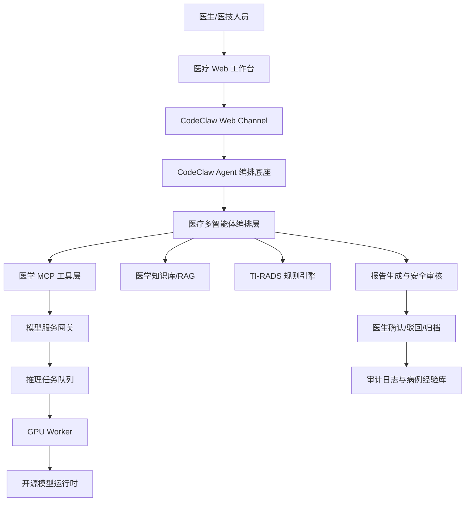
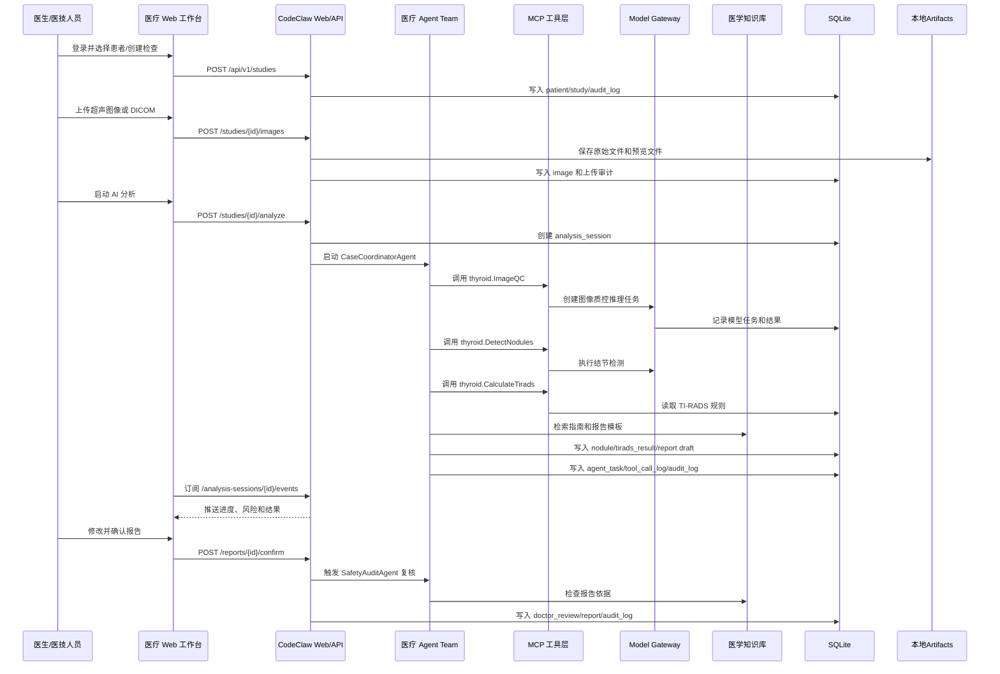
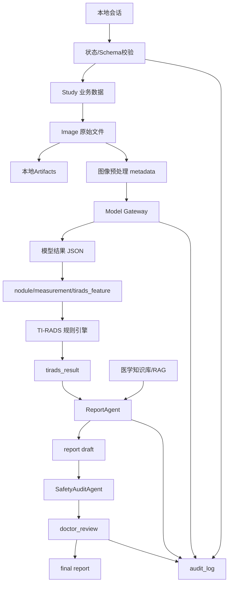
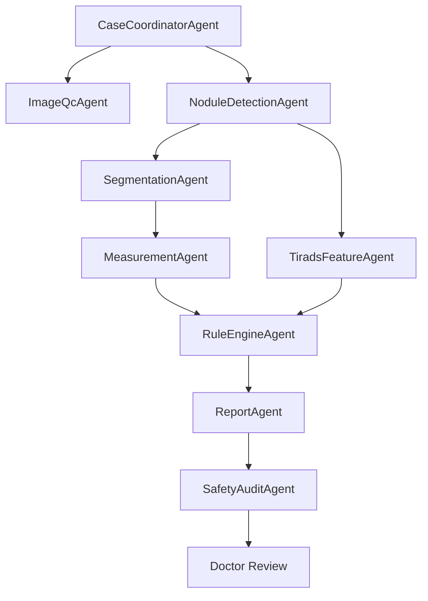
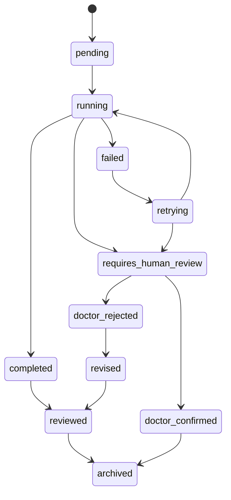
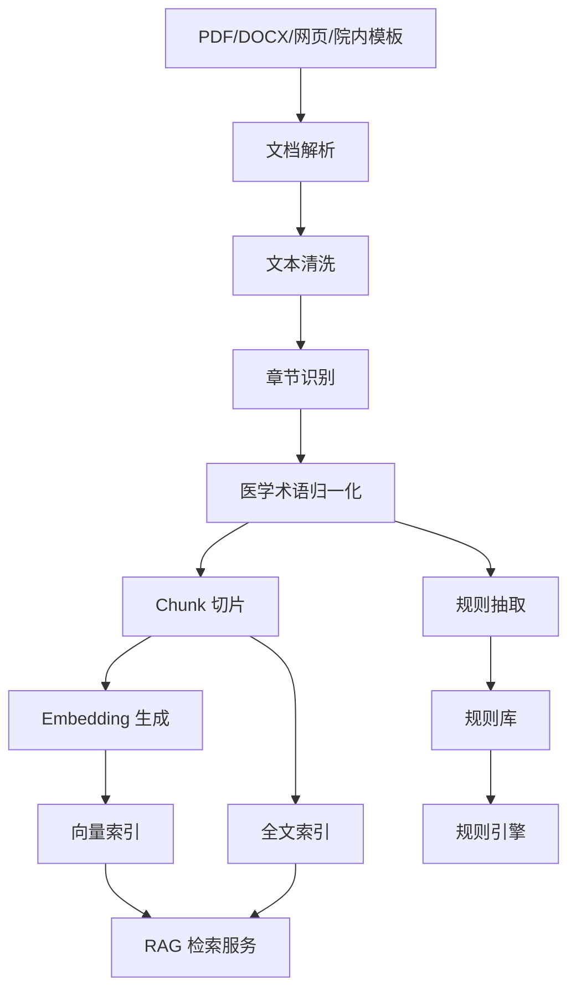
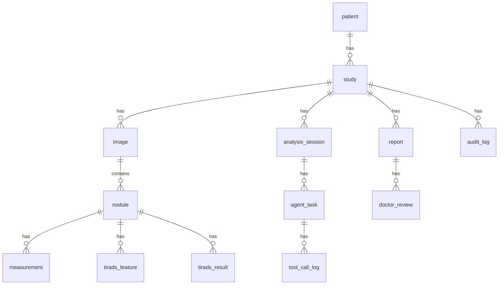
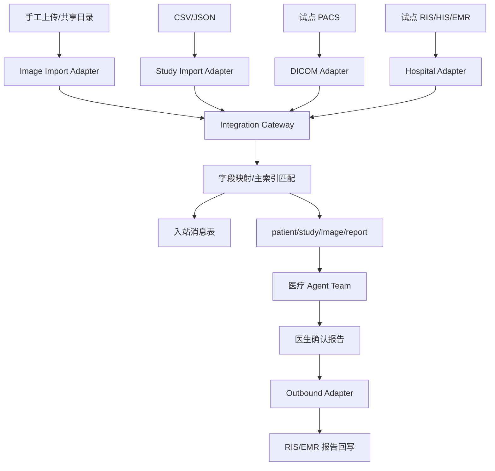

# 甲状腺 AI 智能体技术详细设计方案

版本：v1.0
文档类型：技术详细设计
目标形态：基于 CodeClaw 扩展的医疗 AI 多智能体平台
适用场景：甲状腺超声图像辅助分析、TI-RADS 分级、结构化报告生成、医生审核归档

## 1. 项目目标与系统定位

### 1.1 建设目标

本项目建设一个面向甲状腺超声场景的医疗 AI 智能体平台。系统以 CodeClaw 为通用智能体底座，在其 Agent、Subagent、Task、MCP、Web 会话、Provider 管理等能力之上扩展医疗业务能力，形成可私有化部署、可审计、可解释、可由医生闭环确认的甲状腺 AI 辅助分析系统。

系统需要支持以下核心能力：

- 接收甲状腺超声图像、DICOM 文件和检查基础信息。
- 调用开源模型完成图像质控、结节检测、分割、测量和 TI-RADS 特征识别。
- 基于 ACR TI-RADS、C-TIRADS、ATA 指南和院内规范建立医学知识库与规则引擎。
- 通过医疗多智能体编排完成病例拆解、模型调用、规则计算、报告生成和安全审核。
- 为医生提供可视化工作台，支持 AI 结果查看、报告编辑、人工确认、驳回和归档。
- 记录所有 Agent 决策、工具调用、模型版本、规则版本和医生修改，满足可追溯要求。

### 1.2 系统边界

本系统定位为医生辅助分析平台，不替代医生诊断。AI 输出不得作为最终诊断结论直接归档或对患者展示。验证版只做能力验证，报告由本地医生用户手动确认，不实现多角色权限体系。

系统不在 MVP 阶段承担以下范围：

- 不直接接入医院 HIS、EMR、PACS 的生产环境写入流程。
- 不作为医疗器械注册后的正式诊断设备。
- 不建设 PostgreSQL、分布式对象存储、生产级权限和多租户体系。
- 不进行自动治疗方案决策。
- 不在未脱敏情况下将患者数据进入训练集或病例经验库。
- 不把大模型自身知识作为医学结论依据。

### 1.3 验证版约束

本次开发目标是验证 CodeClaw 能否承载甲状腺 AI 智能体的核心能力，因此采用轻量化实现：

| 领域 | 验证版选择 | 后续生产版 |
|---|---|---|
| 业务数据库 | SQLite，复用 CodeClaw migration/repository 风格 | PostgreSQL 或医院指定数据库 |
| 图像与产物 | 本地目录 / CodeClaw artifacts | MinIO/S3/院内影像归档 |
| 知识库 | SQLite RAG + BM25/hybrid 检索 | PostgreSQL+pgvector 或 Qdrant/Milvus |
| 权限 | 不做业务 RBAC/ACL，仅保留本地 Web token 和医生手动确认 | 院内统一认证、RBAC、资源级 ACL |
| 影像接入 | 手工上传、共享目录导入 | PACS DICOM C-STORE 推送，DICOMweb 查询拉取备选 |
| 病历接入 | 手工录入、CSV 导入、JSON 导入 | RIS/HIS/EMR 正式接口 |
| 模型调度 | SQLite Job Queue + 本地 Worker 轮询 | GPU 队列和 Worker Pool |

### 1.4 组件选型最终版

本次验证版组件选型以“基于 CodeClaw、能力验证优先、轻量可运行、后续可升级”为原则。最终确认如下：

| 序号 | 组件 | 选型 |
|---:|---|---|
| 1 | 主存储 | SQLite |
| 2 | 图像与产物存储 | 本地 `data/artifacts` 目录 + SQLite 索引 |
| 3 | 后端 API | CodeClaw Node.js / TypeScript + 内置 `node:http` Server |
| 4 | 前端 UI | CodeClaw `web-react` + React + TypeScript |
| 5 | 医疗多智能体编排 | CodeClaw Agent Team + 医疗 TeamPlan 扩展 |
| 6 | MCP 工具体系 | CodeClaw MCP Manager + stdio MCP Server + 医疗工具包扩展 |
| 7 | 模型服务框架 | Python FastAPI + 本地 PyTorch Worker |
| 8 | 模型推理队列 | SQLite Job Queue + 本地 Worker 轮询 |
| 9 | 医学知识库/RAG | CodeClaw RAG embedding/hybrid + 医学知识结构化扩展 |
| 10 | TI-RADS 规则引擎 | TypeScript 确定性规则引擎 + SQLite 规则表 + MCP 工具 |
| 11 | 结节检测 | YOLOv11/Ultralytics YOLO 主模型 + RT-DETR/RF-DETR 对照验证 |
| 12 | 分割与测量 | MedSAM/MedSAM2 主线 + nnU-Net 监督基线 + Swin U-Net 对照 |
| 13 | 良恶性分类/TI-RADS 特征识别 | ResNet50 baseline + ViT/TC-ViT 主线 + ResNet-ViT 融合 + 多模态融合增强 |
| 14 | 报告生成 | Qwen3.6 主报告模型 + MedGemma 医学复核 + RAG 证据约束 + 模板化输出 |
| 15 | Embedding/Reranker | Qwen3-Embedding-8B + Qwen3-Reranker-8B，BGE-M3 备选 |
| 16 | 模型运行框架 | vLLM 主推理后端 + LM Studio/Ollama 开发调试备选 + Transformers 实验适配 |
| 17 | DICOM/图像预处理 | Python pydicom/OpenCV image-worker，不使用 CodeClaw dicom-mcp 运行链路 |
| 18 | 医院影像接入 | 验证版手工上传/共享目录；试点 PACS C-STORE，DICOMweb 备选 |
| 19 | 病历/检查信息接入 | 验证版手工录入 + CSV/JSON，不接 mock HIS/RIS |
| 20 | 报告输出 | Web 报告 + Markdown/HTML/PDF/JSON 导出 |
| 21 | 测试与评估 | Vitest + pytest + Playwright + JSON Schema/Zod + Python 模型评估脚本 |

验证版硬件假设：

```text
GPU：RTX 5090 32GB
CUDA：优先 CUDA 12.8
大模型策略：Qwen3.6 量化运行，图像模型和 RAG 模型按任务调度，避免多个重量级模型同时常驻 GPU
```

### 1.5 关键设计原则

```text
医学事实来自知识库
图像特征来自专用模型
分级判断来自规则引擎
报告表达由大模型辅助生成
最终结论由医生确认
所有过程必须可审计
```

## 2. CodeClaw 源码复用分析与扩展边界

### 2.1 已确认的 CodeClaw 能力

对当前目录下 `CodeClaw/` 原始源码进行阅读后，CodeClaw 可作为本项目的智能体运行底座。当前仓库根目录已经同步 CodeClaw 工作源码，后续实际开发落在根目录 `src/`、`packages/`、`web-react/`、`web/` 等目录中。本次开发原则上基于 CodeClaw 现有功能和代码进行扩展，避免另起一套 Agent 框架、Web 框架、MCP 框架或会话体系。重点可复用模块如下：

| 模块 | 源码位置 | 可复用能力 |
|---|---|---|
| QueryEngine | `CodeClaw/src/agent/queryEngine.ts` | 主 Agent 运行、slash command、工具注册、会话提交、Team 命令入口 |
| Agent Team | `CodeClaw/src/agent/team/` | TeamPlan、TeamRun、Blackboard、Mailbox、File Claim、Merge Gate、团队任务状态 |
| Subagent 角色定义 | `CodeClaw/src/agent/subagents/roles.ts` | 角色、工具权限、permission mode、角色指令 |
| Subagent 运行器 | `CodeClaw/src/agent/subagents/runner.ts` | 派生子 QueryEngine、隔离运行、继承 Provider、过滤工具集 |
| Task 工具 | `CodeClaw/src/agent/tools/taskTool.ts` | 父 Agent 启动子 Agent，并收集最终结果 |
| Subagent Registry | `CodeClaw/src/agent/subagents/registry.ts` | 子任务运行状态跟踪，可扩展为持久化任务审计 |
| Web Channel | `CodeClaw/src/channels/web/server.ts` | Web 会话、消息、附件、事件流、状态 API |
| Web React | `CodeClaw/web-react/src/` | 会话工作台、Team 面板、MCP/RAG/Graph/Report/Dashboard 面板模式 |
| Provider 管理 | `CodeClaw/src/provider/` | OpenAI/Anthropic/Ollama/LM Studio provider、fallback、可用性探测 |
| MCP 管理 | `CodeClaw/src/mcp/` | MCP server 配置、生命周期、工具聚合、工具调用 |
| RAG/Knowledge | `CodeClaw/src/rag/`、`CodeClaw/src/knowledge/` | workspace 级 RAG 索引、BM25/hybrid 检索、knowledge_search 证据包 |
| 存储与迁移 | `CodeClaw/src/storage/` | SQLite data/audit db、migration、TeamRunRepo、audit_events |
| DICOM MCP | `CodeClaw/packages/dicom-mcp/src/server.ts` | 本项目不纳入运行链路，仅作为参考代码；医学图像处理改由 Python image-worker 承担 |
| 医疗影像提示文档 | `CodeClaw/CODECLAW医疗影像.md` | 医学影像 Agent 角色提示雏形 |

### 2.2 CodeClaw 当前编排机制

CodeClaw 当前同时具备单 Subagent 调度和 Agent Team 团队调度两层能力。医疗平台应优先复用 Team 层做病例级编排，复用 Subagent 层做具体医学角色执行。

Subagent 调度机制如下：

```text
Parent Agent
  -> Task tool
    -> runSubagent
      -> create child QueryEngine
      -> filter allowed tools by role
      -> execute child prompt
      -> return final text to parent
```

当前实现的关键特征：

- 子 Agent 使用独立 session，避免与父会话状态混杂。
- 子 Agent 默认继承父 Agent 的 currentProvider、fallbackProvider 和 MCP manager。
- role.allowedTools 可以限制子 Agent 可用工具。
- runner 会移除子 Agent 内部的 Task 工具，防止递归创建子 Agent。
- 子任务默认最大运行时间为 5 分钟。
- 当前返回值以最终文本为主，不是面向医疗任务的强结构化结果。

Agent Team 调度机制如下：

```text
/team plan 或 /team run
  -> buildTeamPlan
  -> TeamTask DAG
  -> read-only worker 调用 Task/Subagent
  -> Blackboard 汇总事实和风险
  -> Merge Gate 按 reviewer/test evidence 判断是否通过
  -> TeamRunRepo 持久化 TeamRun 和 TeamClaims
  -> Web TeamPanel 展示任务、claim、merge gate
```

当前 Team 机制的关键特征：

- `TeamPlan` 支持 task、role、scope、deps、allowedTools、writePolicy、model、acceptance。
- `TeamRun` 内含 taskRuns、claims、mergeGate、blackboard、mailbox 和 summary。
- `MergeGate` 支持 reviewer-gated、test-gated、manual-gated。
- `TeamRunRepo` 已将 TeamRun 快照写入 `team_runs`，将文件 claim 写入 `team_claims`。
- Web 已暴露 `/v1/web/sessions/{id}/team-runs`、cancel、retry、write-preview、write 等接口。
- React 已有 `TeamPanel`，可作为医疗 Agent 任务看板的基础。

### 2.3 可直接复用部分

| 能力 | 复用方式 |
|---|---|
| Agent 生命周期 | 保留 CodeClaw QueryEngine 和消息流 |
| Team 编排 | 作为病例级医疗 Agent Team 的优先扩展点 |
| Subagent 调度 | 作为医学角色 worker 的底层运行机制 |
| Task 工具 | 扩展为可启动医学角色的任务工具 |
| Blackboard/Merge Gate | 扩展为医学事实、风险、证据、医生接管的门控机制 |
| TeamRun/Web TeamPanel | 扩展为病例分析任务流和医生可视化进度 |
| MCP 工具桥接 | 用于接入甲状腺模型服务、知识库、规则引擎 |
| Provider 管理 | 支持私有化开源大模型接入 |
| Web 会话 | 支撑医生工作台的病例分析对话和事件展示 |
| RAG/Knowledge | 扩展为医学指南、模板、规则和病例经验检索 |
| SQLite migration/repo | 复用迁移模式新增医疗业务表 |
| audit_events | 扩展医疗审计事件，不另建绕过审计的日志系统 |
| DICOM 处理雏形 | 扩展为医学影像预处理服务 |

### 2.4 需要扩展部分

| 缺口 | 扩展方案 |
|---|---|
| Team 角色偏代码任务 | 扩展医疗 TeamWorkerRole 和 MedicalAgentRole |
| Team 结果偏工程任务 | 增加医学 `resultSchema`、`evidenceSchema`、`humanReviewPolicy` |
| 子任务结果偏文本 | 增加结构化 JSON result schema，并在 Tool/MCP 层校验 |
| 医疗任务状态缺失 | 在 TeamRun 基础上增加 `analysis_session`、`agent_task`、`tool_call_log` 持久化 |
| 无医疗数据模型 | 新增 patient、study、image、nodule、report 等领域表 |
| 无 GPU 调度 | 增加 Model Gateway、推理队列和 GPU Worker |
| 无医学知识库 | 增加指南库、规则库、术语库、报告模板库、病例经验库 |
| 无医生审核闭环 | 增加报告审核、驳回、修改、签署、归档流程 |
| 无医疗安全约束 | 增加 SafetyAuditAgent、禁用语、证据校验和审计日志 |

### 2.5 CodeClaw 优先开发原则

后续工程开发必须遵守以下原则：

- 优先复用 `CodeClaw/src/agent/team/`，医疗多智能体编排不得另写独立 team runtime。
- 优先复用 `Task`、`Subagent` 和 ToolRegistry，医学角色不得绕过 CodeClaw 工具权限机制。
- 优先复用 `src/mcp/` 和 MCP server 模式，甲状腺模型、医学知识库、TI-RADS 规则引擎都以 MCP/HTTP 工具方式接入。
- 优先复用 `src/channels/web/` 与 `web-react/`，医生工作台在现有 Web Channel 和 React 面板体系上扩展。
- 优先复用 `src/storage/migrate.ts`、repository 模式和 `audit_events`，医疗业务表通过新增 migration 扩展。
- 优先复用 provider 配置能力，开源模型通过 vLLM、LM Studio、Ollama 或兼容 OpenAI API 的本地服务接入。
- DICOM 解析、脱敏、预览渲染和超声图像预处理统一进入 Python image-worker；CodeClaw 仅通过 MCP/HTTP 工具调用，不直接承担医学图像处理。
- 优先复用 RAG/Knowledge 架构，医学知识库在其检索、证据包和 provenance 模式上升级。

禁止事项：

- 禁止新建独立 Agent 框架替代 CodeClaw QueryEngine/Team。
- 禁止前端或模型服务绕过 CodeClaw 后端直接执行医疗状态流转。
- 禁止模型服务直接访问 HIS/EMR/PACS。
- 禁止大模型直接生成最终 TI-RADS 分级或正式报告。
- 禁止绕过 CodeClaw 审计、工具白名单和状态校验直接写数据库。

### 2.6 复用结论

CodeClaw 适合作为医疗 AI 平台的通用 Agent OS。项目不应重新开发独立 Agent 编排引擎，而应基于 CodeClaw 的 QueryEngine、Agent Team、Subagent、Task、MCP、Web、RAG、Provider、Storage 和 Audit 能力扩展医疗业务层。

推荐定位如下：

```text
CodeClaw = 通用智能体编排底座
医疗多智能体编排层 = 医疗领域工作流扩展
模型服务层 = 开源医学模型推理执行层
知识库与规则引擎 = 医学依据与确定性判断层
医生工作台 = 人机协同确认层
```

## 3. 总体技术架构设计

### 3.1 总体架构



### 3.2 技术分层

| 层级 | 职责 | 推荐技术 |
|---|---|---|
| 前端工作台 | 图像查看、AI 结果、报告编辑、审核归档 | React/Vite，复用 CodeClaw Web |
| 会话层 | 病例会话、消息、附件、事件流 | CodeClaw Web Channel |
| Agent 编排层 | 主 Agent、Subagent、Task、MCP 调用 | CodeClaw QueryEngine |
| 医疗编排层 | 医学角色、任务状态、失败接管 | 新增医疗 Agent Team |
| 医学工具层 | 模型工具、知识库工具、规则工具 | MCP / HTTP |
| 模型服务层 | 模型路由、任务队列、GPU 推理 | Python FastAPI、SQLite Job Queue、PyTorch |
| 知识库层 | 指南、术语、模板、病例经验 | CodeClaw RAG SQLite + embedding/hybrid + 医学 metadata |
| 规则引擎 | TI-RADS 分值、分级、建议 | TypeScript 确定性规则引擎 |
| 数据层 | 业务数据、审计、模型结果 | SQLite + 本地 artifacts 文件目录 |

### 3.3 核心运行链路

```text
1. 医生创建检查任务并上传图像
2. 系统创建 study 和 analysis_session
3. CaseCoordinatorAgent 拆解分析任务
4. ImageQcAgent 判断图像质量
5. NoduleDetectionAgent 调用检测模型
6. 对每个结节并行执行分割、测量、特征识别
7. RuleEngineAgent 调用 TI-RADS 规则引擎
8. ReportAgent 调用知识库和模板生成报告草稿
9. SafetyAuditAgent 审核报告和证据完整性
10. 医生查看、修改、确认或驳回
11. 系统归档报告、记录审计、沉淀病例经验
```

### 3.4 端到端运行流程详细设计

系统运行流程按“病例创建、图像接入、AI 分析、报告审核、归档反馈”五个阶段执行。验证版不做业务权限体系，每个阶段重点完成状态流转、结构化校验和审计记录。



运行阶段说明：

| 阶段 | 触发方 | 核心动作 | 主要写入 | 关键校验 |
|---|---|---|---|---|
| 登录与会话 | 用户 | 建立本地会话 | session、audit_log | 本地 token 或单用户模式 |
| 病例创建 | 医生/医技 | 创建 patient、study | patient、study | 必填字段、状态初始化 |
| 图像上传 | 医生/医技 | 保存图像、生成预览、脱敏 metadata | image、audit_log | 文件类型、大小、PHI |
| 启动分析 | 医生 | 创建分析任务 | analysis_session、agent_task | study 状态、图像可用、配额 |
| 图像质控 | Agent | 判断是否可分析 | image_quality、agent_task | 低质量图像阻断自动分析 |
| 模型推理 | Agent/MCP | 调用检测、分割、分类模型 | nodule、measurement、tirads_feature | 模型版本、置信度、schema |
| 规则计算 | Agent/规则引擎 | 生成分值、分级、建议类型 | tirads_result | 规则版本、枚举值、尺寸阈值 |
| RAG 取证 | ReportAgent | 检索指南、模板、相似病例 | tool_call_log、evidence | 知识版本、审核状态、来源 |
| 报告生成 | ReportAgent | 生成结构化草稿 | report | 不得输出最终诊断 |
| 安全审核 | SafetyAuditAgent | 检查越权、冲突、缺证据 | audit_log、risk_items | 高风险项阻断确认 |
| 医生确认 | 医生 | 修改、确认、归档 | doctor_review、report | 报告状态、安全审核 |
| 反馈沉淀 | 系统/医生 | 进入病例经验库 | case_knowledge | 脱敏、手动勾选可学习标记 |

### 3.5 核心数据流设计

系统数据流分为业务数据流、图像产物流、模型结果流、知识证据流、报告流和审计流。验证版不实现业务权限流，所有数据流必须明确数据落点和生命周期。



业务数据流：

| 数据 | 来源 | 存储 | 消费方 | 生命周期 |
|---|---|---|---|---|
| patient | 手工录入或 CSV/JSON 导入 | SQLite | 工作台、报告 | 验证版脱敏或模拟数据 |
| study | 检查创建 | SQLite | Agent、工作台、报告 | 全流程主索引 |
| image | 图像上传 | 本地 artifacts + SQLite metadata | 模型服务、工作台 | 本地路径记录，预览可展示 |
| analysis_session | 启动分析 | SQLite | Agent Team、事件流 | 记录一次 AI 分析全过程 |
| nodule | 检测模型或医生标注 | SQLite | 测量、分级、报告 | 可被医生修订 |
| tirads_result | 规则引擎 | SQLite | 报告、解释、审核 | 必须绑定规则版本 |
| report | ReportAgent 和医生 | SQLite | 医生、审核、归档 | 草稿与最终版分离 |
| case_knowledge | 医生确认病例 | SQLite + RAG 索引 | 相似病例检索 | 验证版仅使用脱敏样例 |

图像与模型产物流：

```text
原始图像/DICOM
-> 本地 artifacts/raw 区
-> 脱敏 metadata
-> 预览图 preview
-> 模型输入图 model-ready
-> 检测框 bbox
-> 结节裁剪 crop
-> 分割 mask
-> overlay 图层
-> 测量和特征 JSON
```

要求：

- 原始图像 URI 在验证版为本地 artifacts 路径，生产版再替换为对象存储 URI。
- Model Gateway 只接收本地文件路径或 artifact URI，不接收前端 base64 大包。
- 模型产物必须带 `study_id`、`image_id`、`model_version`、`trace_id`。
- overlay、mask、crop 等衍生产物不得替代原始图像。

知识证据流：

```text
指南/模板/院内规范
-> 文档解析
-> chunk + metadata
-> 人工审核
-> 向量索引/全文索引/规则库
-> Agent 检索 evidence pack
-> 报告草稿引用 evidence
-> SafetyAuditAgent 校验证据与结论
```

要求：

- 未审核知识不得被 ReportAgent 用于生成医学建议。
- RAG 返回必须包含 source、version、chunk_id、review_status。
- 报告中的建议必须能追溯到 `tirads_rules`、CodeClaw `rag_chunks` 或 `medical_chunk_metadata`。

审计数据流：

```text
用户操作
Agent 任务
MCP 工具调用
模型推理
知识库检索
规则计算
医生修改
报告确认
-> audit_log/tool_call_log/doctor_review
```

审计记录不得被普通医生修改或删除。平台管理员只能查看和导出授权范围内的审计数据，不能篡改历史记录。

### 3.6 部署拓扑

MVP 阶段建议采用单机或单服务器部署：

```text
CodeClaw Node 服务
SQLite data.db / thyroid.db
FastAPI Model Gateway
SQLite model_job 表
Python image-worker
1 个 RTX 5090 GPU Worker
vLLM / LM Studio / Ollama 本地模型服务
本地 artifacts 文件目录
```

平台化阶段升级为：

```text
Web/API 服务多副本
独立 Agent Worker
独立 Model Gateway
GPU Worker Pool
PostgreSQL 主从或云数据库
Qdrant/Milvus 向量库
MinIO/S3 对象存储
统一审计与监控
```

## 4. 基于 CodeClaw 的医疗多智能体编排设计

### 4.1 设计定位

本项目不重写 CodeClaw 的通用编排层，而是在其上新增医疗多智能体编排层。两者职责不冲突：

| 层级 | 负责内容 | 不负责内容 |
|---|---|---|
| CodeClaw 通用编排层 | Agent 运行、Subagent 启动、工具注册、MCP 接入、Provider 管理、会话事件 | 医学流程、医学安全、TI-RADS 规则 |
| 医疗多智能体编排层 | 医疗角色、病例任务流、模型调用策略、证据校验、安全审核、医生接管 | 底层 Agent engine、MCP 协议实现 |
| 模型服务层 | 图像质控、检测、分割、分类、报告模型推理 | Agent 推理链路、医生审核 |

### 4.2 Agent Team 总体结构



### 4.3 医疗 Agent 角色详细设计

| Agent | 职责 | 输入 | 输出 | 主要工具 | 失败处理 |
|---|---|---|---|---|---|
| CaseCoordinatorAgent | 病例总控、任务拆解、状态汇总 | study、images、history | analysis_plan、final_summary | session、task、medical.SearchGuideline | 子任务失败则标记人工接管 |
| ImageQcAgent | 判断图像质量、方向、是否可分析 | image_id、image_uri、metadata | quality_score、reject_reason | thyroid.ImageQC | 低质量图像停止后续自动分析 |
| NoduleDetectionAgent | 识别结节候选区域 | image_id、image_uri | nodules[] bbox、confidence | thyroid.DetectNodules | 置信度低则进入医生标注 |
| SegmentationAgent | 生成结节 mask | image、bbox | mask_uri、contour、confidence | thyroid.SegmentNodule | 失败时允许基于 bbox 粗测量 |
| MeasurementAgent | 计算长径、短径、面积、纵横比 | image、mask、pixel_spacing | measurements | thyroid.MeasureNodule | 缺少 pixel spacing 时标记不可量化 |
| TiradsFeatureAgent | 判断 TI-RADS 特征 | nodule crop、metadata | composition、echogenicity、shape、margin、foci | thyroid.ClassifyTiradsFeatures | 模型冲突则要求医生确认 |
| RuleEngineAgent | 计算分值、分级、建议 | tirads_features、size | score、category、recommendation | thyroid.CalculateTirads、medical.GetTiradsRule | 规则缺失时禁止给出分级 |
| ReportAgent | 生成报告草稿 | AI 结果、模板、证据 | report_draft | medical.GetReportTemplate、medical.SearchGuideline | 证据不足时只生成描述，不生成建议 |
| SafetyAuditAgent | 检查越权、冲突、缺证据 | report_draft、evidence、rules | audit_result、risk_items | medical.CheckReportAgainstGuideline | 有高风险项则阻止提交 |

### 4.4 CodeClaw 角色扩展方案

当前 CodeClaw 的 `BUILTIN_ROLES` 是代码任务角色。医疗平台新增角色时建议采用两种策略之一：

第一阶段低侵入方案：

```text
保留 CodeClaw roles.ts
新增 medicalRoles.ts
启动医疗任务时在 Task tool 外层进行 role 映射
```

第二阶段平台化方案：

```text
将 BUILTIN_ROLES 改造为可注册 RoleRegistry
系统角色、项目角色、医疗角色分层加载
Task tool enum 动态读取 RoleRegistry
每个 role 绑定 allowedTools、providerProfile、resultSchema
```

推荐最终角色定义结构：

```ts
interface MedicalAgentRole {
  name: string;
  displayName: string;
  description: string;
  allowedTools: string[];
  permissionMode: "default" | "plan" | "acceptEdits";
  providerProfile: "medical_text" | "medical_vision" | "rule_only";
  resultSchema: string;
  instructions: string;
  maxDurationMs: number;
}
```

医疗角色不应具备文件写入、系统命令、任意网络访问等能力，除非明确用于受控模型服务调用。

### 4.5 Agent 调度状态机

每次 AI 分析对应一个 `analysis_session`，每个 Agent 子任务对应一个 `agent_task`。



状态说明：

| 状态 | 含义 |
|---|---|
| `pending` | 已创建，等待执行 |
| `running` | Agent 或工具正在执行 |
| `completed` | 子任务完成，结果结构化校验通过 |
| `failed` | 工具调用失败、模型错误或 schema 校验失败 |
| `retrying` | 按策略重试 |
| `requires_human_review` | 需要医生确认或人工标注 |
| `doctor_confirmed` | 医生接受 AI 结果 |
| `doctor_rejected` | 医生驳回 AI 结果 |
| `revised` | 医生或 Agent 根据反馈修订 |
| `archived` | 最终归档 |

### 4.6 结构化输入输出约束

医疗 Agent 不允许只返回自由文本。所有关键输出必须满足 JSON Schema。

结节检测输出示例：

```json
{
  "study_id": "S202605070001",
  "image_id": "IMG001",
  "nodules": [
    {
      "nodule_id": "N1",
      "bbox": [120, 88, 260, 210],
      "confidence": 0.86,
      "source_model": "rtdetr-thyroid-v1",
      "requires_review": false
    }
  ]
}
```

TI-RADS 特征输出示例：

```json
{
  "nodule_id": "N1",
  "features": {
    "composition": "solid",
    "echogenicity": "hypoechoic",
    "shape": "wider_than_tall",
    "margin": "smooth",
    "echogenic_foci": "none"
  },
  "confidence": {
    "composition": 0.88,
    "echogenicity": 0.81,
    "shape": 0.93,
    "margin": 0.77,
    "echogenic_foci": 0.84
  },
  "requires_review": true,
  "review_reasons": ["margin_confidence_below_threshold"]
}
```

### 4.7 Agent 与开源模型服务边界

Agent Team 负责医学任务决策和流程编排，开源模型服务负责具体推理。

```text
Agent 不直接加载模型权重
Agent 不直接访问 GPU
Agent 不直接解析模型中间 tensor
Agent 只通过 MCP/HTTP 工具调用模型服务
模型服务必须返回结构化 JSON
```

边界设计：

| 能力 | 所属层 |
|---|---|
| 是否需要执行图像质控 | Agent |
| 具体图像质控推理 | 模型服务 |
| 是否需要医生确认 | Agent + 安全规则 |
| 结节 bbox 生成 | 模型服务 |
| TI-RADS 分级 | 规则引擎 |
| 报告语言组织 | ReportAgent + LLM |
| 最终报告确认 | 医生 |

### 4.8 失败、重试与人工接管

必须触发人工接管的场景：

- 图像质量不足或不符合甲状腺超声场景。
- 缺少 pixel spacing，无法生成可靠毫米级测量。
- 结节检测置信度低于阈值。
- 多模型或多图像结果冲突。
- TI-RADS 特征置信度低或无法分类。
- 规则引擎无法匹配指南版本。
- 知识库未检索到可靠证据。
- 报告中存在“确诊恶性”“无需医生确认”等越权表述。
- SafetyAuditAgent 发现证据与结论不一致。

重试策略：

| 类型 | 重试策略 |
|---|---|
| 网络超时 | 最多重试 2 次，指数退避 |
| 模型服务 5xx | 重试 1 次，失败后人工接管 |
| schema 校验失败 | 不重试，记录原始输出并人工接管 |
| 低置信度 | 不自动重试，转医生确认 |
| 知识库无依据 | 不生成确定性建议 |

## 5. 开源模型选择与论证

### 5.1 选型原则

开源模型选择遵循以下原则：

- 优先私有化部署，避免患者数据出院或出私有网络。
- 图像检测、分割、测量使用专用视觉模型，不交给通用大模型自由判断。
- 医学文本和报告生成使用医学调优模型或中文能力强的通用模型。
- TI-RADS 分级由规则引擎完成，不由大模型生成。
- 所有模型必须记录模型名称、版本、权重 hash、推理参数和输入输出。
- 商业化部署前必须完成许可证审查。

### 5.2 医学文本与报告生成模型

报告生成采用“模板 + 结构化结果 + RAG 证据 + 大模型润色”的受控模式。大模型不得直接决定 TI-RADS 分级，也不得越过医生确认输出最终诊断。

| 模型 | 定位 | 优点 | 风险 | 推荐用途 |
|---|---|---|---|---|
| Qwen3.6 | 主报告模型 | 中文表达、长上下文、工具调用和结构化输出能力强，适合私有化部署 | 非医学专用，必须受 RAG、模板、规则和安全审核约束 | 报告草稿、结构化摘要、医生修改建议 |
| MedGemma | 医学复核辅助模型 | 医学语义和医学安全表达更强 | 中文报告适配和许可证需实测与审查 | 医学表达复核、风险提示、安全审核辅助 |
| Qwen3-VL | 视觉语言辅助模型 | 能结合图像和文字解释模型结果 | 不作为结节检测、分割或最终分级依据 | 图像说明、报告辅助描述、医生解释材料 |

验证版推荐组合：

```text
主报告模型：Qwen3.6
医学复核模型：MedGemma
报告约束：报告模板 + TI-RADS 规则结果 + CodeClaw RAG evidence pack + SafetyAuditAgent
医生职责：最终确认、修改、签署和归档
```

### 5.3 结节检测模型

| 方案 | 优点 | 风险 | 结论 |
|---|---|---|---|
| YOLOv11 / Ultralytics YOLO 系列 | 实时性强、工程成熟、检测链路完整 | 默认 AGPL-3.0 或企业授权，进入正式部署前必须完成许可证审查 | 验证版主检测模型 |
| RT-DETR | 实时 Detection Transformer，许可边界更友好，适合定制训练 | 需要甲状腺超声数据微调 | Transformer 对照模型 |
| RF-DETR | 实时 DETR 体系，适合做检测/实例分割方向探索 | 医疗落地需要本院数据评测 | Transformer 对照模型 |
| MMDetection | PyTorch 检测工具箱，模型丰富 | 工程配置较重 | 训练评测平台和模型对比框架 |

验证版采用双模型验证：

```text
主模型：YOLOv11 / Ultralytics YOLO 系列
对照模型：RT-DETR / RF-DETR
输出策略：主模型给出 bbox、置信度和可追踪理由；对照模型用于一致性校验
```

检测理由不得由大模型自由生成，应来自以下可计算信号：

| 理由信号 | 说明 |
|---|---|
| 主模型置信度 | YOLO 检测 confidence |
| 对照模型一致性 | RT-DETR/RF-DETR 是否检出同一区域 |
| bbox IoU | 主模型与对照模型 bbox 重叠度 |
| 图像质量 | image-worker 或 ImageQcAgent 输出 |
| 边界风险 | 是否靠近文字、标尺、边缘或强伪影区域 |
| 小结节风险 | 小尺寸结节低置信度时强制医生复核 |

### 5.4 分割与测量模型

| 模型 | 用途 | 选择理由 |
|---|---|---|
| MedSAM | 基于提示框的医学图像分割 | 适合使用检测 bbox 作为 prompt，快速建立分割基线 |
| MedSAM2 | 多帧、视频或 3D 医学图像方向扩展 | 超声动态图像或连续帧场景优先评估 |
| nnU-Net | 医学分割强监督基线 | 有本院 mask 标注后作为监督训练主基线 |
| Swin U-Net | Transformer U-Net 分割对照 | 适合评估边界、全局上下文和小结节分割 |

测量逻辑必须基于 DICOM pixel spacing 或设备标定信息。缺少标定信息时，系统只能输出像素级尺寸，不得输出毫米级医学测量结论。

### 5.5 良恶性分类与 TI-RADS 特征识别模型

良恶性分类和 TI-RADS 特征识别属于二阶段模型任务，不能替代结节检测、分割和规则引擎。模型只输出结构化特征候选、良恶性风险概率和置信度。

| 模型 | 定位 | 结论 |
|---|---|---|
| ResNet50 | 稳健 CNN baseline，适合局部纹理、边缘和回声特征 | 必须保留 baseline |
| ViT / TC-ViT | 全局形态建模能力强，适合复杂纹理和整体形态判断 | 主线高性能模型 |
| ResNet-ViT 融合 | CNN 局部纹理 + Transformer 全局上下文 | 最终候选之一 |
| 多模态融合 | 融合 B-mode、SWE、Doppler 和临床结构化信息 | 有多模态数据时作为增强版 |
| MedGemma | 医学解释和复核辅助 | 不作为最终分类器 |

多模态融合验证版优先采用 late fusion：

```text
B-mode -> ResNet/ViT feature
SWE -> ResNet/ViT feature
Doppler -> ResNet/ViT feature
临床结构化信息 -> MLP feature
concat + modality mask
-> fusion MLP
-> TI-RADS 特征概率 / 良恶性风险概率
```

### 5.6 向量与重排模型

知识库检索建议采用：

```text
Embedding 主模型：Qwen3-Embedding-8B
Reranker 主模型：Qwen3-Reranker-8B
轻量备选：Qwen3-Embedding-0.6B / Qwen3-Reranker-0.6B
兼容备选：BGE-M3
检索存储：复用 CodeClaw rag_chunks.embedding BLOB，不引入独立向量数据库
```

医学 RAG 需要支持 metadata filter、版本过滤、指南来源过滤和证据级别过滤。单纯向量相似度不足以支撑医疗安全。

### 5.7 模型运行框架与硬件策略

验证版使用 RTX 5090 32GB 单卡作为主算力。模型运行采用 vLLM 主推理后端，LM Studio/Ollama 作为开发调试备选，Transformers 原生用于特殊模型实验和适配。

```text
主推理后端：vLLM
开发调试：LM Studio / Ollama
实验适配：Transformers 原生
模型调度：SQLite model_job 队列，避免多个重量级模型同时常驻 GPU
```

Qwen3.6 这类大模型在 32GB 显存下应采用量化运行。图像模型、Embedding/Reranker 和 MedGemma 按任务调度或按需加载。

### 5.8 模型选型结论

验证版推荐组合：

| 能力 | 推荐实现 |
|---|---|
| 报告生成 | Qwen3.6 主报告模型 + 模板 + RAG evidence pack |
| 医学复核 | MedGemma 辅助复核和安全提示 |
| 多模态解释 | Qwen3-VL / MedGemma 辅助，不参与最终分级 |
| 结节检测 | YOLOv11 主模型 + RT-DETR/RF-DETR 对照验证 |
| 分割测量 | MedSAM/MedSAM2 + nnU-Net + Swin U-Net |
| 良恶性与特征识别 | ResNet50 + ViT/TC-ViT + ResNet-ViT 融合 + 多模态融合增强 |
| Embedding/Reranker | Qwen3-Embedding-8B + Qwen3-Reranker-8B，BGE-M3 备选 |
| 训练框架 | PyTorch + MONAI |
| 推理服务 | Python FastAPI + PyTorch Worker + vLLM |
| 规则分级 | TypeScript TI-RADS 确定性规则引擎 |

## 6. 医学知识库与 RAG 设计

### 6.1 知识库定位

知识库是医疗 AI 平台的医学依据层。它不是普通聊天问答库，而是为 Agent 提供证据、规则、术语、模板和病例经验的可信来源。

系统知识库由 CodeClaw RAG 底座和医学扩展模块组成。CodeClaw 负责 `rag_chunks`、`rag_terms`、`rag_chunks.embedding` 和 hybrid search；医学扩展负责来源、版本、审核、规则、模板、安全和证据关系。

| 医学扩展模块 | 内容 | 用途 |
|---|---|---|
| `medical_documents` | 指南、论文、模板、院内规范的来源、版本、审核状态 | 文档级 provenance |
| `medical_chunk_metadata` | 给 CodeClaw `rag_chunks` 补医学 metadata | 证据过滤、版本过滤和安全审核 |
| `tirads_rules` | ACR TI-RADS、C-TIRADS 等结构化规则 | 确定性规则推理 |
| `medical_terms` | 标准术语、同义词、禁用词、中英文映射 | 统一报告语言和模型输出 |
| `report_templates` | 检查描述、结论、建议和分级模板 | 支撑报告草稿生成 |
| `evidence_links` | 报告、规则、建议与证据 chunk 的引用关系 | 证据追溯和报告回放 |
| `safety_rules` | 禁止表达、低置信度阻断、无依据建议拦截 | SafetyAuditAgent 审核 |
| `knowledge_ingestion_job` | 文档解析、切片、embedding、审核发布任务状态 | 知识库流水线追踪 |
| `case_knowledge` | 医生确认后的脱敏病例和修改记录 | 相似病例参考和模型评估 |

### 6.2 知识来源

第一阶段建议纳入以下知识来源：

| 来源 | 类型 | 优先级 | 说明 |
|---|---|---|---|
| 医院内部超声报告规范 | 院内规范 | 最高 | 决定报告格式、术语和禁用表达 |
| ACR TI-RADS | 国际指南 | 高 | 甲状腺结节超声特征、分级、FNA/随访建议 |
| C-TIRADS 2020 | 国内指南 | 高 | 中国临床场景下的风险分层 |
| ATA 2015 | 临床管理指南 | 中 | 补充结节管理、FNA、随访等临床建议 |
| 医生确认病例 | 病例经验 | 中 | 只能作为参考，不能覆盖指南和规则 |
| 模型推理记录 | 模型证据 | 低 | 用于回放、质量评估和持续改进 |

知识冲突时按以下优先级处理：

```text
医院内部规范
> 国内指南
> 国际指南
> 专家共识/论文
> 医生确认病例
> 大模型自身知识
```

大模型自身知识优先级最低，不能作为医学结论来源。

### 6.3 知识摄取流程



摄取要求：

- 每个 chunk 必须记录来源、页码、章节、版本、发布时间、生效时间。
- 指南类文档必须经过人工审核后才能启用。
- 院内规范需要记录审批人和审批时间。
- 禁止未经脱敏的病例文本进入知识库。
- 知识更新必须保留旧版本，支持历史报告回放。

### 6.4 Chunk 设计

医学知识切片不宜只按固定长度切分，应采用章节语义切分。

推荐 chunk metadata：

```json
{
  "chunk_id": "KG-ACR-2017-0001",
  "document_id": "DOC-ACR-TIRADS-2017",
  "source_type": "guideline",
  "source_name": "ACR TI-RADS",
  "source_version": "2017",
  "section_title": "Composition",
  "topic": "tirads_feature_scoring",
  "language": "en",
  "page_no": 3,
  "effective_date": "2017-05-01",
  "evidence_level": "guideline",
  "review_status": "approved"
}
```

切片规则：

| 内容类型 | 切片策略 |
|---|---|
| 指南章节 | 按标题、表格、建议项切分 |
| TI-RADS 表格 | 结构化抽取为规则，同时保留原文 chunk |
| 报告模板 | 按部位、描述、结论、建议切分 |
| 病例经验 | 按检查、结节、医生结论切分 |
| 术语库 | 不切片，结构化存储 |

### 6.5 存储设计

MVP 阶段推荐：

```text
SQLite + CodeClaw RAG SQLite
```

生产平台化阶段可升级为：

```text
PostgreSQL 或院内指定数据库 + Qdrant/Milvus + Elasticsearch/OpenSearch
```

存储分工：

| 存储 | 内容 |
|---|---|
| SQLite | 医学结构化实体、规则、版本、审计、报告模板、chunk metadata |
| CodeClaw RAG SQLite | `rag_chunks`、`rag_terms`、`embedding BLOB`、BM25/vector/RRF hybrid 检索 |
| 本地全文索引 | 关键词检索、术语命中、精确条款检索；验证版优先复用 CodeClaw BM25 |
| 本地 artifacts | 原始指南文件、报告附件、图像文件 |

### 6.6 核心数据表

```sql
CREATE TABLE medical_documents (
  id TEXT PRIMARY KEY,
  title TEXT NOT NULL,
  source_type TEXT NOT NULL,
  source_name TEXT NOT NULL,
  version TEXT NOT NULL,
  language TEXT NOT NULL,
  effective_date TEXT,
  file_uri TEXT,
  review_status TEXT NOT NULL,
  approved_by TEXT,
  approved_at INTEGER,
  created_at INTEGER NOT NULL
);

CREATE TABLE medical_chunk_metadata (
  id TEXT PRIMARY KEY,
  document_id TEXT NOT NULL REFERENCES medical_documents(id),
  rag_chunk_id TEXT NOT NULL UNIQUE,
  section_title TEXT,
  chunk_type TEXT NOT NULL,
  topic TEXT,
  page_no INTEGER,
  source_type TEXT NOT NULL,
  guideline_version TEXT,
  evidence_level TEXT,
  tirads_system TEXT,
  body_part TEXT,
  review_status TEXT NOT NULL,
  metadata_json TEXT NOT NULL DEFAULT '{}',
  created_at INTEGER NOT NULL
);

CREATE TABLE medical_terms (
  id TEXT PRIMARY KEY,
  canonical_name TEXT NOT NULL,
  synonyms_json TEXT NOT NULL DEFAULT '[]',
  category TEXT NOT NULL,
  description TEXT,
  standard_code TEXT,
  forbidden INTEGER NOT NULL DEFAULT 0,
  created_at INTEGER NOT NULL
);

CREATE TABLE report_templates (
  id TEXT PRIMARY KEY,
  template_name TEXT NOT NULL,
  scene TEXT NOT NULL,
  tirads_category TEXT,
  template_text TEXT NOT NULL,
  required_fields_json TEXT NOT NULL DEFAULT '[]',
  forbidden_phrases_json TEXT NOT NULL DEFAULT '[]',
  version TEXT NOT NULL,
  status TEXT NOT NULL,
  created_at INTEGER NOT NULL
);

CREATE TABLE evidence_links (
  id TEXT PRIMARY KEY,
  source_type TEXT NOT NULL,
  source_id TEXT NOT NULL,
  rag_chunk_id TEXT NOT NULL,
  document_id TEXT REFERENCES medical_documents(id),
  evidence_role TEXT NOT NULL,
  quote_text TEXT,
  confidence REAL,
  created_at INTEGER NOT NULL
);

CREATE TABLE safety_rules (
  id TEXT PRIMARY KEY,
  rule_code TEXT NOT NULL UNIQUE,
  rule_type TEXT NOT NULL,
  severity TEXT NOT NULL,
  pattern TEXT,
  rule_json TEXT NOT NULL DEFAULT '{}',
  message TEXT NOT NULL,
  status TEXT NOT NULL,
  created_at INTEGER NOT NULL
);

CREATE TABLE knowledge_ingestion_job (
  id TEXT PRIMARY KEY,
  document_id TEXT REFERENCES medical_documents(id),
  job_type TEXT NOT NULL,
  status TEXT NOT NULL,
  input_json TEXT NOT NULL DEFAULT '{}',
  output_json TEXT,
  error_json TEXT,
  created_at INTEGER NOT NULL,
  started_at INTEGER,
  completed_at INTEGER
);

CREATE TABLE case_knowledge (
  id TEXT PRIMARY KEY,
  study_id TEXT NOT NULL,
  nodule_id TEXT,
  doctor_final_result_json TEXT NOT NULL,
  ai_result_json TEXT NOT NULL,
  doctor_revision_json TEXT NOT NULL DEFAULT '{}',
  approved_for_learning INTEGER NOT NULL DEFAULT 0,
  deidentified INTEGER NOT NULL DEFAULT 0,
  created_at INTEGER NOT NULL
);
```

说明：验证版不另建 embedding 表，不在医学扩展表内直接存向量；向量统一复用 CodeClaw `rag_chunks.embedding`，医学扩展表只保存文档、规则、模板、证据关系、安全规则和病例经验的结构化索引。

### 6.7 RAG 检索流程

医疗 RAG 采用混合检索，不允许单纯向量检索直接进入大模型。

```text
Agent 任务或医生问题
-> 医学术语归一化
-> 意图分类
-> metadata filter
-> 向量检索
-> 关键词检索
-> 规则检索
-> rerank
-> 证据片段去重
-> 证据可信度评分
-> 返回带来源的 evidence pack
-> Agent 生成解释或报告
-> SafetyAuditAgent 审核
```

检索约束示例：

```json
{
  "query": "1.4cm 实性低回声结节为什么是 TR4",
  "filters": {
    "source_type": ["guideline", "hospital_policy"],
    "source_name": ["ACR TI-RADS", "C-TIRADS"],
    "topic": ["tirads_feature_scoring", "fna_followup"],
    "review_status": "approved"
  },
  "top_k": 8,
  "rerank": true,
  "require_citation": true
}
```

### 6.8 RAG 输出结构

```json
{
  "answerable": true,
  "evidence": [
    {
      "chunk_id": "KG-ACR-2017-0001",
      "source_name": "ACR TI-RADS",
      "source_version": "2017",
      "section_title": "Risk Stratification",
      "page_no": 5,
      "text": "evidence snippet",
      "score": 0.91
    }
  ],
  "rules": [
    {
      "rule_id": "ACR-TR4-FNA-001",
      "system_name": "ACR TI-RADS",
      "system_version": "2017"
    }
  ],
  "warnings": []
}
```

如果 `answerable=false`，ReportAgent 不得生成确定性医学建议。

### 6.9 知识库工具接口

| 工具 | 输入 | 输出 | 用途 |
|---|---|---|---|
| `medical.SearchGuideline` | query、filters、top_k | evidence[] | 检索指南依据 |
| `medical.GetTiradsRule` | system、version、feature | rule | 查询规则 |
| `medical.NormalizeTerm` | text | normalized_terms[] | 术语归一化 |
| `medical.GetReportTemplate` | scene、category | template | 获取报告模板 |
| `medical.SearchSimilarCases` | features、size、category | cases[] | 检索相似病例 |
| `medical.CheckReportAgainstGuideline` | report、evidence | risk_items[] | 指南一致性审核 |
| `medical.ExplainTiradsResult` | result、rules | explanation | 解释分级依据 |

### 6.10 知识库安全要求

- 每条医学建议必须有来源。
- 每条来源必须有版本。
- 每个版本必须有审核状态。
- 未审核知识不得进入报告生成。
- 过期指南不得默认启用。
- 医生未确认病例不得进入病例经验库。
- 病例进入知识库前必须完成脱敏。
- RAG 未检索到可靠证据时必须拒答或转人工。

## 7. 甲状腺 TI-RADS 规则引擎设计

### 7.1 设计目标

TI-RADS 规则引擎负责将结构化超声特征转换为分值、分级和建议。该模块必须是确定性的、可测试的、可审计的，不允许由大模型自由生成分级。

### 7.2 支持规则体系

MVP 阶段支持：

```text
ACR TI-RADS 2017
C-TIRADS 2020
```

后续可扩展：

```text
ATA 2015
K-TIRADS
EU-TIRADS
院内自定义规则
```

### 7.3 输入结构

```json
{
  "system_name": "ACR_TI_RADS",
  "system_version": "2017",
  "nodule_id": "N1",
  "size_mm": {
    "long_axis": 14.2,
    "short_axis": 8.1,
    "ap_axis": 7.4
  },
  "features": {
    "composition": "solid",
    "echogenicity": "hypoechoic",
    "shape": "wider_than_tall",
    "margin": "smooth",
    "echogenic_foci": "none"
  },
  "feature_confidence": {
    "composition": 0.88,
    "echogenicity": 0.81,
    "shape": 0.93,
    "margin": 0.77,
    "echogenic_foci": 0.84
  }
}
```

### 7.4 输出结构

```json
{
  "nodule_id": "N1",
  "system_name": "ACR_TI_RADS",
  "system_version": "2017",
  "score": 4,
  "category": "TR4",
  "recommendation": {
    "type": "follow_up_or_fna_by_size_threshold",
    "text": "建议由医生结合指南、结节大小和临床信息确认随访或 FNA 策略"
  },
  "evidence_rules": ["ACR-2017-COMP-SOLID", "ACR-2017-ECHO-HYPO"],
  "requires_doctor_review": true,
  "warnings": ["margin_confidence_below_threshold"]
}
```

### 7.5 规则数据结构

```sql
CREATE TABLE tirads_rules (
  id TEXT PRIMARY KEY,
  system_name TEXT NOT NULL,
  system_version TEXT NOT NULL,
  rule_type TEXT NOT NULL,
  feature_name TEXT,
  feature_value TEXT,
  score INTEGER,
  category TEXT,
  size_threshold_mm REAL,
  action TEXT,
  rule_json TEXT NOT NULL,
  evidence_source TEXT NOT NULL,
  status TEXT NOT NULL,
  created_at INTEGER NOT NULL
);
```

规则示例：

```json
{
  "rule_id": "ACR-2017-COMP-SOLID",
  "system_name": "ACR_TI_RADS",
  "system_version": "2017",
  "rule_type": "feature_score",
  "feature_name": "composition",
  "feature_value": "solid",
  "score": 2,
  "evidence_source": "ACR TI-RADS 2017"
}
```

### 7.6 规则执行流程

```text
输入结构化特征
-> schema 校验
-> 术语归一化
-> 加载指定规则版本
-> 特征逐项评分
-> 汇总总分
-> 映射 TI-RADS category
-> 根据尺寸阈值生成建议类型
-> 输出证据规则和警告
```

### 7.7 安全策略

- 缺少关键特征时，不得输出完整分级。
- 任一关键特征置信度低于阈值时，必须标记医生审核。
- 规则版本不存在或未审核时，必须失败。
- 大模型输出的特征必须经过枚举值校验。
- 医生可覆盖 AI 特征，但覆盖记录必须入审计日志。

## 8. 医学影像模型服务设计

### 8.1 模型服务定位

模型服务层负责执行图像和文本模型推理，不负责医学业务决策。所有模型调用必须通过 Model Gateway 统一入口，便于版本管理、审计、限流和失败处理。

### 8.2 服务组件

| 组件 | 职责 |
|---|---|
| Model Gateway | 接收 MCP/HTTP 调用、校验请求、创建推理任务 |
| SQLite Job Queue | 通过 `model_job` 表管理 GPU 推理排队、状态和重试 |
| GPU Worker | 在 RTX 5090 上按任务加载模型、执行推理、返回结果 |
| Image Worker | 使用 Python pydicom/OpenCV 执行 DICOM 解析、脱敏、预处理、质量检测和标定提取 |
| Model Registry | 管理模型版本、权重、hash、运行参数 |
| Artifact Store | 保存 mask、overlay、crop、preview 等产物 |

### 8.3 推理任务状态

| 状态 | 含义 |
|---|---|
| `queued` | 已入队 |
| `running` | 正在推理 |
| `succeeded` | 推理完成 |
| `failed` | 推理失败 |
| `cancelled` | 被取消 |
| `expired` | 超时未完成 |

### 8.4 图像预处理

输入支持：

```text
PNG
JPEG
DICOM Part 10
```

预处理步骤：

```text
文件校验
-> PHI metadata 脱敏
-> DICOM 渲染或图像标准化
-> 方向和灰阶处理
-> pixel spacing 提取
-> 生成 model-ready image
-> 记录 preprocessing metadata
```

本项目不使用 CodeClaw `dicom-mcp` 作为运行链路。DICOM 解析、脱敏、预览渲染、超声标尺处理、OpenCV 增强和模型输入标准化统一由 Python image-worker 完成；CodeClaw 通过 MCP/HTTP 工具调用 image-worker，并记录输入、输出、artifact URI 和审计日志。

### 8.5 模型结果产物

| 产物 | 说明 |
|---|---|
| bbox | 结节检测框 |
| crop | 结节局部裁剪图 |
| mask | 结节分割 mask |
| contour | 轮廓点 |
| overlay | 医生工作台展示图层 |
| measurement | 尺寸、面积、纵横比 |
| feature_probs | TI-RADS 特征分类概率 |
| inference_log | 模型版本、耗时、参数、错误 |

### 8.6 模型调用 API

```http
POST /model/v1/infer/thyroid/detect-nodules
Content-Type: application/json

{
  "study_id": "S202605070001",
  "image_id": "IMG001",
  "image_uri": "artifact://raw/study/IMG001.png",
  "model": "rtdetr-thyroid-v1",
  "return_overlay": true
}
```

返回：

```json
{
  "job_id": "JOB001",
  "status": "succeeded",
  "model": {
    "name": "rtdetr-thyroid",
    "version": "v1",
    "weights_hash": "sha256:..."
  },
  "result": {
    "nodules": [
      {
        "bbox": [120, 88, 260, 210],
        "confidence": 0.86
      }
    ]
  }
}
```

## 9. 数据库与核心数据模型设计

### 9.1 核心实体关系



### 9.2 业务表设计

验证版使用 SQLite。主键使用应用层生成的字符串 ID，JSON 字段以 TEXT 保存，时间字段保存 Unix 毫秒时间戳。

```sql
CREATE TABLE patient (
  id TEXT PRIMARY KEY,
  external_patient_id TEXT,
  name_hash TEXT,
  sex TEXT,
  birth_year INTEGER,
  deidentified INTEGER NOT NULL DEFAULT 1,
  created_at INTEGER NOT NULL
);

CREATE TABLE study (
  id TEXT PRIMARY KEY,
  patient_id TEXT REFERENCES patient(id),
  accession_no TEXT,
  modality TEXT NOT NULL DEFAULT 'US',
  body_part TEXT NOT NULL DEFAULT 'thyroid',
  study_time INTEGER,
  status TEXT NOT NULL,
  created_by TEXT,
  created_at INTEGER NOT NULL
);

CREATE TABLE image (
  id TEXT PRIMARY KEY,
  study_id TEXT NOT NULL REFERENCES study(id),
  file_uri TEXT NOT NULL,
  preview_uri TEXT,
  dicom_metadata TEXT NOT NULL DEFAULT '{}',
  pixel_spacing TEXT,
  image_quality TEXT,
  created_at INTEGER NOT NULL
);

CREATE TABLE nodule (
  id TEXT PRIMARY KEY,
  study_id TEXT NOT NULL REFERENCES study(id),
  image_id TEXT REFERENCES image(id),
  nodule_index INTEGER NOT NULL,
  location TEXT,
  bbox TEXT,
  detection_confidence REAL,
  source TEXT NOT NULL,
  created_at INTEGER NOT NULL
);

CREATE TABLE measurement (
  id TEXT PRIMARY KEY,
  nodule_id TEXT NOT NULL REFERENCES nodule(id),
  long_axis_mm REAL,
  short_axis_mm REAL,
  ap_axis_mm REAL,
  area_mm2 REAL,
  aspect_ratio REAL,
  measurement_source TEXT NOT NULL,
  confidence REAL,
  created_at INTEGER NOT NULL
);

CREATE TABLE tirads_feature (
  id TEXT PRIMARY KEY,
  nodule_id TEXT NOT NULL REFERENCES nodule(id),
  system_name TEXT NOT NULL,
  features TEXT NOT NULL,
  confidence TEXT NOT NULL DEFAULT '{}',
  source_model TEXT,
  requires_review INTEGER NOT NULL DEFAULT 0,
  created_at INTEGER NOT NULL
);

CREATE TABLE tirads_result (
  id TEXT PRIMARY KEY,
  nodule_id TEXT NOT NULL REFERENCES nodule(id),
  system_name TEXT NOT NULL,
  system_version TEXT NOT NULL,
  score INTEGER,
  category TEXT,
  recommendation TEXT,
  evidence_rules TEXT NOT NULL DEFAULT '[]',
  warnings TEXT NOT NULL DEFAULT '[]',
  created_at INTEGER NOT NULL
);
```

### 9.3 Agent 与审计表设计

```sql
CREATE TABLE analysis_session (
  id TEXT PRIMARY KEY,
  study_id TEXT NOT NULL REFERENCES study(id),
  status TEXT NOT NULL,
  started_at INTEGER,
  completed_at INTEGER,
  created_by TEXT,
  created_at INTEGER NOT NULL
);

CREATE TABLE agent_task (
  id TEXT PRIMARY KEY,
  analysis_session_id TEXT NOT NULL REFERENCES analysis_session(id),
  agent_name TEXT NOT NULL,
  task_type TEXT NOT NULL,
  status TEXT NOT NULL,
  input_json TEXT NOT NULL,
  output_json TEXT,
  error_json TEXT,
  started_at INTEGER,
  completed_at INTEGER,
  created_at INTEGER NOT NULL
);

CREATE TABLE tool_call_log (
  id TEXT PRIMARY KEY,
  agent_task_id TEXT REFERENCES agent_task(id),
  tool_name TEXT NOT NULL,
  request_json TEXT NOT NULL,
  response_json TEXT,
  status TEXT NOT NULL,
  duration_ms INTEGER,
  created_at INTEGER NOT NULL
);

CREATE TABLE model_job (
  id TEXT PRIMARY KEY,
  agent_task_id TEXT REFERENCES agent_task(id),
  job_type TEXT NOT NULL,
  status TEXT NOT NULL,
  input_json TEXT NOT NULL,
  output_json TEXT,
  error_json TEXT,
  model_name TEXT,
  model_version TEXT,
  weights_hash TEXT,
  artifact_uri TEXT,
  created_at INTEGER NOT NULL,
  started_at INTEGER,
  completed_at INTEGER
);

CREATE TABLE report (
  id TEXT PRIMARY KEY,
  study_id TEXT NOT NULL REFERENCES study(id),
  report_type TEXT NOT NULL,
  status TEXT NOT NULL,
  draft_text TEXT,
  final_text TEXT,
  structured_json TEXT NOT NULL DEFAULT '{}',
  created_by_agent TEXT,
  confirmed_by TEXT,
  confirmed_at INTEGER,
  created_at INTEGER NOT NULL
);

CREATE TABLE doctor_review (
  id TEXT PRIMARY KEY,
  report_id TEXT NOT NULL REFERENCES report(id),
  reviewer_name TEXT NOT NULL,
  action TEXT NOT NULL,
  comment TEXT,
  before_json TEXT,
  after_json TEXT,
  created_at INTEGER NOT NULL
);

CREATE TABLE audit_log (
  id TEXT PRIMARY KEY,
  study_id TEXT,
  actor_type TEXT NOT NULL,
  actor_id TEXT,
  action TEXT NOT NULL,
  target_type TEXT,
  target_id TEXT,
  detail_json TEXT NOT NULL DEFAULT '{}',
  created_at INTEGER NOT NULL
);
```

### 9.4 验证版账号与权限处理

本次开发只验证甲状腺 AI 智能体能力，不建设业务 RBAC、资源级 ACL、组织架构、用户角色、服务账号授权等生产级权限模块。因此验证版不创建 `app_user`、`role`、`permission`、`resource_acl`、`service_account` 等表。

验证版采用以下最小边界：

| 项 | 验证版处理 |
|---|---|
| 用户身份 | 单用户模式或本地 Web token，用于避免误暴露本地页面 |
| 医生确认 | 在 `report.confirmed_by`、`doctor_review.reviewer_name` 中记录文本姓名或工号 |
| Agent 工具边界 | 复用 CodeClaw role allowedTools 和 MCP 工具白名单，不做医疗业务账号授权 |
| 数据范围 | 默认只处理本地导入的验证数据，不接生产患者数据 |
| 审计 | 关键操作仍写入 `audit_log`，用于追踪流程和问题复盘 |

生产试点阶段再补充院内统一认证、RBAC、资源级 ACL、服务账号、科室范围、审计员视图和合规报表。

## 10. MCP 工具接口设计

### 10.1 工具设计原则

- 工具名稳定，参数 schema 明确。
- 工具返回 JSON，不返回不可解析文本。
- 工具必须包含 `status`、`result`、`warnings`、`trace_id`。
- 医疗工具不得绕过状态校验和审计；生产试点阶段再接入业务权限校验。
- 模型工具必须返回 model name、version、weights hash。

### 10.2 图像预处理工具

图像预处理工具由 CodeClaw MCP wrapper 暴露，实际执行在 Python image-worker。

| 工具 | 说明 |
|---|---|
| `image.ParseDicom` | 解析 DICOM metadata、Study/Series/SOP UID、pixel spacing |
| `image.DeidentifyDicom` | 脱敏 DICOM metadata，输出脱敏 artifact |
| `image.RenderPreview` | 生成 PNG/JPEG 预览图 |
| `image.PreprocessUltrasound` | 灰阶归一化、裁剪、去文字/标尺干扰、生成 model-ready image |
| `image.ExtractCalibration` | 提取 pixel spacing、超声标尺或设备标定信息 |
| `image.ImageQualityCheck` | 图像质量、伪影、可分析性初筛 |

### 10.3 甲状腺工具

#### `thyroid.ImageQC`

输入：

```json
{
  "study_id": "S1",
  "image_id": "IMG1",
  "image_uri": "artifact://raw/study/IMG1.dcm",
  "metadata": {}
}
```

输出：

```json
{
  "status": "ok",
  "result": {
    "quality_score": 0.91,
    "is_analyzable": true,
    "issues": [],
    "image_type": "thyroid_ultrasound"
  },
  "warnings": []
}
```

#### `thyroid.DetectNodules`

输出：

```json
{
  "status": "ok",
  "result": {
    "nodules": [
      {
        "bbox": [120, 88, 260, 210],
        "confidence": 0.86,
        "overlay_uri": "artifact://overlay/study/IMG1-nodule-1.png"
      }
    ]
  }
}
```

#### `thyroid.SegmentNodule`

输出：

```json
{
  "status": "ok",
  "result": {
    "nodule_id": "N1",
    "mask_uri": "artifact://mask/study/N1.png",
    "contour": [[122, 90], [130, 88]],
    "confidence": 0.88
  }
}
```

#### `thyroid.MeasureNodule`

输出：

```json
{
  "status": "ok",
  "result": {
    "nodule_id": "N1",
    "long_axis_mm": 15.2,
    "short_axis_mm": 8.4,
    "area_mm2": 82.6,
    "aspect_ratio": 1.81,
    "requires_doctor_review": false
  }
}
```

#### `thyroid.ClassifyTiradsFeatures`

输出：

```json
{
  "status": "ok",
  "result": {
    "features": {
      "composition": "solid",
      "echogenicity": "hypoechoic",
      "shape": "wider_than_tall",
      "margin": "smooth",
      "echogenic_foci": "none"
    },
    "confidence": {
      "composition": 0.88,
      "echogenicity": 0.81
    }
  }
}
```

#### `thyroid.CalculateTirads`

输出：

```json
{
  "status": "ok",
  "result": {
    "score": 4,
    "category": "TR4",
    "recommendation": {
      "type": "doctor_review_required",
      "text": "建议医生结合指南、尺寸和临床信息确认"
    },
    "evidence_rules": ["ACR-2017-COMP-SOLID"]
  }
}
```

### 10.4 知识库工具

| 工具 | 说明 |
|---|---|
| `medical.SearchGuideline` | 检索指南和院内规范 |
| `medical.GetTiradsRule` | 查询指定规则 |
| `medical.NormalizeTerm` | 将自由文本映射为标准术语 |
| `medical.GetReportTemplate` | 获取报告模板 |
| `medical.SearchSimilarCases` | 检索相似历史病例 |
| `medical.CheckReportAgainstGuideline` | 对报告进行指南一致性审核 |
| `medical.ExplainTiradsResult` | 生成带证据的分级解释 |

## 11. 外部系统交互与数据接入设计

### 11.1 设计目标

甲状腺 AI 智能体平台验证版先通过手工上传、共享目录、手工录入、CSV 和 JSON 导入完成能力验证。医院试点阶段再与 PACS、RIS、HIS、EMR、LIS 等院内系统协同。

外部系统交互不直接写入核心业务表，而是通过 Integration Gateway 完成协议适配、字段映射、状态校验、去重合并、审计记录和失败重试。验证版不接 mock HIS/RIS，不接 HL7/FHIR/院内 REST，不做报告回写；真实院内认证和接口联调放到试点阶段。

```text
手工上传 / 共享目录 / CSV / JSON
试点：PACS DICOM C-STORE / DICOMweb / 院内接口
        |
Integration Gateway
        |
Canonical Data Model
        |
patient / study / image / report / audit_log
        |
医疗 Agent Team
```

### 11.2 外部系统范围

| 外部系统 | 接入内容 | 推荐协议 | MVP 策略 |
|---|---|---|---|
| 手工上传 | DICOM、PNG、JPEG 图像 | Web upload | 验证版必须支持 |
| 共享目录 | 院内样例图像或研究数据集 | 文件监听/批量导入 | 验证版推荐支持 |
| CSV/JSON | 患者脱敏信息、检查号、临床摘要 | 文件导入 | 验证版必须支持 |
| PACS | 超声图像、DICOM metadata、检查图像序列 | DICOM C-STORE、DICOMweb | 试点主线为 C-STORE 推送，DICOMweb 查询拉取备选 |
| RIS/HIS/EMR/LIS | 检查申请、病历摘要、检验指标、报告回写 | HL7/FHIR/院内 REST | 本次不做，试点阶段再接 |
| 院内统一认证 | 用户、科室、角色、单点登录 | OAuth2/OIDC、SAML、LDAP/AD | 本次不做，生产阶段再接 |

### 11.3 集成架构



Integration Gateway 职责：

- 管理导入源、试点外部系统 endpoint 和连接状态。
- 验证版接收手工上传、共享目录、CSV、JSON；试点阶段再接 HL7/FHIR/DICOMweb/院内 REST。
- 将外部数据转换为平台 canonical model。
- 执行 patient、study、accession_no、image instance 的去重匹配。
- 记录 inbound_message、outbound_message 和 sync_job。
- 将失败消息进入重试队列或人工处理队列。
- 对所有入站和出站数据写审计日志。

### 11.4 图像数据接入设计

图像数据接入验证版支持手工上传和共享目录导入；医院试点优先启用 PACS DICOM C-STORE 推送，DICOMweb 查询拉取作为备选。

#### 11.4.1 手工上传与共享目录模式

验证版默认支持医生或医技人员在工作台上传 PNG、JPEG、DICOM 文件，也支持监听或批量导入本地/共享目录中的样例文件。

```text
用户上传图像 / 共享目录发现新文件
-> 文件格式校验
-> 本地 artifacts/raw 区
-> DICOM metadata 脱敏
-> 生成 preview
-> 写入 image 表
-> 可启动 AI 分析
```

适用场景：

- 早期原型验证。
- 无法直接接入 PACS 的环境。
- 研究数据集导入。
- 医院内网共享目录样例联调。

限制：

- 需要人工选择病例和图像。
- 可能缺少 accession_no、series、pixel spacing 等完整 metadata。
- 不适合作为生产环境长期主路径。

#### 11.4.2 PACS 主动推送模式

PACS 或超声工作站将图像主动推送到 AI 平台的 DICOM 接收服务。

```text
PACS/设备
-> DICOM C-STORE
-> AI DICOM Receiver AE
-> metadata 解析和脱敏
-> study 匹配
-> 本地 artifacts
-> image 表
-> 触发或等待 AI 分析
```

关键配置：

| 配置 | 说明 |
|---|---|
| AE Title | AI 平台 DICOM 接收节点名称 |
| Host/Port | DICOM receiver 地址 |
| Calling AE 白名单 | 限制可推送设备 |
| Study 匹配字段 | accession_no、patient_id、study_instance_uid |
| 接收策略 | 自动接收、人工确认、按规则过滤 |

适用场景：

- 医院允许 PACS 路由到 AI 节点。
- 需要低人工干预图像接入。

#### 11.4.3 PACS 查询拉取模式

AI 平台根据检查号、患者号、检查时间从 PACS 查询并拉取图像。

DICOMweb 推荐流程：

```text
根据 accession_no/patient_id/study_date
-> QIDO-RS 查询 Study/Series/Instance
-> WADO-RS 拉取 DICOM instance 或 rendered preview
-> metadata 脱敏
-> 保存到本地 artifacts
-> 写入 image 表
```

传统 DICOM 推荐流程：

```text
C-FIND 查询 study/series
-> C-MOVE 或 C-GET 拉取 instance
-> DICOM Receiver 接收
-> 解析入库
```

查询条件：

| 字段 | 用途 |
|---|---|
| `accession_no` | 最推荐的检查级匹配键 |
| `patient_id` | 患者匹配，需防止跨院区冲突 |
| `study_instance_uid` | DICOM study 唯一标识 |
| `study_date` | 缩小查询范围 |
| `modality=US` | 限定超声 |
| `body_part=THYROID` | 如果 PACS metadata 完整，可用于过滤 |

#### 11.4.4 DICOMweb STOW-RS 回传模式

平台可在医生确认后，将 AI 衍生产物回传 PACS。MVP 不建议默认启用。

可回传内容：

| 内容 | 推荐状态 |
|---|---|
| 最终报告 PDF | 可选 |
| AI overlay 二次截图 | 谨慎启用 |
| DICOM SR | 平台化阶段 |
| DICOM SEG | 分割成熟后 |
| 未确认 AI 草稿 | 禁止回传 |

#### 11.4.5 医院现场超声图像接入实施细则

在医院真实环境中，优先不要让 AI 平台直接接超声设备，而是通过 PACS 或院内影像集成平台接入。原因是 PACS 已经承担影像归档、检查号匹配、图像完整性和权限边界，AI 平台接 PACS 能减少设备侧改造和数据错配风险。

推荐接入优先级：

```text
PACS 路由推送 DICOM 到 AI 平台
> AI 平台按检查号从 PACS 查询拉取
> 超声设备直接推送副本到 AI 平台
> 医生/技师手工上传
> 厂商 SDK、共享目录、截图采集
```

生产环境首选方案：

```text
超声设备
-> PACS 正常归档
-> PACS 根据规则复制一份 DICOM 到 AI DICOM Receiver
-> AI 平台解析、脱敏、预览、入库
-> 医生确认后启动或自动启动 AI 分析
```

##### A. PACS 路由推送方案

该方案适合医院生产环境。

实施步骤：

```text
1. 在医院内网部署 AI DICOM Receiver
2. 为 AI 平台分配 AE Title、IP、Port
3. 在 PACS 中新增 DICOM 目标节点
4. 配置 PACS 路由规则
5. PACS 将甲状腺超声 DICOM 副本推送到 AI 平台
6. AI 平台接收 C-STORE
7. AI 平台解析 metadata 并匹配 study
8. 图像入本地 artifacts，metadata 入库
9. 根据策略自动或人工启动 AI 分析
```

示例配置：

| 配置项 | 示例 |
|---|---|
| AI AE Title | `THYROID_AI` |
| AI Host | `10.10.20.35` |
| AI Port | `11112` |
| Calling AE 白名单 | PACS AE、超声工作站 AE |
| Transfer Syntax | 优先支持 Explicit VR Little Endian、Implicit VR Little Endian |
| 路由条件 | `Modality=US`、检查项目包含甲状腺、科室为超声科 |

PACS 路由条件可按医院实际字段配置：

| 条件 | 说明 |
|---|---|
| `Modality=US` | 只接入超声检查 |
| `BodyPartExamined=THYROID` | 如果设备或 PACS 维护了检查部位 |
| 检查项目代码 | RIS 检查项目为甲状腺超声 |
| 检查描述 | Study Description 或 Procedure Description 包含甲状腺 |
| 设备 AE Title | 指定超声设备或工作站 |
| 科室 | 超声科或甲状腺专病中心 |

优点：

- 不影响超声设备原有工作流。
- 图像先进入 PACS，完整性和归档更可靠。
- AI 平台只接收副本，不改变原始影像归档。
- 可通过 PACS 路由规则控制接入范围。

注意事项：

- PACS 推送可能在检查完成前发生，需要平台支持同一 study 多次接收。
- 同一张图像可能重复推送，需要按 SOP Instance UID 或文件 hash 去重。
- 如果 PACS 不提供甲状腺部位过滤，需要结合 RIS 检查申请筛选。

##### B. AI 平台查询拉取方案

该方案适合医院不愿配置 PACS 主动推送，或需要医生按需分析的场景。

流程：

```text
医生打开检查
-> 平台根据 accession_no 查询 PACS
-> QIDO-RS 或 C-FIND 找到 Study/Series
-> WADO-RS 或 C-MOVE/C-GET 拉取 DICOM
-> 入库并展示
-> 启动 AI 分析
```

DICOMweb 推荐：

```text
QIDO-RS: 查询 study、series、instance
WADO-RS: 拉取 DICOM 原始对象或 rendered image
STOW-RS: 平台化阶段可用于回传确认后的衍生产物
```

传统 DICOM 推荐：

```text
C-FIND: 查询 study/series
C-MOVE: PACS 推送查询到的实例到 AI Receiver
C-GET: 少数环境可使用，兼容性通常不如 C-MOVE
```

查询参数优先级：

```text
accession_no
> study_instance_uid
> patient_id + study_date + modality
> patient_id + 时间范围 + 检查描述
```

优点：

- 不需要 PACS 为所有甲状腺检查自动推送。
- 医生可按需拉取图像，减少 AI 平台存储压力。
- 更适合试点阶段。

风险：

- 查询权限和 DICOMweb 接口不一定开放。
- 需要处理 PACS 查询慢、网络超时和返回多 study 的情况。
- 若 accession_no 不规范，容易出现匹配冲突。

##### C. 超声设备直接推送方案

该方案让超声设备或超声工作站直接把图像副本推送给 AI 平台。

```text
超声设备/工作站
-> 配置 AI AE Title、IP、Port
-> 检查完成后 Send to AI
-> AI Receiver 接收 DICOM
-> 根据 accession_no 或 patient_id 匹配 study
```

适用场景：

- 科研或封闭试点。
- PACS 暂时无法改路由。
- 单设备、单科室、流程可控。

不建议作为生产首选，原因：

- 不同厂商超声设备配置方式差异大。
- 设备侧可能缺少完整检查申请信息。
- 如果设备先发 AI 后归档 PACS，容易造成 AI 和正式影像不一致。
- 设备网络策略和端口开放通常更难协调。

##### D. 手工上传方案

MVP 阶段必须保留手工上传能力，作为无接口环境下的兜底方案。

```text
医生/技师选择 study
-> 上传 PNG/JPEG/DICOM
-> 平台校验格式和 metadata
-> 入库
-> 手动启动分析
```

适用：

- 早期演示。
- 医院接口未开放。
- 历史脱敏数据导入。
- PACS 临时故障时兜底。

限制：

- 人工操作多。
- 可能缺少 DICOM 标定信息。
- 不适合正式闭环生产。

##### E. 不推荐的接入方式

以下方式仅作为特殊场景兜底，不建议作为标准方案：

| 方式 | 问题 |
|---|---|
| 共享目录监听 | 缺少标准 metadata，权限和审计弱 |
| 视频采集卡截图 | 质量和标定信息不可控 |
| 厂商私有 SDK | 厂商绑定强，维护成本高 |
| USB 导出 | 人工流程重，不适合实时分析 |
| 直接读取 PACS 数据库 | 高风险，破坏系统边界 |

### 11.4.6 超声 DICOM 关键字段

AI 平台接入超声图像后，必须解析并保存以下 DICOM 字段，用于匹配、去重、测量和审计。

| 字段 | DICOM Tag | 用途 |
|---|---|---|
| Patient ID | `(0010,0020)` | 患者匹配 |
| Patient Name | `(0010,0010)` | 默认脱敏，不直接展示 |
| Accession Number | `(0008,0050)` | 检查匹配主键 |
| Study Instance UID | `(0020,000D)` | Study 唯一标识 |
| Series Instance UID | `(0020,000E)` | Series 唯一标识 |
| SOP Instance UID | `(0008,0018)` | 图像实例唯一标识，用于去重 |
| Modality | `(0008,0060)` | 应为 `US` |
| Study Date/Time | `(0008,0020)/(0008,0030)` | 检查时间 |
| Study Description | `(0008,1030)` | 检查描述 |
| Series Description | `(0008,103E)` | 序列描述 |
| Body Part Examined | `(0018,0015)` | 检查部位，可能为空 |
| Pixel Spacing | `(0028,0030)` | 部分图像可用于测量 |
| Sequence of Ultrasound Regions | `(0018,6011)` | 超声区域和物理标定信息 |

测量规则：

```text
如果存在可靠 pixel spacing 或 ultrasound region calibration
-> 可输出毫米级测量

如果缺少可靠标定信息
-> 只输出像素级测量或提示医生手工确认
-> 不得自动生成毫米级医学结论
```

### 11.4.7 图像入库处理链路

所有图像无论来自 PACS、设备直推、DICOMweb 拉取还是手工上传，都进入统一处理链路。

```text
接收文件
-> 病毒/格式/大小校验
-> DICOM Part 10 校验
-> 解析 metadata
-> PHI 字段脱敏
-> study 匹配
-> SOP Instance UID 去重
-> 原始文件写入本地 artifacts/raw 区
-> 生成 preview PNG/JPEG
-> 生成 model-ready image
-> 提取 pixel spacing / ultrasound calibration
-> 写入 image 表
-> 写入 inbound_message/image_import_job/audit_log
-> 触发 ImageQcAgent 或等待人工启动
```

统一入库结果：

| 数据 | 落点 |
|---|---|
| 原始 DICOM | 本地 artifacts/raw 区 |
| 脱敏 metadata | `image.dicom_metadata` |
| 预览图 | 本地 artifacts/preview 区 |
| 模型输入图 | 本地 artifacts/model-ready 区 |
| 标定信息 | `image.pixel_spacing` |
| 接入任务 | `image_import_job` |
| 外部消息 | `inbound_message` |
| 审计 | `audit_log` |

### 11.4.8 自动触发 AI 分析策略

医院生产环境不建议所有接入图像立即自动分析，应支持按规则触发。

触发策略：

| 策略 | 说明 |
|---|---|
| 手动触发 | 医生在病例页面点击“启动 AI 分析” |
| 检查完成触发 | PACS/RIS 标记检查完成后自动分析 |
| 图像到齐触发 | 接收到指定数量或指定 series 后分析 |
| 规则过滤触发 | 仅甲状腺超声项目自动分析 |
| 白名单触发 | 仅试点科室、设备、医生自动分析 |

推荐 MVP：

```text
图像接入后默认不自动分析
医生确认图像属于当前检查后手动启动
```

推荐试点：

```text
甲状腺超声检查完成
-> PACS 推送图像
-> 平台完成图像质控
-> 自动生成 AI 草稿
-> 医生打开病例时查看待审核结果
```

### 11.4.9 医院现场部署清单

接入超声图像前，需要与医院信息科、PACS 厂商、超声科共同确认以下内容。

| 类别 | 检查项 |
|---|---|
| 网络 | AI 服务器 IP、端口、防火墙、VLAN、VPN、TLS |
| DICOM | AE Title、Calling AE 白名单、Transfer Syntax、C-ECHO 测试 |
| PACS | 是否支持路由推送、C-FIND/C-MOVE、DICOMweb |
| RIS | accession_no 是否稳定，甲状腺检查项目代码 |
| 设备 | 超声设备厂商、工作站、是否输出 DICOM、是否含标定信息 |
| 数据 | 样例 DICOM、低质量样例、多结节样例、无结节样例 |
| 安全 | PHI 脱敏策略、访问授权、审计要求 |
| 流程 | 自动分析还是手动分析，谁确认报告 |
| 兜底 | PACS 不通时是否允许手工上传 |

上线前必须完成：

```text
C-ECHO 连通性测试
-> 样例 DICOM C-STORE 测试
-> QIDO/WADO 查询拉取测试
-> accession_no 匹配测试
-> 重复图像去重测试
-> DICOM metadata 脱敏测试
-> pixel spacing/超声标定解析测试
-> AI 分析触发测试
-> 医生审核和报告归档测试
```

### 11.5 病历与检查数据获取设计

验证版病历与检查信息只支持手工录入、CSV 导入和 JSON 导入。系统不接 mock HIS/RIS，不接 HL7/FHIR，不直连 HIS 数据库，不做全量病历复制。

#### 11.5.1 手工录入

工作台提供新建检查表单，录入甲状腺分析所需的最小上下文：

```text
patient_id
name_hash / 脱敏姓名
sex
birth_year
accession_no
study_time
chief_complaint
history
lab_summary
operator
department
```

#### 11.5.2 CSV/JSON 导入

CSV/JSON 导入用于批量创建验证病例和匹配图像。字段映射如下：

| 导入字段 | 平台字段 | 说明 |
|---|---|---|
| patient_id | patient.external_patient_id | 验证版可为脱敏编号 |
| name_hash | patient.name_hash | 不保存真实姓名 |
| sex | patient.sex | 枚举值 |
| birth_year | patient.birth_year | 只保存年份或年龄段 |
| accession_no | study.accession_no | 图像匹配主键 |
| study_time | study.study_time | Unix 毫秒或 ISO 时间 |
| chief_complaint | study.clinical_context | 可写入 JSON 摘要 |
| history | study.clinical_context | 甲状腺相关既往史 |
| lab_summary | study.clinical_context | 甲功等摘要，只做报告上下文 |
| operator | study.operator_name | 验证版文本记录 |
| department | study.department_name | 验证版文本记录 |

导入要求：

- 不允许包含身份证号、手机号、详细住址等直接身份标识。
- `patient_id` 或 `accession_no` 至少一个必填。
- `accession_no` 用于与手工上传或共享目录导入的图像匹配。
- 临床信息只作为报告上下文或医生参考，不参与图像模型自动分级。

### 11.6 报告回写设计

验证版不做 RIS/EMR 报告回写。系统只在本地生成 Web 报告，并支持 Markdown、HTML、PDF 和 JSON 导出。

试点阶段如需要回写，系统只允许回写医生确认后的最终报告，不允许回写 AI 草稿。

试点阶段报告回写路径：

```text
医生确认报告
-> SafetyAuditAgent 最终复核
-> 生成 final report
-> Outbound Adapter
-> RIS/EMR
-> 写 outbound_message
-> 写 audit_log
```

回写方式：

| 方式 | 用途 |
|---|---|
| HL7 v2 ORU | 常见检查结果回写 |
| FHIR DiagnosticReport | 结构化报告回写 |
| FHIR Observation | 关键结构化指标回写 |
| FHIR DocumentReference | PDF 或文档附件回写 |
| 院内 REST API | 医院已有接口平台 |

回写内容：

| 内容 | 是否回写 |
|---|---|
| 最终报告文本 | 是 |
| 签署医生 | 是 |
| 签署时间 | 是 |
| TI-RADS 分级 | 可结构化回写 |
| 结节测量 | 可结构化回写 |
| 指南证据 | 可作为内部审计，不一定回写 EMR |
| AI 草稿 | 否 |
| 未确认 AI overlay | 否 |

### 11.7 外部标识映射

平台必须维护外部标识映射，避免不同系统使用不同 ID 造成数据错配。

```sql
CREATE TABLE external_identifier_map (
  id TEXT PRIMARY KEY,
  system_code TEXT NOT NULL,
  resource_type TEXT NOT NULL,
  internal_id TEXT NOT NULL,
  external_id TEXT NOT NULL,
  external_id_type TEXT NOT NULL,
  metadata_json TEXT NOT NULL DEFAULT '{}',
  created_at INTEGER NOT NULL,
  UNIQUE(system_code, resource_type, external_id_type, external_id)
);
```

标识类型：

| 类型 | 说明 |
|---|---|
| `patient_id` | HIS/EMR 患者号 |
| `encounter_id` | 就诊号 |
| `order_id` | 检查申请号 |
| `accession_no` | 影像检查号 |
| `study_instance_uid` | DICOM Study UID |
| `series_instance_uid` | DICOM Series UID |
| `sop_instance_uid` | DICOM Instance UID |
| `report_id` | RIS/EMR 报告 ID |

### 11.8 集成消息表

```sql
CREATE TABLE integration_endpoint (
  id TEXT PRIMARY KEY,
  system_code TEXT NOT NULL,
  system_type TEXT NOT NULL,
  protocol TEXT NOT NULL,
  base_url TEXT,
  auth_type TEXT NOT NULL,
  status TEXT NOT NULL,
  config_json TEXT NOT NULL DEFAULT '{}',
  created_at INTEGER NOT NULL
);

CREATE TABLE inbound_message (
  id TEXT PRIMARY KEY,
  endpoint_id TEXT REFERENCES integration_endpoint(id),
  message_type TEXT NOT NULL,
  external_message_id TEXT,
  payload_json TEXT NOT NULL,
  raw_payload_uri TEXT,
  status TEXT NOT NULL,
  error_json TEXT,
  received_at INTEGER NOT NULL,
  processed_at INTEGER
);

CREATE TABLE outbound_message (
  id TEXT PRIMARY KEY,
  endpoint_id TEXT REFERENCES integration_endpoint(id),
  message_type TEXT NOT NULL,
  target_resource_type TEXT,
  target_resource_id TEXT,
  payload_json TEXT NOT NULL,
  status TEXT NOT NULL,
  retry_count INTEGER NOT NULL DEFAULT 0,
  error_json TEXT,
  created_at INTEGER NOT NULL,
  sent_at INTEGER
);

CREATE TABLE image_import_job (
  id TEXT PRIMARY KEY,
  study_id TEXT REFERENCES study(id),
  source_system TEXT NOT NULL,
  import_mode TEXT NOT NULL,
  query_json TEXT NOT NULL,
  status TEXT NOT NULL,
  imported_count INTEGER NOT NULL DEFAULT 0,
  error_json TEXT,
  created_at INTEGER NOT NULL,
  completed_at INTEGER
);
```

### 11.9 外部系统 API

平台内部提供集成管理 API，供管理员配置和运维。

| API | 方法 | 说明 |
|---|---|---|
| `/api/v1/integrations/endpoints` | POST | 创建外部系统 endpoint |
| `/api/v1/integrations/endpoints` | GET | 查询 endpoint 列表 |
| `/api/v1/integrations/endpoints/{id}/test` | POST | 测试连接 |
| `/api/v1/integrations/pacs/query` | POST | 查询 PACS study/series |
| `/api/v1/integrations/pacs/import` | POST | 拉取 PACS 图像 |
| `/api/v1/integrations/messages/inbound` | GET | 查看入站消息 |
| `/api/v1/integrations/messages/outbound` | GET | 查看出站消息 |
| `/api/v1/integrations/messages/{id}/retry` | POST | 重试失败消息 |

PACS 拉取请求示例：

```json
{
  "endpoint_id": "PACS001",
  "study_id": "S202605070001",
  "query": {
    "accession_no": "ACC001",
    "patient_id": "P001",
    "study_date": "20260507",
    "modality": "US"
  },
  "import_strategy": "all_series"
}
```

### 11.10 数据匹配与去重规则

匹配优先级：

```text
study_instance_uid
> accession_no + source_system
> order_id + source_system
> patient_id + study_date + modality
```

冲突处理：

| 冲突 | 处理 |
|---|---|
| 患者号相同但姓名/生日不一致 | 阻断入库，进入人工匹配 |
| accession_no 重复 | 根据 source_system 和 study_instance_uid 二次判断 |
| 图像重复 | 根据 sop_instance_uid 或文件 hash 去重 |
| 检查申请不存在 | 可创建待匹配 study，禁止自动归档 |
| 病历和图像患者不一致 | 阻断 AI 分析 |

### 11.11 验证版外部接入边界

- 外部系统不得直接写核心业务表，必须经过 Integration Gateway。
- 验证版只采用本地上传、共享目录样例文件、手工录入、CSV 导入和 JSON 导入，不接 mock HIS/RIS/EMR，不直接连接生产院内系统。
- 生产试点阶段外部接口必须使用 mTLS、VPN、IP 白名单、OAuth2 或院内认证网关。
- 所有入站消息必须记录来源系统、接收时间、处理状态。
- 所有出站报告必须记录签署医生、签署时间和回写状态。
- AI 草稿、未确认分级、未审核知识证据不得回写 RIS/EMR。
- 模型服务不得直接访问 HIS/EMR，只能读取平台已导入并登记的 study/image 数据。
- 研究人员不得通过外部系统接口获取可识别患者信息。

### 11.12 异常处理

| 异常 | 处理策略 |
|---|---|
| 共享目录不可读 | 记录 image_import_job failed，允许手工上传 |
| CSV/JSON 解析失败 | 保留导入文件和错误信息，允许修正后重试 |
| 试点 PACS 不可用 | 记录 image_import_job failed，允许人工上传 |
| 试点 DICOM 拉取超时 | 自动重试，超过阈值进入人工处理 |
| 图像格式不支持 | 保存原始文件，标记不可分析 |
| 患者匹配冲突 | 阻断入库，要求人工匹配 |
| 试点报告回写失败 | 保留 final report，出站消息重试，不影响本地归档 |
| 外部系统重复发送 | 幂等处理，不重复创建 study/image |

### 11.13 分阶段实施建议

| 阶段 | 接入方式 | 目标 |
|---|---|---|
| 验证版 | 手工上传图像、共享目录导入、手工录入、CSV/JSON | 验证 AI 工作流、医生审核和报告导出 |
| 试点 | PACS DICOM C-STORE 推送，DICOMweb 查询拉取备选 | 降低人工导入，验证院内影像集成 |
| 生产 | RIS/HIS/EMR/LIS 全流程接口和报告回写 | 形成闭环工作流 |
| 平台化 | 多院区、多系统、多租户适配 | 支持统一集成网关和接口监控 |

## 12. 平台 API 接口设计

### 12.1 病例与图像

| API | 方法 | 说明 |
|---|---|---|
| `/api/v1/studies` | POST | 创建检查 |
| `/api/v1/studies/{study_id}` | GET | 查询检查详情 |
| `/api/v1/studies/{study_id}/images` | POST | 上传图像 |
| `/api/v1/studies/{study_id}/images/{image_id}` | GET | 查询图像和预览 |

创建检查：

```json
{
  "patient": {
    "external_patient_id": "P001",
    "sex": "female",
    "birth_year": 1985
  },
  "study": {
    "modality": "US",
    "body_part": "thyroid",
    "study_time": "2026-05-07T10:00:00+08:00"
  }
}
```

### 12.2 AI 分析

| API | 方法 | 说明 |
|---|---|---|
| `/api/v1/studies/{study_id}/analyze` | POST | 启动 AI 分析 |
| `/api/v1/analysis-sessions/{session_id}` | GET | 查询分析状态 |
| `/api/v1/analysis-sessions/{session_id}/events` | GET | SSE 事件流 |
| `/api/v1/studies/{study_id}/ai-results` | GET | 查询 AI 结果 |

启动分析：

```json
{
  "analysis_profile": "thyroid_mvp",
  "tirads_system": "ACR_TI_RADS",
  "tirads_version": "2017",
  "require_report_draft": true
}
```

### 12.3 报告与审核

| API | 方法 | 说明 |
|---|---|---|
| `/api/v1/studies/{study_id}/report-draft` | POST | 生成报告草稿 |
| `/api/v1/reports/{report_id}` | GET | 查询报告 |
| `/api/v1/reports/{report_id}/review` | POST | 医生审核 |
| `/api/v1/reports/{report_id}/confirm` | POST | 医生确认 |
| `/api/v1/reports/{report_id}/reject` | POST | 医生驳回 |
| `/api/v1/reports/{report_id}/export.md` | GET | Markdown 导出 |
| `/api/v1/reports/{report_id}/export.html` | GET | HTML 导出 |
| `/api/v1/reports/{report_id}/export.pdf` | GET | PDF 导出 |
| `/api/v1/reports/{report_id}/export.json` | GET | JSON 结构化导出 |

医生审核：

```json
{
  "action": "confirm",
  "final_text": "甲状腺左叶见实性低回声结节...",
  "structured_json": {},
  "comment": "医生确认后归档"
}
```

### 12.4 知识库与审计

| API | 方法 | 说明 |
|---|---|---|
| `/api/v1/knowledge/documents` | POST | 上传知识文档 |
| `/api/v1/knowledge/search` | POST | 检索知识库 |
| `/api/v1/knowledge/rules/tirads` | GET | 查询规则 |
| `/api/v1/audit-logs` | GET | 查询审计日志 |

## 13. 医生工作台设计

### 13.1 页面组成

| 页面 | 功能 |
|---|---|
| 检查列表 | 查看待分析、待审核、已归档检查 |
| 病例详情 | 患者基本信息、检查信息、历史资料 |
| 图像工作区 | 图像预览、检测框、mask、测量线、AI 图层开关 |
| AI 结果面板 | 结节列表、TI-RADS 特征、分值、置信度、证据 |
| 知识证据面板 | 展示引用指南、规则、模板、相似病例 |
| 报告编辑区 | AI 草稿、医生修改、模板插入 |
| 安全审核面板 | 风险项、缺失证据、越权表述、修订建议 |
| 审计时间线 | Agent、模型、医生操作全过程 |

### 13.2 医生审核流程

```text
打开待审核病例
-> 查看图像和 AI 标注
-> 查看每个结节的特征和分级依据
-> 查看报告草稿
-> 修改或确认报告
-> SafetyAuditAgent 再次审核
-> 医生签署
-> 归档
```

### 13.3 人工修正能力

医生必须可以：

- 新增、删除、调整结节 bbox。
- 修改结节位置。
- 修改 TI-RADS 特征。
- 覆盖模型分割和测量。
- 修改报告文本。
- 驳回 AI 分析并要求重新分析。
- 标记病例是否可进入经验库。

所有人工修改必须记录修改前后差异。

## 14. 安全、合规与审计设计

### 14.1 医疗安全边界

系统必须内置以下限制：

- 禁止生成“确诊恶性”“排除恶性”等最终诊断语句。
- 禁止在证据不足时给出确定性建议。
- 禁止绕过医生确认直接归档报告。
- 禁止将低质量图像生成完整诊断报告。
- 禁止使用未审核知识库来源生成医学建议。

### 14.2 数据安全

| 风险 | 控制措施 |
|---|---|
| PHI 泄露 | 验证版使用脱敏样例数据、DICOM metadata 脱敏、日志脱敏；生产版再接访问控制 |
| 越权访问 | 验证版不接生产数据，仅保留本地 token/单用户边界和审计日志；生产版再做 RBAC 与资源级权限 |
| 数据出院 | 私有化部署、模型本地推理、禁用公网模型 |
| 病例误入训练集 | 医生确认 + 脱敏 + `approved_for_learning` |
| 模型输出不可追溯 | 记录模型版本、权重 hash、输入、输出 |

### 14.3 验证版权限处理与后置计划

本次开发不实现业务权限体系，目标是验证甲状腺 AI 分析、知识库、Agent 编排、报告审核闭环和审计追踪能力。验证版不接生产患者数据，不建设 RBAC、资源级 ACL、院内统一认证、科室范围、服务账号授权和权限管理 UI。

验证版只保留必要的边界：

| 边界 | 设计 |
|---|---|
| 本地访问 | 单用户模式或本地 Web token，避免本机页面被误访问 |
| 状态机 | 未完成 AI 分析不能生成报告，未通过安全审核不能确认，未医生确认不能归档 |
| Agent 工具白名单 | 复用 CodeClaw role allowedTools、MCP 工具白名单和任务作用域 |
| 数据边界 | 只处理手工上传、共享目录、CSV/JSON 导入的脱敏验证数据 |
| 审计 | 创建病例、上传图像、启动分析、工具调用、报告修改和确认必须写审计 |

验证版 API 校验流程：

```text
接收请求
-> 校验本地 token 或单用户 session
-> 校验请求 schema
-> 校验资源状态机
-> 执行业务逻辑
-> 写入 audit_log
-> 返回结果
```

生产试点阶段再补充以下能力：

| 后置能力 | 说明 |
|---|---|
| 院内认证 | 对接 SSO、OAuth2、LDAP 或医院统一认证网关 |
| RBAC | 医生、技师、管理员、知识管理员、审计员等角色 |
| 资源级 ACL | study、image、report、knowledge_document 按科室或授权访问 |
| 服务账号 | Agent、Model Gateway、Knowledge Worker 独立身份和工具授权 |
| 权限审计 | 权限拒绝、越权尝试、敏感数据访问审计报表 |

### 14.4 审计事件

必须记录：

- 创建病例。
- 上传图像。
- Agent 启动与结束。
- MCP 工具调用。
- 模型推理请求与结果。
- 知识库检索来源。
- TI-RADS 规则版本。
- 报告生成。
- SafetyAuditAgent 审核。
- 医生修改、确认、驳回。
- 报告归档。

## 15. 测试验证与临床评估方案

### 15.1 工程测试

| 测试类型 | 验证内容 |
|---|---|
| 单元测试 | TI-RADS 规则、术语归一化、JSON Schema |
| 集成测试 | Agent 调用 MCP 工具、模型服务返回、报告生成 |
| API 测试 | 病例创建、图像上传、分析启动、报告审核 |
| RAG 测试 | 指南检索、版本过滤、证据引用、无依据拒答 |
| 安全测试 | 越权表述、低质量图像、未审核知识拦截 |
| 验证边界测试 | 本地 token、状态流转、医生确认前不可归档、Agent 工具白名单 |
| 外部接入测试 | 手工上传、共享目录导入、CSV/JSON 导入、accession_no 匹配、导入失败重试 |
| 回归测试 | 同一病例重复分析结果一致性 |

### 15.2 模型评估

| 模型任务 | 指标 |
|---|---|
| 图像质控 | 准确率、误拒率、漏拒率 |
| 结节检测 | precision、recall、F1、mAP |
| 分割 | Dice、IoU、Hausdorff distance |
| 测量 | MAE、相对误差、医生一致性 |
| 特征分类 | per-feature accuracy、macro F1 |
| 报告生成 | 医生可用率、修改率、安全审核通过率 |

### 15.3 临床验收场景

必须覆盖：

- 单结节病例。
- 多结节病例。
- 无明显结节病例。
- 低质量图像。
- 缺少 pixel spacing。
- 边界不清晰结节。
- 特征置信度低病例。
- 知识库无依据问题。
- 医生驳回 AI 结果。
- 报告生成后安全审核失败。

### 15.4 验收标准

MVP 验收建议：

- TI-RADS 规则引擎对人工构造测试集 100% 符合规则表。
- 所有 AI 结果均能追溯到模型版本和输入图像。
- 所有报告建议均能追溯到规则或知识库证据。
- 医生可在工作台完成确认、修改、驳回、归档。
- 安全审核能拦截预设越权诊断表达。
- RAG 无可靠证据时不会生成确定性医学建议。

## 16. MVP 实施路线

### 16.1 第一阶段：平台底座与病例流程

目标：

- 基于 CodeClaw 建立甲状腺病例分析 session。
- 新增 study、image、analysis_session、agent_task、audit_log 表。
- 支持 PNG/JPEG 上传和图像预览。
- 建立基础医生工作台。

交付物：

- 病例创建 API。
- 图像上传 API。
- 分析任务状态 API。
- Agent 任务审计。

### 16.2 第二阶段：医疗 Agent Team

目标：

- 新增医疗 Agent role。
- 接入 Task/Subagent 调度。
- 实现 CaseCoordinatorAgent、ImageQcAgent、ReportAgent、SafetyAuditAgent。

交付物：

- 医疗 role registry。
- 结构化 Agent 输出 schema。
- Agent 状态持久化。
- 安全审核基础规则。

### 16.3 第三阶段：模型服务与 TI-RADS

目标：

- 建立 Model Gateway。
- 接入结节检测模型。
- 接入 TI-RADS 特征识别模型或人工标注入口。
- 实现 TI-RADS 规则引擎。

交付物：

- `thyroid.ImageQC`
- `thyroid.DetectNodules`
- `thyroid.ClassifyTiradsFeatures`
- `thyroid.CalculateTirads`

### 16.4 第四阶段：医学知识库与 RAG

目标：

- 建立指南库、规则库、模板库、术语库。
- 实现医学 RAG 检索工具。
- 报告生成必须引用证据。

交付物：

- `medical.SearchGuideline`
- `medical.GetTiradsRule`
- `medical.GetReportTemplate`
- `medical.CheckReportAgainstGuideline`

### 16.5 第五阶段：医生审核闭环

目标：

- 支持医生修改 AI 结果。
- 支持报告确认、驳回、归档。
- 病例经验库沉淀。

交付物：

- 医生审核 API。
- 报告版本管理。
- 修改 diff 审计。
- `case_knowledge` 入库流程。

## 17. 风险与应对

| 风险 | 影响 | 应对 |
|---|---|---|
| 数据量不足 | 检测/分割模型效果不稳定 | 先支持医生标注和规则流程，逐步积累数据 |
| 模型幻觉 | 报告出现无依据建议 | 强制 RAG 引用和 SafetyAuditAgent |
| 许可证风险 | 影响商业化部署 | YOLO 等模型进入许可证审查清单 |
| DICOM 兼容不足 | 部分设备图像无法解析 | MVP 支持 PNG/JPEG，DICOM 分阶段扩展 |
| 院内接口差异大 | PACS/RIS/HIS/EMR 字段和协议不统一 | 通过 Integration Gateway 和适配器隔离差异 |
| 患者或检查匹配错误 | 图像和病历错配会造成严重风险 | 使用 accession_no、Study UID、多字段校验和人工冲突处理 |
| 报告回写失败 | 外部系统未收到最终报告 | 出站消息持久化、重试、人工补偿 |
| 医生不信任 AI | 平台使用率低 | 显示证据、置信度、可修改、可回放 |
| 规则版本变化 | 历史结果不可复现 | 规则版本化和报告引用规则版本 |

## 18. 参考资料

- ACR TI-RADS 官方资源：https://www.acr.org/Clinical-Resources/Clinical-Tools-and-Reference/Reporting-and-Data-Systems/TI-RADS
- ACR TI-RADS White Paper：https://pubmed.ncbi.nlm.nih.gov/28372962/
- ATA 2015 Guidelines：https://pubmed.ncbi.nlm.nih.gov/26462967/
- C-TIRADS 2020 相关研究：https://pubmed.ncbi.nlm.nih.gov/32852733/
- DICOM Standard：https://www.dicomstandard.org/current/
- DICOMweb：https://www.dicomstandard.org/dicomweb
- HL7 FHIR Patient：https://hl7.org/fhir/patient.html
- HL7 FHIR Encounter：https://hl7.org/fhir/encounter.html
- HL7 FHIR ServiceRequest：https://hl7.org/fhir/servicerequest.html
- HL7 FHIR ImagingStudy：https://hl7.org/fhir/imagingstudy.html
- HL7 FHIR DiagnosticReport：https://hl7.org/fhir/diagnosticreport.html
- HL7 FHIR Observation：https://hl7.org/fhir/observation.html
- HL7 FHIR DocumentReference：https://hl7.org/fhir/documentreference.html
- MedGemma model card：https://huggingface.co/google/medgemma-4b-pt
- Qwen3 官方仓库：https://github.com/QwenLM/Qwen3
- Qwen3-VL 文档：https://huggingface.co/docs/transformers/model_doc/qwen3_vl
- MedSAM 官方仓库：https://github.com/bowang-lab/MedSAM
- MMDetection 官方仓库：https://github.com/open-mmlab/mmdetection
- RT-DETR 官方仓库：https://github.com/lyuwenyu/RT-DETR
- MONAI 文档：https://docs.monai.io/en/stable/
- MCP 架构文档：https://modelcontextprotocol.io/docs/learn/architecture
- pgvector：https://github.com/pgvector/pgvector
- Qdrant Search：https://qdrant.tech/documentation/search/
- Milvus Hybrid Search：https://milvus.io/docs/multi-vector-search.md
- LlamaIndex RAG：https://docs.llamaindex.ai/en/stable/understanding/rag/
