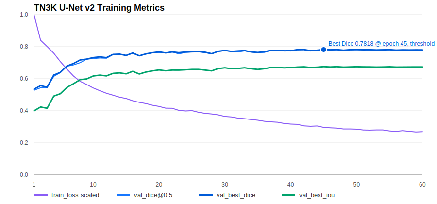

# TN3K 分割模型下一轮训练记录

生成日期：2026-05-10

## 1. 本轮目标

在 `tn3k-unet-v1` baseline 之后，本轮推进三条分割路线：

1. 增强版 U-Net 调参：先拿到可直接替换 v1 的更强 TorchScript 权重。
2. nnU-Net：准备标准 nnU-Net v2 数据目录，并完成完整性校验和预处理。
3. Swin U-Net：准备 Transformer encoder 分割训练入口，并完成小样本 smoke test。

## 2. 增强版 U-Net v2

训练脚本：

```text
scripts/train_tn3k_unet.py
```

本轮新增能力：

| 能力 | 说明 |
| --- | --- |
| `--model residual_attention` | Residual Attention U-Net 变体 |
| `--augment` | 在线超声图像增强：翻转、轻量旋转、亮度/对比度扰动、噪声 |
| `--scheduler cosine` | CosineAnnealingLR |
| `--threshold-sweep` | 验证集扫描 0.30 到 0.70 阈值，按最佳 Dice 保存 |
| `--early-stopping-patience` | 无提升早停 |

训练命令：

```bash
python scripts/train_tn3k_unet.py \
  --epochs 60 \
  --batch-size 8 \
  --image-size 256 \
  --base-channels 24 \
  --model residual_attention \
  --dropout 0.08 \
  --augment \
  --scheduler cosine \
  --threshold-sweep \
  --early-stopping-patience 15 \
  --num-workers 4 \
  --out-dir data/models/segmentation/tn3k-unet-v2
```

训练结果：

| 指标 | v1 baseline | v2 enhanced |
| --- | ---: | ---: |
| best epoch | 15 | 45 |
| Val Dice | 0.705510 | 0.781792 |
| Val IoU | 0.576197 | 0.675132 |
| 最佳阈值 | 0.50 | 0.35 |
| 训练耗时 | 188.401 秒 | 412.852 秒 |

v2 相比 v1：

| 指标 | 提升 |
| --- | ---: |
| Val Dice | +0.076282 |
| Val IoU | +0.098935 |

训练曲线：



输出权重：

```text
/home/beelink/jiazhuangxian/data/models/segmentation/tn3k-unet-v2/best_state.pt
/home/beelink/jiazhuangxian/data/models/segmentation/tn3k-unet-v2/best_torchscript.pt
```

## 3. v2 静态链路验证

验证配置：

```bash
export JZX_UNET_SEGMENTER_WEIGHTS=$PWD/data/models/segmentation/tn3k-unet-v2/best_torchscript.pt
export JZX_UNET_SEGMENTER_INPUT_SIZE=256
export JZX_UNET_SEGMENTER_THRESHOLD=0.35
export JZX_MODEL_DEVICE=cuda
```

验证链路：

```text
thyroid.segment_nodule -> U-Net TorchScript mask -> thyroid.measure_nodule
```

验证结果：

| 字段 | 值 |
| --- | --- |
| 模型版本 | `tn3k-unet-v2` |
| segmentation source | `unet_torchscript` |
| bbox | `[91.0, 53.0, 226.0, 182.0]` |
| confidence | 0.7954 |
| requires_doctor_review | false |

测量结果：

| 字段 | 值 |
| --- | ---: |
| long_axis_mm | 13.5 |
| short_axis_mm | 12.9 |
| area_mm2 | 78.76 |
| aspect_ratio | 1.0465 |
| measurement_source | mask |

链路 artifact：

```text
artifact://model-output/thyroid-segment-nodule/STATIC_CHAIN_V2/0000/mj_64a43bacd1844f24b82fc0974174dfc7/segmentation.json
artifact://model-output/thyroid-measure-nodule/STATIC_CHAIN_V2/0000/mj_33a3356b516844c792106efbfc026f28/measurements.json
```

## 4. nnU-Net 准备状态

新增脚本：

```text
scripts/prepare_tn3k_nnunet.py
```

已在 5090 生成 nnU-Net v2 raw dataset：

```text
/home/beelink/jiazhuangxian/data/nnunet/nnUNet_raw/Dataset501_TN3KThyroid
```

数据量：

| 子集 | 数量 |
| --- | ---: |
| imagesTr / labelsTr | 2303 |
| imagesTs / labelsTs | 576 |

已完成：

```bash
nnUNetv2_plan_and_preprocess -d 501 --verify_dataset_integrity
```

结果：

```text
verify_dataset_integrity Done
Preprocessing dataset Dataset501_TN3KThyroid completed
```

计划文件：

```text
/home/beelink/jiazhuangxian/data/nnunet/nnUNet_preprocessed/Dataset501_TN3KThyroid/nnUNetPlans.json
```

nnU-Net 自动规划的 2D 配置：

| 配置 | 值 |
| --- | --- |
| patch_size | 384 x 448 |
| batch_size | 19 |
| architecture | PlainConvUNet |
| stages | 7 |
| normalization | ZScoreNormalization |

下一步训练命令：

```bash
export nnUNet_raw=$PWD/data/nnunet/nnUNet_raw
export nnUNet_preprocessed=$PWD/data/nnunet/nnUNet_preprocessed
export nnUNet_results=$PWD/data/nnunet/nnUNet_results
nnUNetv2_train 501 2d 0
```

说明：nnU-Net 默认训练周期较长，本轮先完成数据准备、完整性校验和预处理，未启动全量 nnU-Net 训练。

## 5. Swin U-Net 准备状态

新增脚本：

```text
scripts/train_tn3k_swin_unet.py
```

远端 5090 已安装：

```text
nnunetv2
timm
segmentation-models-pytorch
```

Swin U-Net 使用 `segmentation-models-pytorch` 的 U-Net decoder + timm Swin encoder：

```text
encoder: tu-swin_tiny_patch4_window7_224
```

已完成小样本 smoke test：

```bash
python scripts/train_tn3k_swin_unet.py \
  --max-samples 16 \
  --epochs 1 \
  --batch-size 1 \
  --image-size 224 \
  --num-workers 0 \
  --encoder-weights none \
  --out-dir data/models/segmentation/tn3k-swin-unet-smoke
```

smoke 结果：

```text
epoch 1
train_loss 1.259036
val_dice 0.000453
val_iou 0.000453
```

该结果只用于确认 Swin U-Net 训练入口、依赖和 TorchScript 导出链路可运行，不代表模型效果。

离线运行修复：

```text
--encoder-weights none
```

会被规范化为 Python `None`，避免 timm 自动访问 Hugging Face 下载预训练权重。

下一步正式训练命令建议：

```bash
python scripts/train_tn3k_swin_unet.py \
  --epochs 40 \
  --batch-size 4 \
  --image-size 224 \
  --encoder-weights none \
  --out-dir data/models/segmentation/tn3k-swin-unet-v1
```

如果允许联网下载或已有本地缓存，可尝试：

```bash
--encoder-weights imagenet
```

## 6. 本轮结论

本轮已经取得明确提升：

1. 增强版 U-Net v2 已完成训练，Val Dice 从 `0.705510` 提升到 `0.781792`。
2. v2 TorchScript 权重已可直接接入 model-gateway 静态分割链路。
3. nnU-Net 数据已完成标准格式准备、完整性校验和预处理。
4. Swin U-Net 训练入口和远端依赖已准备完成，并通过小样本 smoke test。

下一步建议优先级：

1. 将 model-worker 默认静态分割权重切换到 `tn3k-unet-v2/best_torchscript.pt`，阈值设为 `0.35`。
2. 启动 nnU-Net 2D full training，作为强医学分割基线。
3. 启动 Swin U-Net v1 正式训练，与 U-Net v2、nnU-Net 对比。
4. 输出三模型横向对比报告，决定验证版默认分割主模型。
