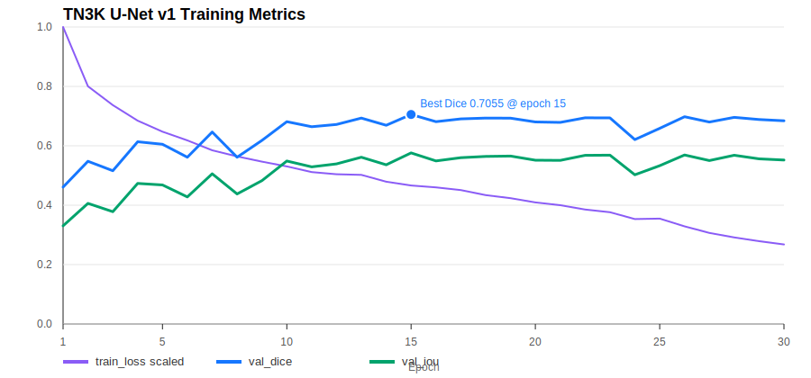
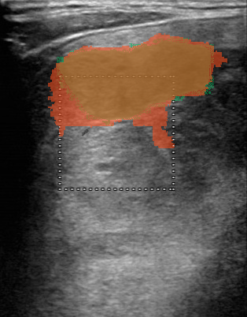

# TN3K U-Net 甲状腺结节分割训练报告

生成日期：2026-05-10

## 1. 训练目标

本轮训练目标是建立第一版可运行的甲状腺结节静态分割权重，用于替换验证阶段的 `bbox_fallback`，使平台具备真实的：

```text
检测框 -> 结节分割 mask -> 长短径/面积测量 -> 报告依据
```

本轮模型定位为能力验证版 baseline，不作为最终临床级模型。

## 2. 数据集

数据集使用 TN3K 甲状腺超声分割数据，位于 5090 主机：

```text
/home/beelink/jiazhuangxian/data/artifacts/datasets/tn3k/processed/datasets/tn3k
```

数据检查结果：

| 项目 | 数量 |
| --- | ---: |
| trainval-image | 2879 |
| trainval-mask | 2879 |
| 可配对 image/mask | 2879 |
| 未配对图片 | 0 |

训练脚本采用固定 seed 的 80/20 切分：

| 子集 | 数量 |
| --- | ---: |
| 训练集 | 2303 |
| 验证集 | 576 |

## 3. 模型与训练配置

模型：轻量 U-Net baseline

训练脚本：

```text
scripts/train_tn3k_unet.py
```

训练命令：

```bash
python scripts/train_tn3k_unet.py \
  --epochs 30 \
  --batch-size 16 \
  --image-size 256 \
  --base-channels 32 \
  --num-workers 4 \
  --out-dir data/models/segmentation/tn3k-unet-v1
```

关键配置：

| 配置项 | 值 |
| --- | --- |
| 训练设备 | RTX 5090 CUDA |
| epoch | 30 |
| batch size | 16 |
| 输入尺寸 | 256 x 256 |
| base channels | 32 |
| learning rate | 0.001 |
| loss | BCEWithLogits + Dice loss |
| 随机种子 | 20260510 |
| 训练耗时 | 188.401 秒 |

训练过程中发现并修复了一个 TorchScript 导出问题：第一次训练在 epoch 1 后导出 TorchScript 时把 traced 模型转到 CPU，导致原训练模型进入 CPU/GPU 混合状态。已修复为 deep-copy 模型后单独导出 TorchScript，不影响继续训练。

## 4. 训练指标

最佳模型出现在 epoch 15：

| 指标 | 值 |
| --- | ---: |
| best epoch | 15 |
| validation Dice | 0.705510 |
| validation IoU | 0.576197 |

训练曲线：



完整 epoch 指标：

| Epoch | Train Loss | Val Dice | Val IoU |
| ---: | ---: | ---: | ---: |
| 1 | 1.075335 | 0.460867 | 0.330474 |
| 2 | 0.860581 | 0.547747 | 0.406206 |
| 3 | 0.792441 | 0.516194 | 0.378162 |
| 4 | 0.736141 | 0.613609 | 0.473357 |
| 5 | 0.696503 | 0.605109 | 0.468326 |
| 6 | 0.664822 | 0.561603 | 0.427790 |
| 7 | 0.628870 | 0.646338 | 0.505733 |
| 8 | 0.606607 | 0.561421 | 0.437854 |
| 9 | 0.587692 | 0.618177 | 0.482683 |
| 10 | 0.570647 | 0.681151 | 0.548749 |
| 11 | 0.549947 | 0.664269 | 0.529011 |
| 12 | 0.542282 | 0.671894 | 0.539160 |
| 13 | 0.539923 | 0.693351 | 0.561571 |
| 14 | 0.515075 | 0.669241 | 0.536085 |
| 15 | 0.501514 | 0.705510 | 0.576197 |
| 16 | 0.494506 | 0.681321 | 0.549060 |
| 17 | 0.484839 | 0.690656 | 0.560142 |
| 18 | 0.466641 | 0.693239 | 0.564109 |
| 19 | 0.455681 | 0.692899 | 0.565459 |
| 20 | 0.440144 | 0.680415 | 0.551536 |
| 21 | 0.430217 | 0.678925 | 0.550946 |
| 22 | 0.414375 | 0.694302 | 0.567894 |
| 23 | 0.404859 | 0.693902 | 0.568575 |
| 24 | 0.380003 | 0.620935 | 0.502490 |
| 25 | 0.381737 | 0.658725 | 0.533151 |
| 26 | 0.353510 | 0.697942 | 0.569182 |
| 27 | 0.329679 | 0.680073 | 0.550251 |
| 28 | 0.313466 | 0.695654 | 0.568188 |
| 29 | 0.299696 | 0.688486 | 0.555957 |
| 30 | 0.287978 | 0.684280 | 0.552270 |

从曲线看，训练 loss 持续下降，但验证集在 epoch 15 后进入波动区间，说明该 baseline 已开始出现过拟合或学习率策略不足。最佳权重采用 epoch 15 的 checkpoint。

## 5. 输出权重与文件

远程 5090 输出目录：

```text
/home/beelink/jiazhuangxian/data/models/segmentation/tn3k-unet-v1
```

核心文件：

| 文件 | 说明 |
| --- | --- |
| `best_state.pt` | PyTorch state_dict 训练权重 |
| `best_torchscript.pt` | model-gateway 可直接加载的 TorchScript 权重 |
| `summary.json` | 数据、训练配置、最佳指标摘要 |
| `metrics.csv` | 每个 epoch 的 train loss、Val Dice、Val IoU |

本地报告资产：

```text
docs/assets/tn3k-unet-v1/
```

## 6. 静态链路验证

使用 `tn3k-unet-v1/best_torchscript.pt` 接入 model-gateway，配置：

```bash
export JZX_UNET_SEGMENTER_WEIGHTS=$PWD/data/models/segmentation/tn3k-unet-v1/best_torchscript.pt
export JZX_UNET_SEGMENTER_INPUT_SIZE=256
export JZX_UNET_SEGMENTER_THRESHOLD=0.5
export JZX_MODEL_DEVICE=cuda
```

配置检查结果：

```json
{
  "ready_segmenters": ["unet"],
  "segmenters": [
    ["medsam", "not_ready"],
    ["unet", "ready"]
  ]
}
```

验证链路：

```text
thyroid.segment_nodule -> U-Net TorchScript mask -> thyroid.measure_nodule
```

本次验证关闭了 `bbox_fallback`，分割结果来自真实 U-Net mask。

样例图像与 mask overlay：



颜色说明：绿色区域为 TN3K 标注 mask，橙红色区域为 U-Net 预测 mask。

静态分割结果：

| 字段 | 值 |
| --- | --- |
| 输入样例 | `trainval-image/0000.jpg` |
| 模型 | `unet-thyroid-segmenter` |
| 模型版本 | `tn3k-unet-v1` |
| segmentation source | `unet_torchscript` |
| bbox | `[61.0, 42.0, 289.0, 188.0]` |
| confidence | `0.8437` |
| requires_doctor_review | `false` |

静态测量结果：

| 字段 | 值 |
| --- | ---: |
| long_axis_mm | 22.8 |
| short_axis_mm | 14.6 |
| area_mm2 | 195.11 |
| aspect_ratio | 1.5616 |
| long_axis_px | 228.0 |
| short_axis_px | 146.0 |
| area_px2 | 19511.0 |
| measurement_source | mask |
| requires_doctor_review | false |

链路输出 artifact：

```text
artifact://model-output/thyroid-segment-nodule/STATIC_CHAIN_V1/0000/mj_b24c75fe234245df96c1825f5443300b/segmentation.json
artifact://model-output/thyroid-measure-nodule/STATIC_CHAIN_V1/0000/mj_6cf6584602f84da58a771e018352b6bb/measurements.json
```

## 7. 结论

本轮已经完成从训练到工程链路验证的闭环：

1. TN3K 分割数据可用，2879 对 image/mask 全部配对。
2. U-Net baseline 在 80/20 验证集上达到 `Dice 0.705510`、`IoU 0.576197`。
3. `best_torchscript.pt` 已能被 model-gateway 直接加载。
4. 静态链路已在关闭 fallback 的情况下完成真实 mask 分割和测量。

该模型已经足够支撑验证版平台展示“真实分割与测量能力”，但还不足以作为最终医疗级模型。下一步建议：

1. 加入更强的数据增强、学习率调度和早停策略，训练 U-Net v2。
2. 使用 nnU-Net 或 Swin U-Net 训练更强分割模型。
3. 接入 MedSAM/SAM checkpoint 做 bbox prompt 分割对照。
4. 增加外部测试集评估，避免只在 TN3K 80/20 split 上判断泛化能力。
