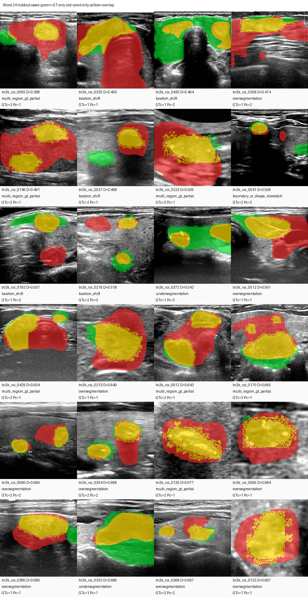
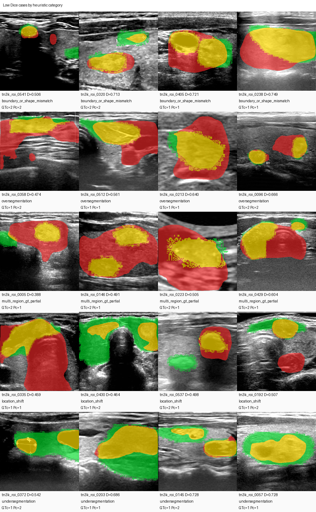

# TN3K 低 Dice 病例审计报告

生成日期：2026-05-10

## 1. 审计范围

本次审计对象为 Dataset503 Tight ROI 5-fold selected ensemble 在 20% 留出集上的分割结果。

留出集评估结果：

| 指标 | 数值 |
|---|---:|
| 病例数 | 576 |
| Mean Dice | 0.883226 |
| Mean IoU | 0.799119 |
| Median Dice | 0.903258 |
| Min Dice | 0.387707 |
| Dice < 0.80 | 55 |
| Dice < 0.90 | 269 |

审计重点是 `Dice < 0.80` 的 55 个明显低分病例，同时保留 `Dice < 0.90` 的 269 个病例明细，便于后续人工复核。

## 2. 审计方法

对每个留出集病例计算：

- GT mask 面积、预测 mask 面积、面积比。
- overlap、false positive、false negative 面积。
- overlap/GT recall 与 overlap/pred precision。
- GT 与预测 mask 的有效连通域数量。
- GT 与预测中心点距离。
- bbox 信息。

连通域统计使用“有效连通域”口径，忽略很小的 mask 碎片，避免把标签边缘噪声误判为多病灶。

分类为启发式初筛，类别包括：

| 类别 | 含义 |
|---|---|
| `boundary_or_shape_mismatch` | 预测与标注大体位置相关，但边界/形状差异明显 |
| `oversegmentation` | 预测面积明显偏大，误分割较多 |
| `multi_region_gt_partial` | GT 有多个有效区域，预测只覆盖部分或把区域合并 |
| `location_shift` | 预测与 GT 中心偏移明显 |
| `undersegmentation` | 预测面积明显偏小，漏分割较多 |
| `moderate_boundary_error` | Dice 介于 0.80-0.90 的中等边界误差 |

## 3. 分类统计

Dice < 0.80 的 55 例：

| 类别 | 数量 |
|---|---:|
| boundary_or_shape_mismatch | 21 |
| oversegmentation | 13 |
| multi_region_gt_partial | 12 |
| location_shift | 5 |
| undersegmentation | 4 |

Dice < 0.90 的 269 例：

| 类别 | 数量 |
|---|---:|
| moderate_boundary_error | 177 |
| multi_region_gt_partial | 49 |
| boundary_or_shape_mismatch | 21 |
| oversegmentation | 13 |
| location_shift | 5 |
| undersegmentation | 4 |

结论：真正严重低分主要集中在边界/形状不一致、过分割、多区域标注不匹配和少量位置偏移。`Dice < 0.90` 中大量属于中等边界误差，这也是 median Dice 已超过 0.90、但 mean Dice 被低分病例拉低的原因。

## 4. 最差病例

最差 10 个病例：

| 病例 | Dice | IoU | 初筛类别 | GT面积 | 预测面积 | Recall | Precision |
|---|---:|---:|---|---:|---:|---:|---:|
| tn3k_roi_0005 | 0.3877 | 0.2405 | multi_region_gt_partial | 14197 | 37280 | 0.703 | 0.268 |
| tn3k_roi_0335 | 0.4586 | 0.2975 | location_shift | 28047 | 81179 | 0.893 | 0.309 |
| tn3k_roi_0430 | 0.4635 | 0.3017 | location_shift | 55870 | 16967 | 0.302 | 0.995 |
| tn3k_roi_0358 | 0.4736 | 0.3103 | oversegmentation | 17101 | 43881 | 0.844 | 0.329 |
| tn3k_roi_0146 | 0.4905 | 0.3249 | multi_region_gt_partial | 24041 | 73784 | 0.998 | 0.325 |
| tn3k_roi_0537 | 0.4976 | 0.3312 | location_shift | 18516 | 21857 | 0.542 | 0.460 |
| tn3k_roi_0223 | 0.5048 | 0.3376 | multi_region_gt_partial | 31322 | 85080 | 0.938 | 0.345 |
| tn3k_roi_0541 | 0.5059 | 0.3386 | boundary_or_shape_mismatch | 7412 | 5617 | 0.445 | 0.587 |
| tn3k_roi_0192 | 0.5067 | 0.3393 | location_shift | 16924 | 20143 | 0.555 | 0.466 |
| tn3k_roi_0216 | 0.5179 | 0.3495 | location_shift | 13583 | 16224 | 0.568 | 0.476 |

## 5. 可视化

颜色说明：

- 绿色：GT only，标注有但模型没有预测。
- 红色：Pred only，模型预测但标注没有。
- 黄色：GT 与预测重叠。

最差 24 例：



按启发式类别抽样：



## 6. 关键判断

1. 单纯增加 nnU-Net epoch 不太可能把 Dice 推到 0.95。
   5 折训练曲线已稳定在 pseudo Dice 约 0.89，留出集 median Dice 也已超过 0.90。

2. 低 Dice 主因不是单一问题。
   边界形状误差、过分割、多区域标注、位置偏移和欠分割同时存在，需要分类型处理。

3. 最大连通域后处理不可用。
   已验证会让 Mean Dice 从 0.883226 降到 0.874762，说明部分病例存在多区域或复杂标注，不能简单删除小区域。

4. 多区域 GT 与过分割需要人工复核。
   有些病例可能是标签本身包含多个有效区域，也可能是边缘噪声或标注策略不一致。该类病例应优先建立人工审计表。

## 7. 审计产物

本地文件：

```text
/Users/xutianliang/Downloads/jiazhuangxian/docs/assets/tn3k-low-dice-audit/holdout_low_dice_audit.csv
/Users/xutianliang/Downloads/jiazhuangxian/docs/assets/tn3k-low-dice-audit/holdout_low_dice_audit.json
/Users/xutianliang/Downloads/jiazhuangxian/docs/assets/tn3k-low-dice-audit/holdout_low_dice_audit_summary.json
/Users/xutianliang/Downloads/jiazhuangxian/docs/assets/tn3k-low-dice-audit/holdout_low_dice_worst24_overlay.png
/Users/xutianliang/Downloads/jiazhuangxian/docs/assets/tn3k-low-dice-audit/holdout_low_dice_by_category_overlay.png
```

5090 远程文件：

```text
/home/beelink/jiazhuangxian/data/models/segmentation/nnunet-tn3k-roi-tight-2d-100epochs-ensemble-selected/audit
```

## 8. 下一步建议

1. 人工复核 Dice < 0.80 的 55 例，给每例标记：
   `label_issue`、`model_issue`、`crop_issue`、`multi_region_valid`、`boundary_ambiguous`。

2. 建立 clean holdout subset。
   对疑似标注质量问题病例做标记后，分别计算 full holdout 与 clean subset 指标，避免把标签问题误判为模型能力上限。

3. 针对错误类型改进模型：
   - 边界/形状问题：尝试 Swin U-Net、nnU-Net 新 ResEnc presets、边界 loss。
   - 位置偏移：检查 ROI 裁剪和 detector prompt。
   - 多区域问题：明确任务定义，是分割主结节、所有结节，还是所有标注区域。
   - 过分割：加入 hard negative 或背景约束。

4. 对目标 Dice 0.95 的现实判断：
   需要更干净的一致性标注、更明确的分割任务定义，以及更强模型或提示式分割方案。仅基于当前 TN3K 标注和 nnU-Net 100 epoch 5-fold，达到 0.95 的概率较低。

