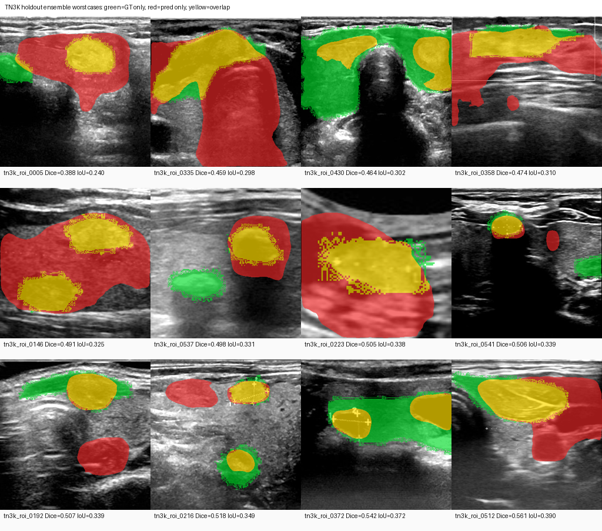

# TN3K 甲状腺结节分割训练报告：nnU-Net Tight ROI 5-Fold

生成日期：2026-05-10

## 1. 结论

本轮已完成 TN3K 甲状腺结节分割训练的完整闭环：数据标准化、ROI 裁剪、nnU-Net 5 折训练、20% 留出集 ensemble 推理、后处理验证和最差病例诊断。

当前最佳可复现权重包已保留在 5090：

```text
/home/beelink/jiazhuangxian/data/models/segmentation/tn3k-nnunet-tight-selected-5fold-v1
```

该权重包包含 5 个 selected checkpoint、`dataset.json`、`nnUNetPlans.json`、留出集评估 summary、后处理评估 summary 和最差病例诊断图。

最终 20% 留出集 5-fold ensemble 指标：

| 指标 | 数值 |
|---|---:|
| 留出集病例数 | 576 |
| Mean Dice | 0.883226 |
| Mean IoU | 0.799119 |
| Median Dice | 0.903258 |
| Min Dice | 0.387707 |
| Dice < 0.70 | 24 |
| Dice < 0.80 | 55 |
| Dice < 0.90 | 269 |

目标 Dice `0.95` 未达到。当前证据显示主要瓶颈不是训练轮数不足，而是低分难例、标注一致性、复杂边界、多区域标注或 ROI 裁剪策略造成的误差。

## 2. 数据集与划分

数据来源：TN3K 甲状腺超声图像与 mask。

原始 TN3K 图像尺寸不统一，但每张 image 与 mask 的尺寸一致。训练前已进行 ROI 裁剪与尺寸标准化。

本轮主训练数据集：

```text
Dataset503_TN3KThyroidROITight
```

关键参数：

| 项目 | 数值 |
|---|---:|
| ROI 输出尺寸 | 384 x 384 |
| ROI margin ratio | 0.15 |
| min crop size | 80 |
| 总样本数 | 2879 |
| 训练集 | 2303 |
| 留出验证集 | 576 |
| 空 mask 跳过数 | 0 |

nnU-Net 5 折训练在 2303 张训练集上进行，每折约 1842 张训练、460/461 张内部验证。最终模型效果使用 576 张 20% 留出集评估。

## 3. 训练方法

主模型：

```text
nnU-Net v2 2D
trainer: nnUNetTrainer_100epochs
plans: nnUNetPlans
configuration: 2d
dataset: Dataset503_TN3KThyroidROITight
```

核心训练命令：

```bash
nnUNetv2_train 503 2d <fold> -tr nnUNetTrainer_100epochs
```

5 折分别训练 fold `0-4`，每折 100 epoch。训练完成后分别复验 `checkpoint_best.pth`，并选择每折表现更好的 checkpoint 作为 selected checkpoint。

## 4. 历史实验对比

| 实验 | 关键设置 | Mean Dice | 结论 |
|---|---|---:|---|
| U-Net v1 | 基础 U-Net | 0.705510 | 不足 |
| U-Net v2 | 残差注意力、增强、阈值搜索 | 0.781792 | 明显提升但不足 |
| nnU-Net Dataset501 | full-frame 2D | 0.811993 | 优于自研 U-Net |
| nnU-Net Dataset502 | ROI 0.35 margin | 0.870746 | ROI 明显有效 |
| nnU-Net Dataset502 ResEnc | ResEnc ROI | 0.867891 | 未超过默认 ROI |
| nnU-Net Dataset503 | Tight ROI 0.15 margin | 0.883226 | 当前最佳路线 |

## 5. 5 折训练结果

每折最终采用的 checkpoint：

| Fold | 采用权重 | Mean Dice |
|---:|---|---:|
| 0 | checkpoint_final.pth | 0.883281 |
| 1 | checkpoint_best.pth | 0.874356 |
| 2 | checkpoint_best.pth | 0.884121 |
| 3 | checkpoint_best.pth | 0.879180 |
| 4 | checkpoint_best.pth | 0.878447 |

Fold2 是当前单折内部验证最好的 checkpoint；最终保留方案采用 5-fold selected ensemble，而不是单折模型。

## 6. 最佳权重保留

已在 5090 上创建不可覆盖的权重包：

```text
/home/beelink/jiazhuangxian/data/models/segmentation/tn3k-nnunet-tight-selected-5fold-v1
```

目录结构：

```text
tn3k-nnunet-tight-selected-5fold-v1/
  MANIFEST.md
  config/
    dataset.json
    nnUNetPlans.json
  weights/
    fold_0/checkpoint_selected.pth
    fold_1/checkpoint_selected.pth
    fold_2/checkpoint_selected.pth
    fold_3/checkpoint_selected.pth
    fold_4/checkpoint_selected.pth
  evaluation/
    holdout_ensemble_summary.json
    holdout_lcc_summary.json
  diagnostics/
    holdout_worst_cases.json
    holdout_worst_cases_overlay.png
```

权重包大小约 `1.3G`。`MANIFEST.md` 中记录了每折来源 checkpoint 和 SHA256。

## 7. 留出集 Ensemble 结果

推理输入：

```text
/home/beelink/jiazhuangxian/data/nnunet/nnUNet_raw/Dataset503_TN3KThyroidROITight/imagesTs
```

推理输出：

```text
/home/beelink/jiazhuangxian/data/models/segmentation/nnunet-tn3k-roi-tight-2d-100epochs-ensemble-selected/imagesTs_pred
```

评估文件：

```text
/home/beelink/jiazhuangxian/data/models/segmentation/nnunet-tn3k-roi-tight-2d-100epochs-ensemble-selected/imagesTs_pred/summary.json
```

留出集结果：

| 指标 | 数值 |
|---|---:|
| Mean Dice | 0.883226 |
| Mean IoU | 0.799119 |
| Median Dice | 0.903258 |
| Min Dice | 0.387707 |
| Max Dice | 0.974363 |
| Dice < 0.70 | 24 |
| Dice < 0.80 | 55 |
| Dice < 0.85 | 103 |
| Dice < 0.90 | 269 |
| Dice < 0.95 | 519 |

## 8. 后处理验证

测试了 largest connected component 后处理。

| 方法 | Mean Dice | Mean IoU | Median Dice | Dice < 0.80 | Dice < 0.90 |
|---|---:|---:|---:|---:|---:|
| 原始 5-fold ensemble | 0.883226 | 0.799119 | 0.903258 | 55 | 269 |
| 最大连通域后处理 | 0.874762 | 0.790001 | 0.902178 | 64 | 273 |

结论：不启用最大连通域后处理。该策略会误删部分有效区域，说明 TN3K 中存在多区域标注或复杂结构场景。

## 9. 最差病例诊断

最差病例 overlay 已生成：



本地文件：

```text
/Users/xutianliang/Downloads/jiazhuangxian/docs/assets/tn3k-ensemble-selected/holdout_worst_cases_overlay.png
/Users/xutianliang/Downloads/jiazhuangxian/docs/assets/tn3k-ensemble-selected/holdout_worst_cases.json
```

最差 5 个留出集病例：

| 病例 | Dice | IoU |
|---|---:|---:|
| tn3k_roi_0005 | 0.3877 | 0.2405 |
| tn3k_roi_0335 | 0.4586 | 0.2975 |
| tn3k_roi_0430 | 0.4635 | 0.3017 |
| tn3k_roi_0358 | 0.4736 | 0.3103 |
| tn3k_roi_0146 | 0.4905 | 0.3249 |

这些低分病例是拉低 Mean Dice 的主要原因。Median Dice 已超过 `0.90`，说明多数病例表现尚可，但低分离群病例仍然明显。

## 10. 结论与下一步

本轮训练已经完成验证版分割模型的第一版强基线，当前最佳可部署方案是：

```text
Dataset503 Tight ROI + nnU-Net 2D + 5-fold selected ensemble
```

但该方案未达到 `0.95` Dice 目标。下一轮不建议只增加 epoch，应优先做：

1. 低 Dice 病例审计：区分标注问题、边界问题、ROI 裁剪问题、多区域问题和模型漏分割。
2. 清洁验证集评估：对疑似标签质量问题病例做标记，输出 clean subset 指标。
3. 更强模型路线：MedSAM/SAM2 detector-prompt、Swin U-Net、nnU-Net 新 ResEnc presets。
4. 报告和平台接入：将当前权重包接入分割 worker，作为验证版默认分割模型。

