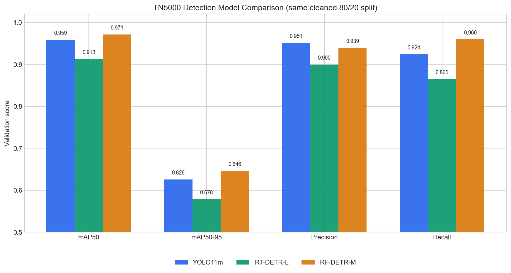
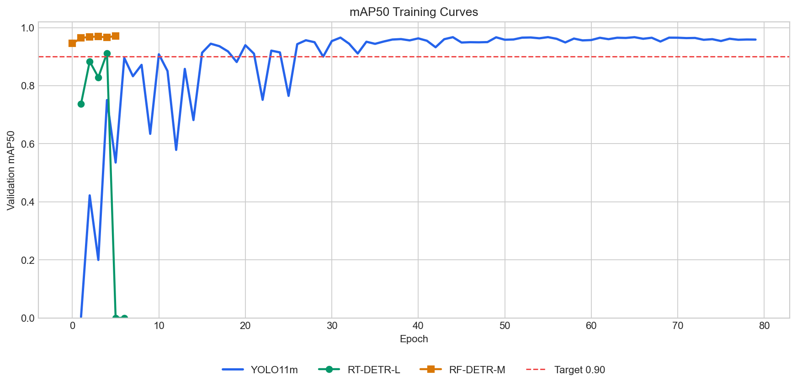

# TN5000 甲状腺结节检测模型训练、对比与主用模型决策报告

生成时间：2026-05-10

## 1. 本次目标

使用此前 YOLO11m 训练所用的同一份 TN5000 清洗检测数据，继续训练和验证 RT-DETR / RF-DETR 检测模型，并与 YOLO11m 结果进行横向对比。

本轮工程决策：

| 角色 | 模型 | 决策 |
| --- | --- | --- |
| 主用检测模型 | RF-DETR-Medium | 本轮同数据验证指标最高，召回率最高，作为后续验证版默认结节检测模型 |
| 对照检测模型 | YOLO11m | 保留为稳定实时对照模型，用于一致性校验、漏检/误检提示和工程兜底 |
| 研究对照模型 | RT-DETR-L | 暂不进入默认推理链路，继续排查 NaN 稳定性 |
| 结果评估 | 主 LLM / Qwen3.6 | 不直接生成 bbox，不替代医生；负责汇总双模型结果、解释冲突、给出复核优先级 |

本报告只评价“甲状腺结节框检测”能力，不评价良恶性分类、TI-RADS 特征识别、报告生成或医生审核模块。

## 2. 数据与切分

本次三类检测模型使用同一份清洗后的 TN5000 detection manifest：

`data/artifacts/datasets/tn5000/derived/detection-clean/annotations/manifest.jsonl`

固定训练/验证切分字段：

`fixed_training_split`

| 切分 | 图像数 | 标注框数 | 说明 |
| --- | ---: | ---: | --- |
| train | 3,897 | 3,999 | 用于模型训练 |
| val | 974 | 998 | 用于验证与模型对比 |
| total | 4,871 | 4,997 | 清洗后有效检测样本 |

数据一致性说明：

- YOLO11m、RT-DETR-L、RF-DETR-Medium 均来自同一 manifest。
- train/val 使用同一固定 80/20 split。
- 类别统一为单类：`thyroid_nodule`。
- YOLO / RT-DETR 使用 YOLO layout；RF-DETR 使用同源 manifest 转换出的 COCO layout。
- RF-DETR-Medium 使用 576 输入分辨率，因为该 checkpoint 的预训练位置编码对应 576；强行用 896 会触发位置编码维度不匹配。

## 3. 训练环境

远端 GPU 环境：

- GPU：NVIDIA GeForce RTX 5090 32GB
- Python 环境：`.venv-model-gateway-gpu`
- PyTorch：`2.11.0+cu128`
- Ultralytics：`8.4.48`
- RF-DETR：已安装 `rfdetr[train,loggers]`

本次新增/使用的训练脚本：

- `scripts/train_tn3k_yolo.py`
- `scripts/train_rfdetr_detector.py`

## 4. 模型训练配置

| 模型 | 角色 | 输入分辨率 | Batch | 训练状态 |
| --- | --- | ---: | ---: | --- |
| YOLO11m | 对照检测模型 / 实时备选 | 896 | 16 | 完整训练，达到目标 |
| RT-DETR-L | Transformer 检测对照 | 896 | 8 | epoch 4 达标，后续 NaN，使用 best.pt 单独验证 |
| RF-DETR-Medium | 主用检测模型 | 576 | 4，grad accumulate 4 | 训练到 epoch 5，稳定超过目标后手动停止 |

RT-DETR-L 说明：

- 首轮训练在 epoch 4 达到 `mAP50=0.91221`。
- epoch 5 后训练 loss 出现 NaN，后续指标归零。
- 因此本报告采用 epoch 4 保存的 `best.pt` 重新执行验证，验证结果为 `mAP50=0.91289`。
- RT-DETR 暂不作为主检测模型，需要继续做学习率、优化器、AMP、数据增强和梯度稳定性调优。

RF-DETR-Medium 说明：

- 初始使用 896 分辨率时，预训练权重位置编码维度不匹配，训练无法启动。
- 修正为 Medium checkpoint 原生 576 分辨率后训练正常。
- epoch 0 即超过 0.90 目标，epoch 5 达到本次最佳 `mAP50=0.97141`。
- 为节省验证版时间，在连续多轮超过目标且指标稳定后手动停止，best checkpoint 与 `metrics.csv` 已保留。

## 5. 对比结果





| 模型 | mAP50 | mAP50-95 | Precision | Recall | 结论 |
| --- | ---: | ---: | ---: | ---: | --- |
| YOLO11m | 0.95886 | 0.62583 | 0.95133 | 0.92385 | 稳定、实时，作为对照模型和兜底候选 |
| RT-DETR-L | 0.91289 | 0.57849 | 0.89959 | 0.86473 | 达标但训练不稳定，需要继续调参 |
| RF-DETR-Medium | 0.97141 | 0.64611 | 0.93922 | 0.95992 | 当前验证指标最高，确定为主用模型 |

补充指标：

- RF-DETR-Medium EMA 指标：`ema_mAP50=0.97515`，`ema_mAP50-95=0.66692`。
- RT-DETR-L best.pt 单独验证保存了 PR 曲线与混淆矩阵。
- YOLO11m 完整训练保存了 PR 曲线、混淆矩阵和训练结果图。

## 6. 结论

当前验证版采用“双模型检测 + 主 LLM 评估”策略：

| 层级 | 推荐模型 | 原因 |
| --- | --- | --- |
| 主用检测模型 | RF-DETR-Medium | 本次同数据 split 上 mAP50 最高，Recall 最高，优先减少漏检风险 |
| 对照检测模型 | YOLO11m | 训练完整、速度快、部署成熟，用于一致性校验和工程兜底 |
| 暂缓主用 | RT-DETR-L | 达到 0.90 目标，但出现 NaN，不应直接进入主流程 |
| 结果评估 | 主 LLM / Qwen3.6 | 汇总双模型检测结果、IoU 一致性、低置信度和冲突风险，生成医生复核提示 |

工程建议：

1. 验证版以 RF-DETR-Medium 作为默认主检测模型。
2. YOLO11m 每次同步运行，作为对照检测模型。
3. 对两个模型输出做 IoU 匹配：
   - 高重合：标记为双模型一致检出。
   - RF-DETR 有、YOLO 无：保留主模型候选，标记为主模型单独检出，进入医生复核。
   - YOLO 有、RF-DETR 无：标记为对照模型疑似补充候选，进入医生复核。
   - 两者 bbox 偏移明显：标记为定位冲突，要求医生检查 overlay。
4. RT-DETR-L 继续作为研究对照，不进入默认推理链路。
5. 主 LLM 只做结构化评估和解释，不得自行新增、删除或移动 bbox。
6. 下一步应补充推理速度、显存、CPU fallback、批量处理吞吐和不同医院超声图像外部验证。

## 7. 主 LLM 结果评估设计

主 LLM 使用 Qwen3.6 或同等级本地大模型。它不是检测模型，也不是最终诊断者；它只读取结构化模型结果和证据，输出医生可审阅的评估意见。

### 7.1 输入

| 输入 | 来源 | 说明 |
| --- | --- | --- |
| `primary_detections` | RF-DETR-Medium | 主检测 bbox、confidence、模型版本、权重 hash |
| `comparator_detections` | YOLO11m | 对照 bbox、confidence、模型版本、权重 hash |
| `comparison_matrix` | bbox 对比服务 | IoU、中心点距离、面积差、匹配状态 |
| `image_quality` | ImageQC | 低清晰度、遮挡、文字/标尺干扰、边缘风险 |
| `training_metrics` | 本报告 / summary JSON | 模型级验证指标，仅用于解释置信背景 |
| `doctor_policy` | 平台规则 | 哪些冲突必须医生复核，哪些低置信度必须提示 |

### 7.2 输出

主 LLM 输出结构化 JSON，供医生工作台展示和审计：

```json
{
  "overall_assessment": "consistent | needs_review | high_risk_conflict",
  "primary_model": "RF-DETR-Medium",
  "comparator_model": "YOLO11m",
  "accepted_primary_nodules": [
    {
      "primary_detection_id": "rf_001",
      "match_status": "matched_by_yolo | rf_only | localization_conflict",
      "review_priority": "low | medium | high",
      "reason": "双模型均检出且 IoU 高，或主模型单独检出但置信度较高"
    }
  ],
  "comparator_only_candidates": [
    {
      "comparator_detection_id": "yolo_003",
      "review_priority": "medium",
      "reason": "YOLO 检出但 RF-DETR 未检出，建议医生检查是否为漏检或伪影"
    }
  ],
  "warnings": [
    "图像质量不足时不得给出确定性结论",
    "模型冲突区域必须由医生确认"
  ],
  "doctor_review_focus": [
    "检查 RF-DETR 单独检出的低置信度小结节",
    "检查 YOLO 单独检出的边缘区域候选框"
  ]
}
```

### 7.3 约束

- 主 LLM 不直接读取并自由解释原始图像来产生 bbox。
- 主 LLM 不得修改检测框坐标，只能引用模型输出和对比服务结果。
- 主 LLM 不得决定 TI-RADS 分级，TI-RADS 必须来自特征模型 + 确定性规则引擎。
- 主 LLM 输出必须带模型来源、证据来源和复核原因。
- 医生工作台必须允许医生接受、修改、删除或新增 bbox，并记录修改痕迹。

## 8. 已产出文件

模型结果与指标：

- `data/artifacts/model-training/tn5000-yolo/summaries/tn5000-clean-yolo11m-80-20-e150-i896-b16-target90.json`
- `data/artifacts/model-training/tn5000-rtdetr/summaries/tn5000-clean-rtdetr-l-best-val.json`
- `data/artifacts/model-training/tn5000-rfdetr/summaries/tn5000-clean-rfdetr-medium-80-20-e40-r576-b4x4-target90.json`
- `data/artifacts/model-training/tn5000-rfdetr/runs/tn5000-clean-rfdetr-medium-80-20-e40-r576-b4x4-target90/metrics.csv`

对比图表：

- `docs/assets/tn5000-detector-comparison-20260510/detector_metrics_comparison.png`
- `docs/assets/tn5000-detector-comparison-20260510/detector_map50_curves.png`

代码：

- `scripts/train_tn3k_yolo.py`
- `scripts/train_rfdetr_detector.py`
- `test/unit/scripts/test_train_rfdetr_detector.py`

## 9. 后续任务

短期任务：

- 将 RF-DETR-Medium 跑满完整训练或配置 early-stop callback，确认完整训练曲线。
- 为 RF-DETR-Medium / YOLO11m 建立统一推理接口，RF-DETR-Medium 标记为 primary。
- 新增检测结果对比器：bbox IoU、置信度、漏检候选、冲突解释。
- 新增主 LLM 结果评估器：读取双模型结构化输出，生成医生复核重点。
- 在医生工作台 overlay 中展示双模型 bbox，并支持按模型过滤。
- 记录每个 bbox 的来源模型、置信度、IoU 匹配状态和人工修订记录。

中期任务：

- 增加外部甲状腺超声数据集验证。
- 对不同超声设备来源做 domain shift 评估。
- 训练多尺度版本并评估小结节召回率。
- 接入后续良恶性分类 / TI-RADS 特征识别模型。
