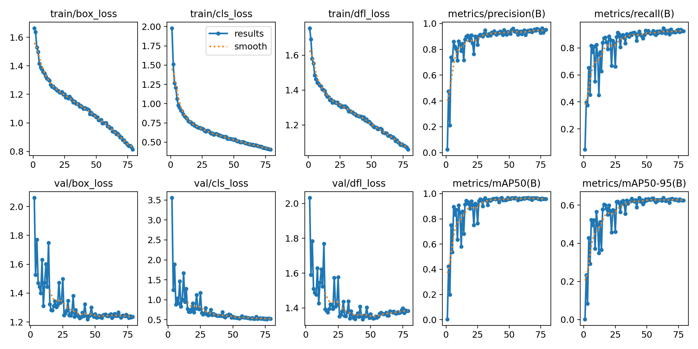
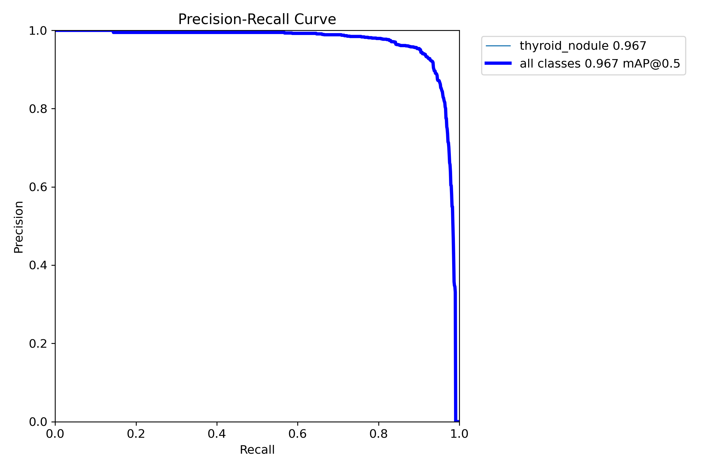
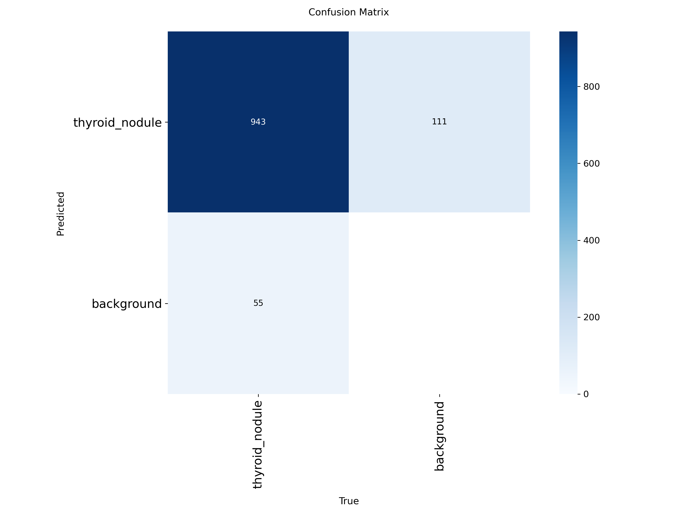
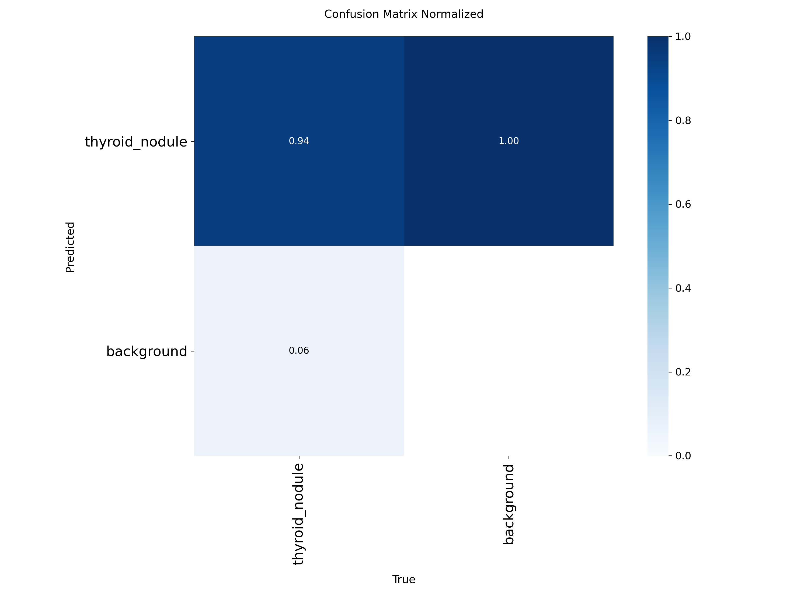

# TN5000 YOLO11m 甲状腺结节检测训练报告

更新时间：2026-05-10  
训练目标：基于官方 TN5000 detection archive 训练甲状腺结节检测模型，采用 80% 训练、20% 验证，验证目标定为 `mAP50 >= 0.90`。

> 说明：用户提出的“正确率 90%”在目标检测任务中不宜直接用分类 accuracy 表达。本次将验收指标定义为目标检测通用指标 `mAP50(B)`，即 bbox 在 IoU=0.50 条件下的平均精度。该指标更适合评价结节框定位能力。

## 1. 结论摘要

本次训练已经达到目标。

| 项目 | 结果 |
| --- | --- |
| 数据集 | 官方 TN5000 detection archive |
| 模型 | YOLO11m / Ultralytics YOLO |
| 任务 | 甲状腺结节单类检测 |
| 划分 | 80% train / 20% val |
| 训练图像 | 3,897 张 |
| 验证图像 | 974 张 |
| 训练 bbox | 3,999 个 |
| 验证 bbox | 998 个 |
| 目标指标 | `metrics/mAP50(B) >= 0.90` |
| 最终 summary mAP50 | `0.95886` |
| CSV 最佳 mAP50 | `0.96731`，epoch 55 |
| Ultralytics best.pt 验证 mAP50 | `0.967` |
| 结论 | 达标，可进入 model-gateway smoke 与阈值校准 |

最佳权重保存在远程 5090 主机：

```text
/home/beelink/jiazhuangxian/runs/detect/data/artifacts/model-training/tn5000-yolo/runs/tn5000-clean-yolo11m-80-20-e150-i896-b16-target90/weights/best.pt
```

## 2. 数据来源

原始数据来自官方 TN5000 detection archive：

```text
data/artifacts/datasets/tn5000/raw/extracted/TN5000_forReview/TN5000_forReview/
```

原始归档结构为 VOC-style detection 数据：

| 类型 | 数量 |
| --- | ---: |
| JPG 图像 | 5,000 |
| XML 标注 | 5,000 |
| 官方 train split | 3,500 |
| 官方 val split | 500 |
| 官方 test split | 1,000 |

本次训练没有直接使用官方 split。原因是评估发现原始 archive 存在跨 split 重复图像，如果直接按官方 split 训练/验证，验证指标可能被数据泄漏抬高。

## 3. 数据质量评估

前置评估脚本：

```bash
npm run datasets:tn5000:evaluate
```

评估输出：

```text
data/artifacts/datasets/tn5000/derived/evaluation/
```

主要发现：

| 问题 | 数量 | 处理策略 |
| --- | ---: | --- |
| XML/图像尺寸不一致 | 2 | 剔除 |
| bbox 越界 | 1 | 剔除 |
| exact duplicate image hash groups | 119 | 合并为多 bbox 图像 |
| 跨 train/val/test 重复图像组 | 65 | 重新固定 80/20 划分 |

被剔除样本：

| 样本 | 原因 |
| --- | --- |
| `002589` | XML 尺寸 `818x628`，图像尺寸 `718x500` |
| `004092` | XML 尺寸 `677x432`，图像尺寸 `718x500` |
| `003813` | bbox `[333, 73, 719, 351]` 越界 |

## 4. 数据清洗与转换方法

新增脚本：

```text
scripts/tn5000_voc_to_detection.py
```

执行命令：

```bash
cd ~/jiazhuangxian
source .venv-dataset-tools/bin/activate
python3 scripts/tn5000_voc_to_detection.py \
  --dataset-root data/artifacts/datasets/tn5000/raw/extracted/TN5000_forReview/TN5000_forReview \
  --output-root data/artifacts/datasets/tn5000/derived/detection-clean \
  --train-ratio 0.8 \
  --seed 20260510 \
  --image-mode symlink \
  --class-mode collapsed
```

核心处理原则：

1. 不修改原始 TN5000 archive，只生成 derived 训练产物。
2. 医疗标注异常不做静默裁剪，尺寸不一致和越界框直接剔除。
3. exact duplicate 图像不简单删除，而是按图像 hash 合并成一个样本，并保留多个 bbox。
4. 本次训练是结节定位任务，因此将 `0=benign` 和 `1=malignant` 折叠为单一类别 `thyroid_nodule`。
5. 原始良恶性标签只作为 stratified split 的分层依据，不作为检测类别。

清洗后数据输出：

```text
data/artifacts/datasets/tn5000/derived/detection-clean/
```

| 输出 | 路径 |
| --- | --- |
| manifest | `annotations/manifest.jsonl` |
| train manifest | `annotations/train.jsonl` |
| val manifest | `annotations/val.jsonl` |
| YOLO 配置 | `yolo/data.yaml` |
| COCO train | `coco/train.json` |
| COCO val | `coco/val.json` |
| 清洗摘要 | `summary.json` |

## 5. 清洗后数据规模

| 指标 | 数量 |
| --- | ---: |
| 有效原始样本 | 4,997 |
| 唯一图像 hash | 4,871 |
| 合并重复图像组 | 119 |
| 合并重复原始样本 | 245 |
| 清洗后图像 | 4,871 |
| 清洗后 bbox | 4,997 |
| 多 bbox 图像 | 119 |

良恶性分层统计：

| 标签 | 含义 | 数量 |
| --- | --- | ---: |
| `0` | benign | 1,390 |
| `1` | malignant | 3,481 |

## 6. 80/20 划分

划分策略：

| 项目 | 值 |
| --- | --- |
| train ratio | `0.8` |
| seed | `20260510` |
| split 字段 | `fixed_training_split` |
| stratify | 原始良恶性诊断标签 |
| 检测类别 | 单类 `thyroid_nodule` |

划分结果：

| split | 图像数 | bbox 数 | benign | malignant |
| --- | ---: | ---: | ---: | ---: |
| train | 3,897 | 3,999 | 1,112 | 2,785 |
| val | 974 | 998 | 278 | 696 |

## 7. 训练方法

训练脚本：

```text
scripts/train_tn3k_yolo.py
```

虽然脚本名仍包含 `tn3k`，本次已经扩展为通用 thyroid detection manifest 训练脚本，支持：

- TN3K 单 bbox manifest。
- TN5000 多 bbox manifest。
- 固定 split 字段。
- 单类检测和多类检测 class names。
- 医学图像轻增强参数。
- 训练 summary 输出和目标阈值判断。

训练命令：

```bash
cd ~/jiazhuangxian
JZX_MODEL_DEVICE=0 .venv-model-gateway-gpu/bin/python scripts/train_tn3k_yolo.py \
  --manifest data/artifacts/datasets/tn5000/derived/detection-clean/annotations/manifest.jsonl \
  --output-root data/artifacts/model-training/tn5000-yolo \
  --name tn5000-clean-yolo11m-80-20-e150-i896-b16-target90 \
  --fixed-split-field fixed_training_split \
  --train-ratio 0.8 \
  --seed 20260510 \
  --model data/artifacts/model-weights/yolo/yolo11m.pt \
  --epochs 150 \
  --patience 35 \
  --imgsz 896 \
  --batch 16 \
  --device 0 \
  --workers 6 \
  --cache disk \
  --target-threshold 0.90 \
  --mosaic 0.2 \
  --scale 0.25 \
  --translate 0.05 \
  --hsv-h 0.0 \
  --hsv-s 0.15 \
  --hsv-v 0.15 \
  --erasing 0.0 \
  --auto-augment none \
  --close-mosaic 10
```

训练环境：

| 项目 | 配置 |
| --- | --- |
| GPU | NVIDIA RTX 5090 32GB |
| Python env | `.venv-model-gateway-gpu` |
| PyTorch | `2.11.0+cu128` |
| CUDA runtime | `12.8` |
| Ultralytics | `8.4.48` |
| 训练设备 | `device=0` |

核心超参数：

| 参数 | 值 | 说明 |
| --- | ---: | --- |
| model | `yolo11m.pt` | 中等规模 YOLO11，作为强基线 |
| imgsz | `896` | 提高小结节检测分辨率 |
| batch | `16` | 适配 5090 显存 |
| epochs | `150` | 上限轮数 |
| patience | `35` | 早停容忍 |
| cache | `disk` | 加速数据读取 |
| mosaic | `0.2` | 保留少量拼接增强 |
| scale | `0.25` | 控制尺度扰动 |
| translate | `0.05` | 控制平移扰动 |
| hsv_s / hsv_v | `0.15 / 0.15` | 轻量亮度/饱和度增强 |
| erasing | `0.0` | 禁用随机擦除，避免破坏医学纹理 |
| auto_augment | `none` | 禁用通用自然图像增强 |
| close_mosaic | `10` | 末 10 epoch 关闭 mosaic |

## 8. 训练过程

训练运行名：

```text
tn5000-clean-yolo11m-80-20-e150-i896-b16-target90
```

训练过程摘要：

| 项目 | 值 |
| --- | --- |
| 实际训练时长 | `0.868` 小时 |
| 早停 epoch | `79` |
| 首次达到 mAP50 0.90 | epoch `10`，mAP50 `0.90830` |
| CSV 最佳 mAP50 | epoch `55`，mAP50 `0.96731` |
| 最终 summary epoch | `79` |

训练输出目录：

```text
/home/beelink/jiazhuangxian/runs/detect/data/artifacts/model-training/tn5000-yolo/runs/tn5000-clean-yolo11m-80-20-e150-i896-b16-target90/
```

本地已同步轻量训练产物：

```text
data/artifacts/model-training/tn5000-yolo/runs/tn5000-clean-yolo11m-80-20-e150-i896-b16-target90/
```

## 9. 训练结果

最终 summary 指标：

| 指标 | 值 |
| --- | ---: |
| precision | `0.95133` |
| recall | `0.92385` |
| mAP50 | `0.95886` |
| mAP50-95 | `0.62583` |
| train/box_loss | `0.81319` |
| train/cls_loss | `0.40476` |
| train/dfl_loss | `1.05890` |
| val/box_loss | `1.23647` |
| val/cls_loss | `0.52626` |
| val/dfl_loss | `1.38209` |

CSV 最佳 epoch 指标：

| epoch | precision | recall | mAP50 | mAP50-95 |
| ---: | ---: | ---: | ---: | ---: |
| 55 | `0.93722` | `0.92746` | `0.96731` | `0.63634` |

Ultralytics 对 `best.pt` 的最终验证结果：

| 指标 | 值 |
| --- | ---: |
| precision | `0.929` |
| recall | `0.923` |
| mAP50 | `0.967` |
| mAP50-95 | `0.639` |

目标判断：

```json
{
  "metric": "metrics/mAP50(B)",
  "threshold": 0.9,
  "value": 0.95886,
  "target_met": true
}
```

## 10. 结果图

### 10.1 训练曲线



观察：

- 训练和验证 loss 整体下降后趋于平稳。
- mAP50 很早超过 0.90，后续进入稳定提升和平台期。
- mAP50-95 明显低于 mAP50，说明模型已经能较好找到结节，但高 IoU 下的边界精细度仍有提升空间。

### 10.2 PR 曲线



观察：

- 单类 `thyroid_nodule` 的 PR 曲线整体表现较好。
- 后续需要结合医生工作台需求选择默认 confidence threshold，避免为了高召回引入过多误检。

### 10.3 混淆矩阵



### 10.4 归一化混淆矩阵



## 11. 当前可用产物

| 产物 | 路径 |
| --- | --- |
| 清洗数据摘要 | `data/artifacts/datasets/tn5000/derived/detection-clean/summary.json` |
| 清洗 manifest | `data/artifacts/datasets/tn5000/derived/detection-clean/annotations/manifest.jsonl` |
| YOLO data.yaml | `data/artifacts/datasets/tn5000/derived/detection-clean/yolo/data.yaml` |
| 训练 summary | `data/artifacts/model-training/tn5000-yolo/summaries/tn5000-clean-yolo11m-80-20-e150-i896-b16-target90.json` |
| 训练 results.csv | `data/artifacts/model-training/tn5000-yolo/runs/tn5000-clean-yolo11m-80-20-e150-i896-b16-target90/results.csv` |
| 训练曲线 | `data/artifacts/model-training/tn5000-yolo/runs/tn5000-clean-yolo11m-80-20-e150-i896-b16-target90/results.png` |
| 最优权重 | 远程 5090：`/home/beelink/jiazhuangxian/runs/detect/data/artifacts/model-training/tn5000-yolo/runs/tn5000-clean-yolo11m-80-20-e150-i896-b16-target90/weights/best.pt` |

## 12. 结果解释

本次结果说明 YOLO11m 对官方 TN5000 标注标准下的甲状腺结节定位已经具备较强能力，验证集 mAP50 达到 `0.95886`，超过 90% 目标。

需要注意：

1. 当前任务是结节“定位检测”，不是良恶性分类。
2. 训练类别是单类 `thyroid_nodule`，没有把 benign/malignant 作为检测类别。
3. 良恶性判断、TI-RADS 特征识别和报告生成仍需后续模型模块完成。
4. mAP50-95 约 `0.639`，说明若按更严格边界重叠要求，仍有边界精修空间。
5. 当前结论只代表 TN5000 清洗验证集表现，后续仍应在 TN3K 或其他外部数据上做泛化评估。

## 13. 下一步建议

1. 将 `best.pt` 接入 `model-gateway`，跑真实 detector smoke，生成 `detections.json` 和 `overlay.png`。
2. 做 confidence threshold 校准，输出不同阈值下 precision/recall/F1 对照表。
3. 建立误检/漏检样本清单，用医生工作台逐例查看 overlay。
4. 做 TN3K 外部验证，确认模型跨数据集泛化能力。
5. 训练 RT-DETR/RF-DETR 对照模型，与 YOLO11m 做同一验证集对照。
6. 后续再接良恶性分类、TI-RADS 特征识别和多模态增强模块。
