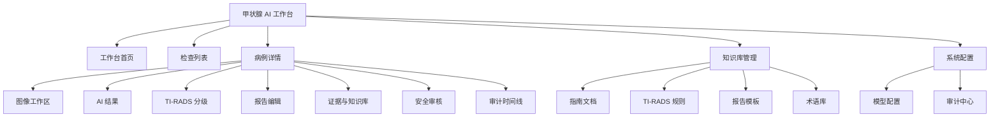

# 甲状腺 AI 智能体功能设计方案 UI 设计补充

版本：v1.0
文档类型：功能设计补充 / UI 交互设计
适用范围：医生工作台、医技工作台、知识库管理、AI 分析结果审核

## 1. UI 设计目标

甲状腺 AI 智能体的 UI 不是普通聊天界面，而是面向医生和医技人员的医疗工作台。界面必须帮助用户快速完成检查创建、图像查看、AI 结果审核、TI-RADS 分级确认、报告编辑、医生签署和归档。

UI 设计目标：

- 让医生在一个页面内完成“看图、看 AI 标注、看证据、改报告、签署”的核心工作。
- 让医技人员快速创建检查、上传图像、查看 AI 分析状态。
- 让 AI 结果始终可解释、可修改、可追溯。
- 明确区分 AI 草稿、医生修改和最终报告。
- 避免把 AI 结果设计成最终诊断结论。
- 在低质量图像、低置信度、证据不足时给出醒目的人工接管提示。
- 所有关键动作需要有状态保护、二次确认和审计记录。
- 验证版不做业务权限和用户角色管理 UI，仅保留本地单用户/医生确认流程；生产试点阶段再补充 RBAC、资源级权限和院内认证。

## 2. 目标用户与主要任务

| 用户 | 主要任务 | 关键页面 |
|---|---|---|
| 超声技师 | 创建检查、上传图像、启动 AI 分析、提交医生审核 | 检查列表、创建检查、图像上传、分析状态 |
| 审核医生 | 查看 AI 标注、修正结节、确认 TI-RADS 特征、编辑报告 | 病例详情、图像工作区、AI 结果面板、报告编辑区 |
| 签署医生 | 复核报告、确认或驳回、最终签署 | 报告审核、证据面板、安全审核面板 |
| 科室管理员 | 查看任务统计、配置模板 | 工作台首页、模板管理、审计中心 |
| 知识库管理员 | 上传指南、维护术语、审核知识版本 | 知识库管理、规则管理、模板管理 |
| 审计员 | 查看操作日志、模型调用记录、报告修改记录 | 审计中心、病例审计时间线 |

## 3. 信息架构



主导航建议：

| 一级导航 | 子功能 |
|---|---|
| 工作台 | 今日任务、待分析、待审核、已驳回、已归档 |
| 检查管理 | 检查列表、新建检查、图像上传、分析状态 |
| AI 审核 | 待医生审核、低置信度病例、安全风险病例 |
| 报告管理 | 草稿报告、待签署报告、已归档报告 |
| 知识库 | 指南、规则、模板、术语、相似病例 |
| 系统配置 | 模型、知识库参数、本地数据目录、审计 |

## 4. 全局布局设计

### 4.1 页面框架

系统采用医疗工作台布局：

```text
顶部栏：系统名称、机构/科室、当前用户、通知、退出
左侧导航：工作台、检查管理、AI 审核、报告管理、知识库、系统管理
主内容区：列表、病例详情、图像工作区、报告编辑区
右侧辅助区：AI 结果、证据、审核风险、审计时间线
底部状态区：保存状态、分析状态、当前模型版本、规则版本
```

### 4.2 全局状态提示

| 状态 | UI 表现 |
|---|---|
| AI 分析中 | 顶部状态条 + 进度步骤 + 当前 Agent 名称 |
| 等待医生审核 | 黄色状态标签 |
| 安全审核未通过 | 红色风险提示 + 禁用签署按钮 |
| 低置信度 | 特征项旁显示置信度和人工确认标记 |
| 知识库无依据 | 报告建议区显示“缺少可靠依据”提示 |
| 已归档 | 页面只读，修改需创建修订版本 |

### 4.3 视觉原则

- 主色使用医疗蓝或青绿色，强调可信、稳定、安静。
- 风险提示使用红色，低置信度使用黄色，已确认使用绿色。
- 医疗工作台避免营销式大卡片和装饰性视觉。
- 信息密度要适合医生快速扫描。
- 图像区域优先级最高，报告和 AI 结果紧随其后。
- 所有 AI 结论旁必须显示状态：未确认、需复核、医生已确认。

## 5. 核心页面设计

## 5.1 工作台首页

### 页面目标

让用户进入系统后立即看到自己的任务、风险病例和待办报告。

### 页面布局

```text
顶部：今日任务摘要
中部左侧：待处理检查列表
中部右侧：风险提醒和低置信度病例
底部：近期报告、模型运行状态、知识库版本状态
```

### 功能模块

| 模块 | 内容 |
|---|---|
| 今日任务 | 待上传、分析中、待审核、待签署、已驳回 |
| 风险提醒 | 安全审核失败、低质量图像、低置信度结果 |
| 快捷入口 | 新建检查、上传图像、进入待审核列表 |
| 系统状态 | 模型服务状态、知识库版本、规则版本 |

### 操作

- 点击待审核任务进入病例详情。
- 点击风险病例进入安全审核面板。
- 点击新建检查进入检查创建页面。
- 点击模型状态查看模型版本和服务健康状态。

## 5.2 检查列表页

### 页面目标

用于管理所有甲状腺超声检查任务。

### 筛选条件

| 条件 | 说明 |
|---|---|
| 状态 | 待上传、待分析、分析中、待审核、待签署、已归档、已驳回 |
| 时间 | 今日、本周、本月、自定义 |
| 医生 | 创建人、审核人、签署人 |
| 风险 | 低置信度、安全审核失败、知识库无依据 |
| TI-RADS | TR1、TR2、TR3、TR4、TR5 |
| 图像状态 | 无图像、图像不足、图像可分析 |

### 列表字段

| 字段 | 说明 |
|---|---|
| 检查号 | accession no 或系统编号 |
| 患者信息 | 脱敏姓名、性别、年龄 |
| 检查时间 | 超声检查时间 |
| 状态 | 当前流程状态 |
| AI 状态 | 未分析、分析中、成功、失败、需复核 |
| 最高分级 | 当前最高 TI-RADS 分级 |
| 风险提示 | 低质量、低置信度、缺证据 |
| 操作 | 查看、上传、分析、审核、签署 |

### 验证版操作边界

| 用户 | 可见范围 | 可操作 |
|---|---|---|
| 本地验证用户 | 本地导入的验证病例 | 上传、启动分析、审核、确认 |
| 医生确认人 | 当前打开病例 | 修改 AI 结果、编辑报告、签署确认 |
| 审计查看人 | 本地审计记录 | 查看审计，不可修改 |

## 5.3 新建检查页

### 页面目标

快速创建一次甲状腺超声检查任务。

### 表单字段

| 分组 | 字段 |
|---|---|
| 患者信息 | 患者编号、姓名脱敏显示、性别、出生年份 |
| 检查信息 | 检查号、检查时间、检查部位、设备、操作者 |
| 临床信息 | 主诉、既往史、甲状腺手术史、相关化验 |
| AI 设置 | 是否自动分析、TI-RADS 规则体系、报告模板 |

### 校验规则

- 患者编号或检查号至少有一个。
- 检查部位默认甲状腺，不允许创建无部位检查。
- 未选择规则体系时默认使用院内配置。
- 检查号、患者编号或导入来源不完整时不可创建检查。

## 5.4 图像上传页

### 页面目标

上传甲状腺超声图像，并完成格式校验、预览和质量初筛。

### 支持格式

| 格式 | MVP 支持 |
|---|---|
| PNG | 支持 |
| JPEG | 支持 |
| DICOM | 支持基础 Part 10，复杂压缩和多帧后续扩展 |
| 视频 | 后续扩展 |

### 上传后 UI

| 状态 | 表现 |
|---|---|
| 上传中 | 文件级进度条 |
| 上传成功 | 生成缩略图和图像编号 |
| 格式失败 | 显示失败原因 |
| DICOM 脱敏完成 | 显示“metadata 已脱敏” |
| 可分析 | 允许启动 AI 分析 |
| 需人工确认 | 标记图像质量问题 |

### 图像卡片信息

- 缩略图。
- 文件名。
- 图像类型。
- 是否 DICOM。
- pixel spacing 是否存在。
- 图像质量初筛状态。
- 删除、重新上传、设为主图。

## 5.5 病例详情页

### 页面目标

病例详情是医生审核的主页面，必须把图像、AI 结果、证据、报告放在同一工作流中。

### 推荐布局

```text
┌────────────────────────────────────────────────────────────┐
│ 顶部：患者脱敏信息 / 检查状态 / AI状态 / 签署状态             │
├───────────────┬───────────────────────────┬────────────────┤
│ 左侧图像列表   │ 中央图像工作区              │ 右侧AI结果面板    │
│ 缩略图         │ 检测框/测量/mask/图层       │ 结节/特征/分级    │
├───────────────┴───────────────────────────┴────────────────┤
│ 底部：报告编辑区 / 知识证据 / 安全审核 / 审计时间线 Tabs      │
└────────────────────────────────────────────────────────────┘
```

### 顶部信息

| 信息 | 说明 |
|---|---|
| 患者 | 脱敏姓名、性别、年龄 |
| 检查 | 检查号、时间、部位 |
| 状态 | 分析中、待审核、待签署、已归档 |
| 规则版本 | ACR TI-RADS 2017 / C-TIRADS 2020 |
| 模型版本 | 当前推理模型版本 |
| 操作按钮 | 启动分析、重新分析、提交审核、确认报告、驳回 |

## 5.6 图像工作区

### 页面目标

让医生查看原始图像、AI 检测框、分割轮廓、测量线和结节位置。

### 工具栏

| 工具 | 功能 |
|---|---|
| 缩放 | 放大、缩小、适配窗口 |
| 平移 | 移动画布 |
| 窗宽窗位 | DICOM 灰阶调节 |
| 图层开关 | 检测框、mask、测量线、热区、标尺 |
| 测量 | 手工测量长径、短径 |
| 标注 | 新增、调整、删除结节框 |
| 对比 | 原图 / AI overlay / 医生修订 |

### 结节交互

| 操作 | 说明 |
|---|---|
| 点击检测框 | 选中对应结节，右侧结果面板同步 |
| 拖拽检测框 | 医生修正 bbox |
| 新增结节 | 手工框选新增 nodule |
| 删除结节 | 标记 AI 误检，进入审计 |
| 调整测量线 | 覆盖 AI 测量结果 |
| 切换图层 | 对比 AI 和医生修订 |

### 状态提示

- AI 框：蓝色。
- 医生修订框：绿色。
- 低置信度框：黄色。
- 安全风险相关框：红色。
- 已删除误检：灰色虚线。

## 5.7 AI 结果面板

### 页面目标

展示每个结节的 AI 结构化结果，并允许医生逐项确认或修改。

### 结构

```text
结节列表
  N1 左叶 14.2mm TR4 需复核
  N2 右叶 6.1mm TR3 已确认

选中结节详情
  位置
  尺寸
  TI-RADS 特征
  分值
  建议
  置信度
  证据
```

### 字段

| 字段 | UI 控件 |
|---|---|
| 位置 | 下拉选择：左叶、右叶、峡部 |
| 长径/短径 | 数值输入 + 单位 mm |
| 成分 | 单选/下拉 |
| 回声 | 单选/下拉 |
| 形态 | 单选/下拉 |
| 边缘 | 单选/下拉 |
| 强回声灶 | 多选 |
| 置信度 | 百分比 + 风险颜色 |
| 是否医生确认 | 勾选确认 |

### 修改规则

- 医生修改任何特征后，TI-RADS 分值必须自动重新计算。
- 修改前后差异必须记录。
- 被医生确认的字段显示“医生已确认”。
- 低置信度字段默认要求医生确认。

## 5.8 TI-RADS 分级页签

### 页面目标

让医生看到分级不是大模型生成的，而是由特征和规则计算得到。

### 展示方式

| 内容 | 展示 |
|---|---|
| 特征项 | 每项特征、选中值、对应分值 |
| 总分 | 自动汇总 |
| 分级 | TR1-TR5 |
| 建议 | 根据分级和尺寸显示建议类型 |
| 规则来源 | ACR TI-RADS / C-TIRADS 版本 |
| 证据 | 可展开查看规则条目 |

### 示例布局

```text
N1 TI-RADS 分级

成分：实性        +2
回声：低回声      +2
形态：纵横比正常  +0
边缘：光整        +0
强回声灶：无      +0
----------------------
总分：4
分级：TR4
状态：需医生确认
规则：ACR TI-RADS 2017
```

## 5.9 报告编辑区

### 页面目标

生成医生可编辑的报告草稿，并明确区分 AI 草稿和最终报告。

### 报告区域结构

```text
左侧：结构化字段
  甲状腺大小
  回声
  结节描述
  TI-RADS 分级
  建议

右侧：报告正文编辑器
  所见
  结论
  建议

底部：AI 草稿 / 医生修改 / 最终签署版本对比
```

### 报告状态

| 状态 | 说明 |
|---|---|
| AI 草稿 | ReportAgent 生成，不能直接归档 |
| 医生编辑中 | 医生修改报告 |
| 安全审核中 | SafetyAuditAgent 复核 |
| 待签署 | 安全审核通过，等待签署医生确认 |
| 已驳回 | 医生要求重新分析或修改 |
| 已归档 | 最终报告，不可直接覆盖 |

### 编辑要求

- 结构化字段修改后自动同步正文建议。
- 正文手动修改后保留 diff。
- 出现禁用词时实时提示。
- 缺少证据的建议不允许提交签署。
- 已归档报告只能创建修订版。

## 5.10 知识证据面板

### 页面目标

让医生看到 AI 报告依据来自哪里。

### 展示内容

| 内容 | 说明 |
|---|---|
| 指南依据 | ACR TI-RADS、C-TIRADS、ATA、院内规范 |
| 规则条目 | 特征分值、分级阈值、建议阈值 |
| 报告模板 | 当前模板来源和版本 |
| 相似病例 | 脱敏病例参考 |
| 引用版本 | 文档版本、生效日期、审核状态 |

### 交互

- 点击报告中的建议，右侧定位到对应证据。
- 点击证据片段，展开完整指南段落。
- 对过期或未审核知识显示不可用状态。
- 相似病例只能参考，不得覆盖当前病例判断。

## 5.11 安全审核面板

### 页面目标

在医生签署前显示所有安全风险。

### 风险类型

| 风险 | UI 表现 |
|---|---|
| 越权诊断 | 红色高危，阻止提交 |
| 缺少证据 | 红色高危，阻止提交 |
| 低置信度未确认 | 黄色中危，要求确认 |
| 图像质量不足 | 红色高危，建议重新上传 |
| 规则版本不一致 | 红色高危 |
| 医生修改未复核 | 黄色中危 |

### 操作

- 查看风险详情。
- 定位到报告文本。
- 定位到图像或结节。
- 重新运行安全审核。
- 驳回 AI 草稿。
- 通过审核并提交签署。

## 5.12 审计时间线

### 页面目标

展示病例从创建到归档的完整记录。

### 时间线节点

| 节点 | 内容 |
|---|---|
| 创建检查 | 创建人、时间、患者脱敏信息 |
| 上传图像 | 文件、格式、脱敏状态 |
| 启动分析 | 启动人、规则版本、模型配置 |
| Agent 执行 | Agent 名称、任务状态、耗时 |
| 工具调用 | MCP 工具名、输入摘要、输出摘要 |
| 模型推理 | 模型名称、版本、权重 hash |
| 报告生成 | AI 草稿版本 |
| 医生修改 | 修改前后 diff |
| 安全审核 | 风险项、处理结果 |
| 医生签署 | 签署人、时间 |
| 归档 | 最终报告版本 |

### 审计查看

- 审计记录不可编辑、不可删除。
- 验证版默认显示本地验证数据的审计时间线。
- 生产试点阶段再按医生、科室、审计员等角色控制审计范围。

## 6. 知识库管理 UI

### 6.1 指南文档管理

功能：

- 上传指南 PDF/DOCX。
- 查看解析状态。
- 查看 chunk 切片。
- 标记来源、版本、生效时间。
- 提交审核。
- 发布或停用知识版本。

列表字段：

| 字段 | 说明 |
|---|---|
| 文档名称 | 指南或规范名称 |
| 来源 | ACR、C-TIRADS、ATA、院内规范 |
| 版本 | 2017、2020 等 |
| 状态 | 草稿、解析中、待审核、已发布、已停用 |
| 审核人 | 知识审核员 |
| 生效时间 | 用于报告引用 |

### 6.2 TI-RADS 规则管理

功能：

- 查看规则版本。
- 查看特征分值。
- 查看分级阈值。
- 查看建议阈值。
- 对规则进行版本发布。
- 禁止直接在线随意修改已发布规则。

规则修改必须创建新版本，旧版本保留用于历史回放。

### 6.3 报告模板管理

功能：

- 管理所见模板。
- 管理结论模板。
- 管理不同 TI-RADS 分级建议话术。
- 配置禁用词和必填字段。
- 模板发布需要审核。

### 6.4 术语库管理

功能：

- 管理标准术语。
- 管理同义词。
- 管理禁用表达。
- 管理中英文映射。
- 支持术语搜索和批量导入。

## 7. 验证版边界与后置权限 UI

### 7.1 验证版不建设的 UI

验证版不建设以下页面：

- 用户列表。
- 角色分配。
- 科室范围配置。
- 账号启用/停用。
- 服务账号管理。
- 资源级授权管理。

### 7.2 验证版动作可见性

UI 需要根据状态机控制按钮可用性：

| 场景 | UI 表现 |
|---|---|
| 未上传图像 | 禁用启动分析 |
| AI 分析中 | 禁用重复启动，显示进度 |
| 安全审核未通过 | 禁用确认报告，显示风险原因 |
| 医生未确认 | 禁用归档 |
| 已归档报告 | 只读展示，修改需创建修订版 |

禁止只在前端禁用按钮，后端 API 必须再次校验状态机和审计要求。

## 8. AI 状态与异常 UI

### 8.1 分析进度

进度步骤：

```text
图像质控
-> 结节检测
-> 分割测量
-> TI-RADS 特征识别
-> 规则计算
-> 知识库取证
-> 报告生成
-> 安全审核
```

每一步显示：

- 当前状态。
- Agent 名称。
- 工具名称。
- 开始时间。
- 耗时。
- 成功或失败原因。

### 8.2 失败状态

| 失败 | 页面处理 |
|---|---|
| 图像不可分析 | 停止自动流程，提示重新上传或人工审核 |
| 模型服务失败 | 显示重试按钮和错误编号 |
| 低置信度 | 标记字段为需医生确认 |
| 规则缺失 | 禁止生成分级，提示规则管理员 |
| 知识库无依据 | 报告建议区不生成确定性建议 |
| 安全审核失败 | 阻止签署 |

## 9. 移动端与响应式

MVP 主要面向桌面端医生工作站。移动端只建议支持轻量查看，不建议在移动端完成正式图像审核和报告签署。

| 终端 | 支持范围 |
|---|---|
| 桌面端 | 完整功能 |
| 平板 | 查看病例、查看报告、简单审核 |
| 手机 | 查看任务状态和报告摘要 |

图像测量、结节标注、最终签署建议仅在桌面端开放。

## 10. 可用性与验收标准

### 10.1 UI 可用性标准

- 医生从病例列表进入审核页面不超过 2 次点击。
- 图像、AI 结果、报告编辑在同一页面可见或一键切换。
- 每个 AI 结论都能看到置信度和证据来源。
- 低置信度字段必须清晰标识。
- 安全审核失败时，签署按钮必须禁用。
- 医生修改后必须能查看修改前后差异。
- 已归档报告必须只读。

### 10.2 关键验收场景

| 场景 | 验收标准 |
|---|---|
| 上传图像并启动分析 | 能看到进度、Agent 状态和最终 AI 结果 |
| 多结节病例审核 | 能逐个结节查看、修改、确认 |
| 修改 TI-RADS 特征 | 分值和分级自动重算 |
| 报告编辑 | AI 草稿和医生修改可区分 |
| 安全审核失败 | 显示风险并阻止签署 |
| 知识证据查看 | 能定位指南、规则、模板来源 |
| 已归档报告 | 只读展示，修改需创建修订版 |

## 11. MVP UI 范围

第一阶段建议实现以下页面：

```text
工作台首页
检查列表
新建检查
图像上传
病例详情
图像工作区
AI 结果面板
TI-RADS 分级面板
报告编辑区
安全审核面板
审计时间线
知识库文档列表
报告模板管理
模型与本地运行配置
```

第二阶段扩展：

```text
DICOM 高级查看
相似病例检索
模型评估看板
批量质控
规则版本对比
知识库审核流
科研数据集导出
```

## 12. 与技术设计的对应关系

| UI 模块 | 对应技术模块 |
|---|---|
| 检查列表 | study、analysis_session、report |
| 图像工作区 | image、nodule、measurement、本地 artifacts |
| AI 结果面板 | tirads_feature、tirads_result、agent_task |
| 知识证据面板 | CodeClaw rag_chunks、medical_chunk_metadata、tirads_rules、RAG 工具 |
| 报告编辑区 | report、doctor_review |
| 安全审核面板 | SafetyAuditAgent、risk_items、audit_log |
| 审计时间线 | audit_log、tool_call_log |
| 系统配置 | model_config、local_artifact_config、audit_log |

## 13. 结论

甲状腺 AI 智能体的 UI 应以医生审核工作流为中心，而不是以聊天为中心。核心页面必须把图像、AI 标注、结构化特征、TI-RADS 分级、知识证据、报告编辑和安全审核整合在一起。AI 结果默认是待确认状态，医生拥有最终修改和签署权。UI 需要清晰呈现证据、置信度、风险和审计记录，才能满足医疗场景下的可信、可解释、可追溯要求。
