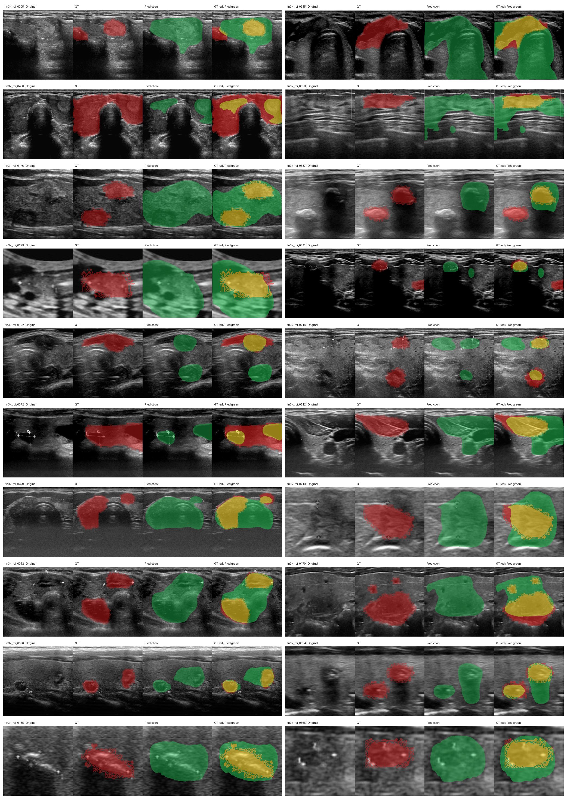

# TN3K Manual Review Packet

- Cases: `20`
- Contact sheet: `tn3k_manual_review_contact_sheet.png`

| Rank | Case | Dice | Category | Group | Suggested action | Panel |
| ---: | --- | ---: | --- | --- | --- | --- |
| 1 | `tn3k_roi_0005` | 0.3877 | `multi_region_gt_partial` | `label_or_task_review` | `verify_image_label_alignment_and_task_definition` | [panel](panels/tn3k_roi_0005_panel.png) |
| 2 | `tn3k_roi_0335` | 0.4586 | `location_shift` | `label_or_task_review` | `verify_image_label_alignment_and_task_definition` | [panel](panels/tn3k_roi_0335_panel.png) |
| 3 | `tn3k_roi_0430` | 0.4635 | `location_shift` | `label_or_task_review` | `verify_image_label_alignment_and_task_definition` | [panel](panels/tn3k_roi_0430_panel.png) |
| 4 | `tn3k_roi_0358` | 0.4736 | `oversegmentation` | `model_hard` | `verify_label_then_mark_hard_case_or_correct_mask` | [panel](panels/tn3k_roi_0358_panel.png) |
| 5 | `tn3k_roi_0146` | 0.4905 | `multi_region_gt_partial` | `label_or_task_review` | `verify_image_label_alignment_and_task_definition` | [panel](panels/tn3k_roi_0146_panel.png) |
| 6 | `tn3k_roi_0537` | 0.4976 | `location_shift` | `label_or_task_review` | `verify_image_label_alignment_and_task_definition` | [panel](panels/tn3k_roi_0537_panel.png) |
| 7 | `tn3k_roi_0223` | 0.5048 | `multi_region_gt_partial` | `label_or_task_review` | `verify_image_label_alignment_and_task_definition` | [panel](panels/tn3k_roi_0223_panel.png) |
| 8 | `tn3k_roi_0541` | 0.5059 | `boundary_or_shape_mismatch` | `model_hard` | `verify_label_then_mark_hard_case_or_correct_mask` | [panel](panels/tn3k_roi_0541_panel.png) |
| 9 | `tn3k_roi_0192` | 0.5067 | `location_shift` | `label_or_task_review` | `verify_image_label_alignment_and_task_definition` | [panel](panels/tn3k_roi_0192_panel.png) |
| 10 | `tn3k_roi_0216` | 0.5179 | `location_shift` | `label_or_task_review` | `verify_image_label_alignment_and_task_definition` | [panel](panels/tn3k_roi_0216_panel.png) |
| 11 | `tn3k_roi_0372` | 0.5421 | `undersegmentation` | `model_hard` | `verify_label_then_mark_hard_case_or_correct_mask` | [panel](panels/tn3k_roi_0372_panel.png) |
| 12 | `tn3k_roi_0512` | 0.5614 | `oversegmentation` | `model_hard` | `verify_label_then_mark_hard_case_or_correct_mask` | [panel](panels/tn3k_roi_0512_panel.png) |
| 13 | `tn3k_roi_0429` | 0.604 | `multi_region_gt_partial` | `label_or_task_review` | `verify_image_label_alignment_and_task_definition` | [panel](panels/tn3k_roi_0429_panel.png) |
| 14 | `tn3k_roi_0213` | 0.6405 | `oversegmentation` | `model_hard` | `verify_label_then_mark_hard_case_or_correct_mask` | [panel](panels/tn3k_roi_0213_panel.png) |
| 15 | `tn3k_roi_0012` | 0.6435 | `multi_region_gt_partial` | `label_or_task_review` | `verify_image_label_alignment_and_task_definition` | [panel](panels/tn3k_roi_0012_panel.png) |
| 16 | `tn3k_roi_0170` | 0.6645 | `multi_region_gt_partial` | `label_or_task_review` | `verify_image_label_alignment_and_task_definition` | [panel](panels/tn3k_roi_0170_panel.png) |
| 17 | `tn3k_roi_0096` | 0.6661 | `oversegmentation` | `model_hard` | `verify_label_then_mark_hard_case_or_correct_mask` | [panel](panels/tn3k_roi_0096_panel.png) |
| 18 | `tn3k_roi_0354` | 0.6682 | `oversegmentation` | `model_hard` | `verify_label_then_mark_hard_case_or_correct_mask` | [panel](panels/tn3k_roi_0354_panel.png) |
| 19 | `tn3k_roi_0135` | 0.6772 | `multi_region_gt_partial` | `label_or_task_review` | `verify_image_label_alignment_and_task_definition` | [panel](panels/tn3k_roi_0135_panel.png) |
| 20 | `tn3k_roi_0565` | 0.6841 | `oversegmentation` | `model_hard` | `verify_label_then_mark_hard_case_or_correct_mask` | [panel](panels/tn3k_roi_0565_panel.png) |
